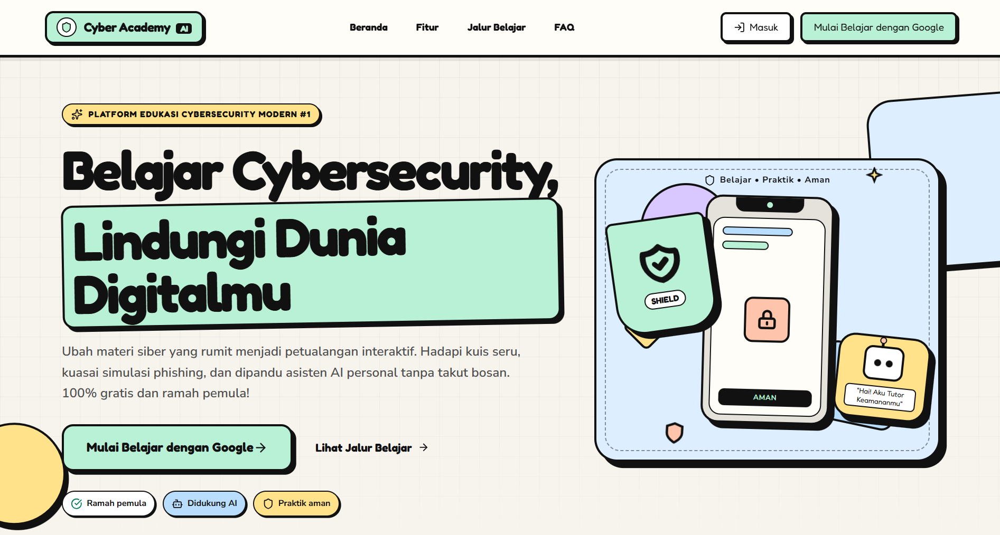
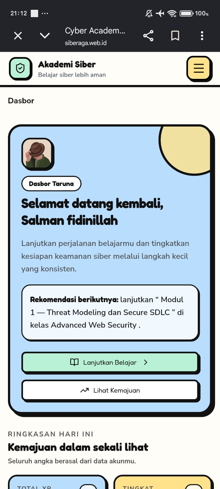
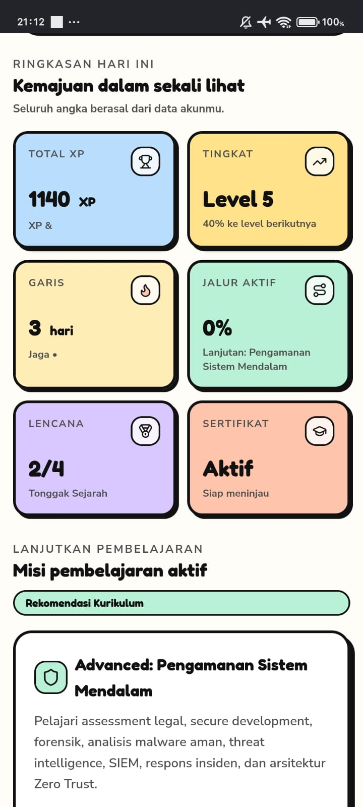
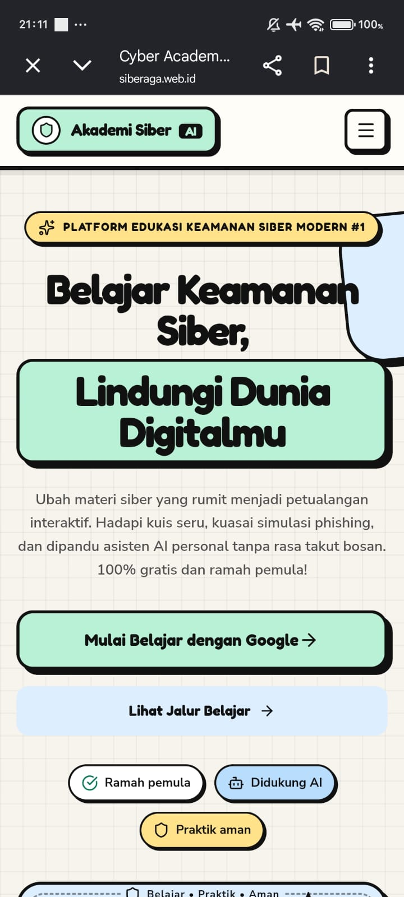
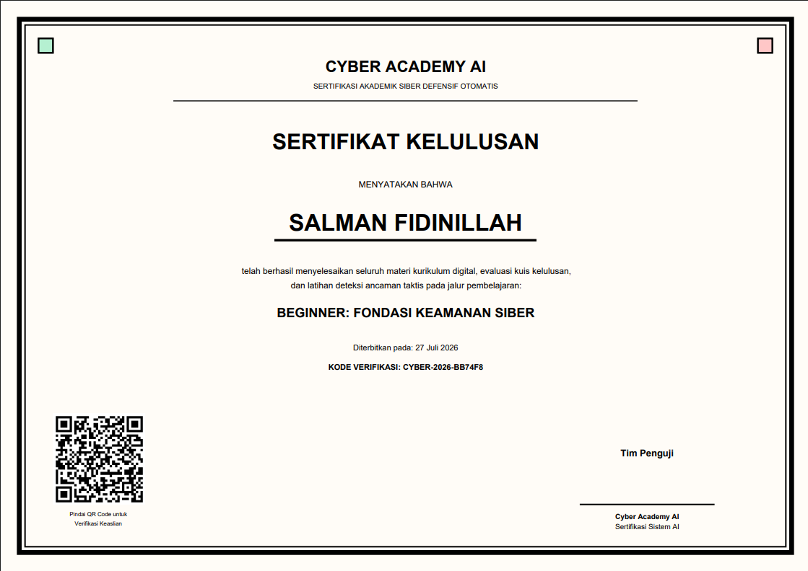
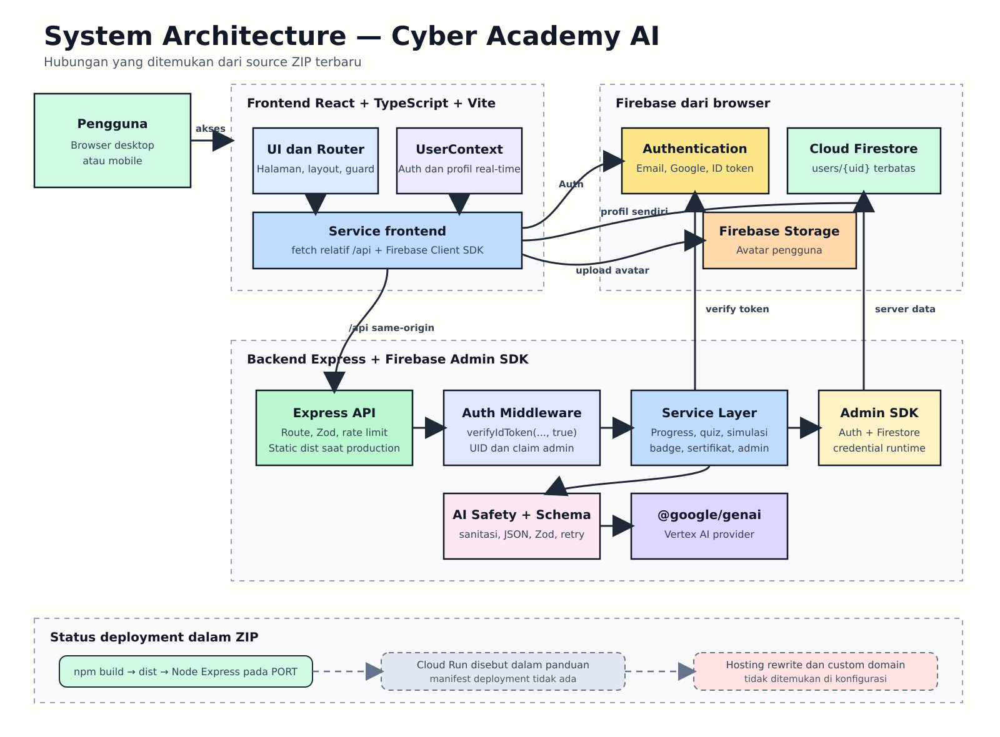
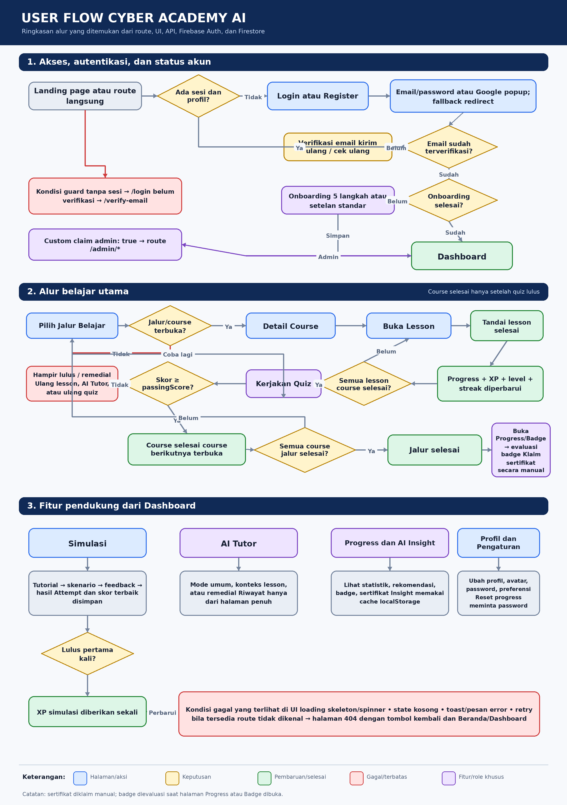

# Cyber Academy AI

Cyber Academy AI adalah platform belajar keamanan siber berbasis web. Project ini menggabungkan materi bertahap, kuis, simulasi aman, pendamping belajar berbasis AI, dan pencatatan progress agar topik cybersecurity lebih mudah dipelajari dari dasar sampai lanjutan.

Project ini dikembangkan untuk FTI Festival 2026 kategori Web Development.

## Demo

Website production: [https://siberaga.web.id](https://siberaga.web.id)

### Akun Demo Juri

| | |
| --- | --- |
| Email | `juri@siberaga.web.id` |
| Password | `Juri123@` |

Akun ini disediakan untuk mencoba alur pengguna biasa. Akun tersebut tidak dinyatakan sebagai akun admin.

## Tampilan Aplikasi

### Landing Page



### Dashboard Mobile





### Tampilan Mobile



### Sertifikat



## Tentang Project

Materi keamanan siber sering terasa teknis bagi pemula, sementara ancaman seperti phishing, penipuan pesan, pencurian akun, dan penyalahgunaan data dekat dengan aktivitas sehari-hari. Cyber Academy AI dibuat sebagai tempat belajar yang menggabungkan penjelasan, latihan pengambilan keputusan, evaluasi, dan pendamping AI dalam satu alur.

Pengguna dapat memilih jalur belajar, menyelesaikan lesson dan kuis, mencoba simulasi fiktif yang aman, lalu melihat perkembangan XP, level, streak, badge, dan sertifikatnya.

## Fitur Utama

- Autentikasi email/password dan Google melalui Firebase Authentication, termasuk verifikasi email dan reset password.
- Tiga learning path: Beginner, Intermediate, dan Advanced.
- Course, lesson, dan kuis bertahap dengan aturan akses serta progress yang diproses backend.
- Empat simulasi defensif: email phishing, WhatsApp scam, vishing, dan analisis malware dalam sandbox fiktif.
- AI Tutor dengan riwayat percakapan dan AI Learning Insight untuk membantu proses belajar.
- Progress, XP, level, streak, dan transaksi reward yang dijaga server agar tidak ditentukan oleh browser.
- Empat badge milestone dan sertifikat learning path yang dapat diverifikasi melalui halaman publik.
- Halaman profil, pengaturan akun, avatar, dan keamanan akun.
- Panel admin untuk pengguna dengan custom claim admin guna mengelola pengguna dan konten yang didukung API.

## Data Pembelajaran

Katalog pada source diperiksa oleh test integritas dan berisi:

| Data | Jumlah |
| --- | ---: |
| Learning path | 3 |
| Course | 25 |
| Lesson | 79 |
| Quiz | 25 |
| Question | 160 |

Pembagian course per jalur:

- Beginner: 4 course
- Intermediate: 10 course
- Advanced: 11 course

## Teknologi

- React 19, TypeScript, React Router, Vite, dan Tailwind CSS untuk frontend.
- Node.js dan Express untuk server, API, serta penyajian hasil build frontend.
- Firebase Authentication untuk autentikasi pengguna.
- Cloud Firestore untuk profil, katalog, progress, kuis, simulasi, badge, sertifikat, riwayat AI, dan audit admin.
- Firebase Storage untuk avatar pengguna.
- Vertex AI melalui `@google/genai` untuk AI Tutor dan AI Learning Insight.
- Zod untuk validasi data dan output terstruktur.
- Vitest, Testing Library, Supertest, dan jsdom untuk pengujian.
- Cloud Run sebagai target runtime production yang didukung oleh konfigurasi server.

## Arsitektur Singkat

Pengguna membuka `siberaga.web.id`. Aplikasi React dan endpoint Express berjalan dalam satu build: Express melayani file frontend serta route `/api`. Firebase menangani Authentication, Firestore, dan Storage, sedangkan request AI diproses backend sebelum diteruskan ke Vertex AI.

Repository ini mendukung runtime Cloud Run melalui `PORT`, bind `0.0.0.0`, dan Application Default Credentials. File `firebase.json` hanya memuat Firestore rules, indexes, dan Storage rules; konfigurasi pemetaan custom domain atau Firebase Hosting tidak tersimpan di repository ini.



Penjelasan lebih lengkap tersedia pada [System Architecture](docs/system-architecture.md).

## User Flow

Alur utama pengguna dimulai dari registrasi atau login, verifikasi email, onboarding, memilih jalur belajar, menyelesaikan lesson dan kuis, lalu melihat progress serta pencapaian. Course dan learning path berikutnya mengikuti kondisi progress yang diperiksa backend.



Detail alur tersedia pada [User Flow](docs/user-flow.md).

## Struktur Repository

```text
.
├── docs/                 # Dokumentasi, diagram, screenshot, dan wireframe
├── scripts/              # Validator, export, seed, badge, dan utilitas admin
├── server/               # Route, middleware, service, validasi, dan test backend
├── src/                  # Frontend React, data katalog, service, dan test
├── server.ts             # Entry point Express dan penyajian build production
├── firebase.json         # Firestore dan Storage configuration
├── firestore.rules       # Aturan akses Firestore
├── storage.rules         # Aturan akses Firebase Storage
├── package.json          # Dependency dan script project
└── vite.config.ts        # Konfigurasi build frontend
```

## Dokumentasi

- [Project Concept](docs/project-concept.md)
- [Product Requirements Document](docs/prd.md)
- [Sitemap](docs/sitemap.md)
- [User Flow](docs/user-flow.md)
- [Use Case](docs/use-case.md)
- [Entity Relationship Diagram](docs/erd.md)
- [System Architecture](docs/system-architecture.md)
- [API Documentation](docs/api-documentation.md)
- [Design System](docs/design-system.md)
- [Wireframe](docs/wireframes/wireframe.md)
- [Badge Documentation](docs/badges.md)
- [Catalog Sync](docs/catalog-sync.md)
- [Vertex AI](docs/vertex-ai.md)

## Menjalankan Project

Prasyarat utama adalah Node.js dan npm. Install dependency dari lockfile lalu jalankan mode development:

```bash
npm ci
npm run dev
```

Server development berjalan pada port `3000` secara default dan dapat diubah melalui `PORT`.

Konfigurasi Firebase client dibaca dari environment variable `VITE_FIREBASE_*` dengan fallback ke `firebase-applet-config.json`. Salin [`.env.example`](.env.example) menjadi `.env` untuk konfigurasi lokal, lalu isi hanya nilai yang diperlukan. File `.env` tidak boleh dimasukkan ke repository.

```env
VITE_FIREBASE_API_KEY=...
VITE_FIREBASE_AUTH_DOMAIN=siberaga.web.id
VITE_FIREBASE_PROJECT_ID=...
VITE_FIREBASE_STORAGE_BUCKET=...
VITE_FIREBASE_MESSAGING_SENDER_ID=...
VITE_FIREBASE_APP_ID=...
VITE_FIREBASE_MEASUREMENT_ID=...
VITE_FIREBASE_FIRESTORE_DATABASE_ID=(default)

AI_PROVIDER=vertex
GOOGLE_CLOUD_PROJECT=...
GOOGLE_CLOUD_LOCATION=...
GEMINI_MODEL=...
PORT=3000
```

Backend Firebase dan Vertex AI memakai Application Default Credentials. Credential server tidak disimpan di `.env.example` maupun repository.

Script pemeriksaan yang tersedia:

```bash
npm run lint
npm run typecheck
npm test
npm run build
```

Untuk mencoba hasil build production secara lokal:

```bash
npm start
```

`npm start` dijalankan setelah `npm run build` menghasilkan `dist/server.cjs`.

## Deployment

Build production dibuat dengan Vite untuk frontend dan esbuild untuk backend. Hasilnya dijalankan melalui `node dist/server.cjs`, lalu Express melayani SPA dan API pada port runtime. Target production yang didukung project adalah Cloud Run dengan service account runtime dan environment variable backend yang sesuai.

Seed bukan bagian dari proses deployment normal. Rules dan indexes Firebase dikelola terpisah sesuai konfigurasi `firebase.json`.

## Pengujian

Project menyediakan pemeriksaan berikut:

- `npm run lint` dan `npm run typecheck`, keduanya menjalankan pemeriksaan TypeScript tanpa emit.
- `npm test` untuk test Vitest pada frontend, backend, service, data katalog, dan validator.
- `npm run build` untuk memeriksa build frontend dan bundle server.
- Pemeriksaan manual responsive pada tampilan desktop dan mobile.

README tidak mencantumkan jumlah test yang tetap karena jumlahnya dapat berubah saat repository dikembangkan.

## Catatan Keamanan

- Login dan sesi memakai Firebase Authentication.
- Endpoint yang dilindungi memverifikasi Firebase ID token; endpoint admin juga memeriksa custom claim `admin: true`.
- Progress, XP, kuis, simulasi, badge, dan sertifikat diproses melalui backend.
- Firestore rules dan Storage rules membatasi akses langsung dari client.
- Avatar dibatasi menurut pemilik, jenis file, dan ukuran melalui validasi aplikasi serta Storage rules.
- Request AI melewati backend, validasi, penyaringan input sensitif, dan pemeriksaan output.
- Credential server, private key, token, dan file `.env` tidak boleh disimpan di repository.

Tidak ada aplikasi yang dapat dianggap 100% aman. Konfigurasi production, IAM, Authorized domains, rules, logging, dan dependency tetap perlu ditinjau sebelum setiap rilis.

## Keterbatasan

- Aplikasi memerlukan koneksi ke layanan Firebase dan provider AI yang telah dikonfigurasi.
- Quota AI saat ini disimpan di memory proses sehingga tidak dibagi antar-instance dan akan kembali awal saat instance restart.
- Konfigurasi Firebase Hosting, pemetaan custom domain, revision, dan traffic Cloud Run tidak tersimpan pada ZIP project ini.
- Isi katalog source sudah memiliki test integritas, tetapi kondisi resource production tetap perlu diverifikasi terpisah sebelum rilis.

## Dokumentasi Lomba

Folder `docs/` berisi dokumen project, API, struktur data, arsitektur, alur pengguna, design system, screenshot, diagram, dan wireframe. Dokumen tersebut disertakan untuk membantu juri dan pengembang memahami implementasi tanpa harus menelusuri seluruh source lebih dahulu.

## Developer

**Salman Fidinillah**  
Pengembang Cyber Academy AI

## Kompetisi

**FTI Festival 2026 — Web Development**
