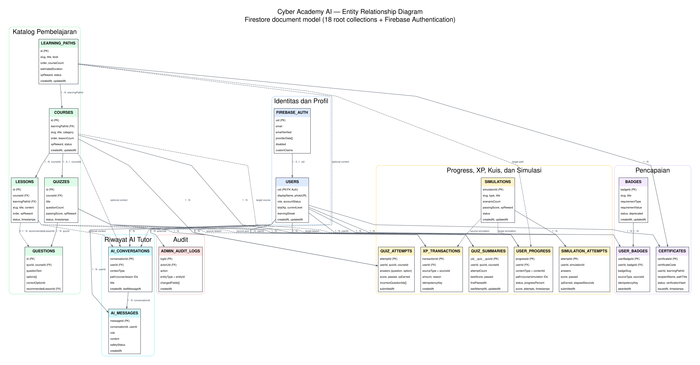

# Entity Relationship Diagram
# Cyber Academy AI

## 1. Pengantar

ERD ini menunjukkan susunan data dan hubungan antarentity yang benar-benar digunakan di Cyber Academy AI. Acuan utamanya adalah konfigurasi Firebase, service frontend dan backend, endpoint API, type/interface TypeScript, aturan Firestore, indeks, serta script seed di source project.

Database utama project memakai Cloud Firestore. Karena bentuknya collection dan document, hubungan data tidak memakai foreign key seperti database relasional. Relasi dibuat melalui document ID, field ID, array, nested object, dan pencarian berdasarkan field tertentu.

Diagram juga menampilkan Firebase Authentication karena UID dari layanan tersebut menjadi identitas utama pengguna. Firebase Authentication bukan collection Firestore.

## 2. Gambaran Umum Penyimpanan Data

| Bagian | Penyimpanan | Keterangan |
|---|---|---|
| Autentikasi | Firebase Authentication | Menyimpan akun, provider login, email terverifikasi, status disabled, dan custom claim `admin`. UID dipakai sebagai penghubung ke data pengguna. |
| Profil pengguna | Firestore `users` | Document ID sama dengan UID Firebase Authentication. Profil juga menyimpan ringkasan XP, level, dan streak yang dikelola server. |
| Katalog belajar | Firestore `learningPaths`, `courses`, `lessons`, `quizzes`, `questions` | Dibaca melalui backend. Lima collection ini juga menjadi target `scripts/seed-content.ts`. |
| Progress dan XP | Firestore `userProgress`, `xpTransactions` | Bersifat server-authoritative. Client tidak boleh menulis langsung berdasarkan `firestore.rules`. |
| Kuis dan simulasi | Firestore `quizAttempts`, `quizSummaries`, `simulations`, `simulationAttempts` | Hasil penilaian dibuat oleh backend. Kunci jawaban simulasi tetap berada di source server. |
| Badge dan sertifikat | Firestore `badges`, `userBadges`, `certificates` | Badge diberikan berdasarkan data progress nyata. Sertifikat dibuat satu kali untuk setiap pasangan pengguna dan learning path. |
| Riwayat AI Tutor | Firestore `aiConversations`, `aiMessages` | Percakapan dan pesan disimpan sebagai dua collection root yang dihubungkan oleh `conversationId`. |
| AI Insight | `localStorage` browser | Hasil insight disimpan pada key `ai_insight_<uid>`. Tidak ada collection Firestore khusus AI Insight. |
| File avatar | Firebase Storage | File berada pada path `users/{uid}/avatar/{filename}`. URL hasil upload disimpan pada `users.photoURL`. |
| Sertifikat PDF | Dibuat saat endpoint dipanggil | PDF dibuat oleh server dari document `certificates`; field `pdfPath` berisi endpoint download, bukan path file Storage. |
| Data awal dan data tampilan | Source TypeScript | Katalog awal ada di `src/data.ts`, `src/quiz_data.ts`, file intermediate/advanced, dan `src/live_catalog_additions.ts`. Data landing page, skenario simulasi, serta kunci jawabannya tidak otomatis menjadi collection baru. |
| Konfigurasi | File konfigurasi dan environment variable | Firebase client membaca `VITE_FIREBASE_*` dengan fallback `firebase-applet-config.json`. Backend memakai Application Default Credentials atau `FIREBASE_SERVICE_ACCOUNT_JSON`. |

Firestore yang dipakai adalah database root. Audit tidak menemukan pemanggilan subcollection atau `collectionGroup()` di source.

## 3. Daftar Collection dan Entity

| No. | Collection / Entity | Fungsi | Sumber Implementasi |
|---:|---|---|---|
| 1 | Firebase Authentication user | Identitas akun, provider login, verifikasi email, status disabled, dan custom claim admin. | `src/services/authService.ts`, `server/middleware/auth.ts`, `server/services/adminUserService.ts`, `scripts/set-admin.ts` |
| 2 | `users` | Profil pengguna serta ringkasan XP, level, dan streak. | `src/services/userService.ts`, `server/services/learningStateService.ts`, `firestore.rules` |
| 3 | `learningPaths` | Data jalur Beginner, Intermediate, dan Advanced. | `server/services/contentService.ts`, `scripts/seed-content.ts`, `scripts/seedValidator.ts` |
| 4 | `courses` | Kelas di dalam learning path. | `server/services/contentService.ts`, `src/data.ts`, `scripts/seedValidator.ts` |
| 5 | `lessons` | Materi yang berada di dalam course. | `server/services/contentService.ts`, `src/types.ts`, `scripts/seedValidator.ts` |
| 6 | `quizzes` | Kuis course, passing score, reward, dan jumlah soal. | `server/services/quizService.ts`, `server/validation/quizSchemas.ts`, `src/quiz_data.ts` |
| 7 | `questions` | Soal, opsi jawaban, jawaban benar, penjelasan, dan materi remedial. | `server/services/quizService.ts`, `server/validation/quizSchemas.ts`, `src/quiz_data.ts` |
| 8 | `userProgress` | Progress polymorphic untuk path, course, lesson, dan simulasi. | `server/services/learningStateService.ts`, `server/services/simulationService.ts` |
| 9 | `xpTransactions` | Catatan penambahan XP yang idempotent. | `server/services/learningStateService.ts`, `server/services/quizService.ts`, `server/services/simulationService.ts` |
| 10 | `quizAttempts` | Setiap percobaan kuis dan hasil penilaiannya. | `server/services/quizService.ts`, `src/types.ts` |
| 11 | `quizSummaries` | Ringkasan kuis per pengguna, termasuk nilai terbaik dan status lulus. | `server/services/quizService.ts`, `src/types.ts` |
| 12 | `simulations` | Metadata simulasi yang aman untuk dikirim ke client. | `server/services/simulationService.ts`, `server/simulationDefinitions.ts` |
| 13 | `simulationAttempts` | Setiap percobaan simulasi dan hasil penilaiannya. | `server/services/simulationService.ts`, `src/types.ts` |
| 14 | `badges` | Definisi badge aktif dan data badge lama yang dinonaktifkan. | `server/services/badgeDefinitions.ts`, `server/services/achievementService.ts`, `scripts/seed-badges.ts` |
| 15 | `userBadges` | Penghubung pengguna dengan badge yang telah diberikan. | `server/services/achievementService.ts`, `src/types.ts` |
| 16 | `certificates` | Sertifikat learning path dan data verifikasi publik. | `server/services/achievementService.ts`, `server.ts`, `src/types.ts` |
| 17 | `aiConversations` | Metadata percakapan AI Tutor milik pengguna. | `server/services/aiHistoryService.ts`, `server/routes/aiHistoryRoutes.ts` |
| 18 | `aiMessages` | Pesan pengguna dan jawaban AI di dalam percakapan. | `server/services/aiHistoryService.ts`, `src/types.ts` |
| 19 | `adminAuditLogs` | Jejak perubahan data yang dilakukan melalui alur admin atau evaluasi badge. | `server/services/auditService.ts`, `server/services/adminUserService.ts` |

## 4. Diagram ERD Utama

Diagram menggunakan nama entity huruf besar agar mudah dibaca. Nama collection aslinya tetap memakai bentuk camelCase seperti pada tabel sebelumnya.

```mermaid
erDiagram
    FIREBASE_AUTH ||--o| USERS : "UID menjadi document ID"
    USERS ||--o{ USER_PROGRESS : memiliki
    USERS ||--o{ XP_TRANSACTIONS : menerima
    USERS ||--o{ QUIZ_ATTEMPTS : mengerjakan
    USERS ||--o{ QUIZ_SUMMARIES : diringkas
    USERS ||--o{ SIMULATION_ATTEMPTS : menjalankan
    USERS ||--o{ USER_BADGES : memperoleh
    USERS ||--o{ CERTIFICATES : menerima
    USERS ||--o{ AI_CONVERSATIONS : membuat
    USERS ||--o{ AI_MESSAGES : menulis_memiliki
    USERS ||--o{ ADMIN_AUDIT_LOGS : menjadi_aktor

    LEARNING_PATHS ||--o{ COURSES : berisi
    COURSES ||--o{ LESSONS : berisi
    COURSES ||--o| QUIZZES : memiliki
    QUIZZES ||--|{ QUESTIONS : berisi
    LESSONS o|--o{ QUESTIONS : direkomendasikan

    LEARNING_PATHS o|--o{ USER_PROGRESS : target_path
    COURSES o|--o{ USER_PROGRESS : target_course
    LESSONS o|--o{ USER_PROGRESS : target_lesson
    SIMULATIONS o|--o{ USER_PROGRESS : target_simulasi

    LESSONS o|--o{ XP_TRANSACTIONS : sumber_lesson
    QUIZZES o|--o{ XP_TRANSACTIONS : sumber_quiz
    SIMULATIONS o|--o{ XP_TRANSACTIONS : sumber_simulasi

    COURSES ||--o{ QUIZ_ATTEMPTS : dicatat_untuk
    QUIZZES ||--o{ QUIZ_ATTEMPTS : menghasilkan
    COURSES ||--o{ QUIZ_SUMMARIES : diringkas_untuk
    QUIZZES ||--o{ QUIZ_SUMMARIES : memiliki_ringkasan

    SIMULATIONS ||--o{ SIMULATION_ATTEMPTS : menghasilkan
    BADGES ||--o{ USER_BADGES : diberikan_sebagai
    LEARNING_PATHS ||--o{ CERTIFICATES : disertifikasi

    LEARNING_PATHS o|--o{ AI_CONVERSATIONS : konteks_path
    COURSES o|--o{ AI_CONVERSATIONS : konteks_course
    LESSONS o|--o{ AI_CONVERSATIONS : konteks_lesson
    AI_CONVERSATIONS ||--o{ AI_MESSAGES : berisi

    FIREBASE_AUTH {
        string uid PK
        string email
        boolean emailVerified
        array providerData
        boolean disabled
        object customClaims
    }

    USERS {
        string uid PK
        string email
        string displayName
        string photoURL
        string role
        string accountStatus
        boolean onboardingCompleted
        number totalXp
        number currentLevel
        number learningStreak
        string lastStudyDate
        timestamp createdAt
        timestamp updatedAt
    }

    LEARNING_PATHS {
        string id PK
        string slug
        string title
        string level
        number order
        number courseCount
        number estimatedDuration
        number xpReward
        string status
        timestamp createdAt
        timestamp updatedAt
    }

    COURSES {
        string id PK
        string learningPathId FK
        string slug
        string title
        string category
        string level
        number order
        number lessonCount
        number xpReward
        string status
        timestamp createdAt
        timestamp updatedAt
    }

    LESSONS {
        string id PK
        string courseId FK
        string learningPathId FK
        string slug
        string title
        string contentType
        number order
        number xpReward
        string status
        timestamp createdAt
        timestamp updatedAt
    }

    QUIZZES {
        string id PK
        string courseId FK
        string title
        number questionCount
        number passingScore
        number xpReward
        string status
        timestamp createdAt
        timestamp updatedAt
    }

    QUESTIONS {
        string id PK
        string quizId FK
        string courseId FK
        string questionText
        array options
        string correctOptionId
        string recommendedLessonId FK
        number order
        string status
    }

    USER_PROGRESS {
        string progressId PK
        string userId FK
        string contentType
        string contentId FK
        string learningPathId FK
        string courseId FK
        string simulationId FK
        string status
        number progressPercent
        number bestScore
        number attempts
        timestamp startedAt
        timestamp completedAt
        timestamp updatedAt
    }

    XP_TRANSACTIONS {
        string transactionId PK
        string userId FK
        string sourceType
        string sourceId FK
        number amount
        string reason
        string idempotencyKey
        timestamp createdAt
    }

    QUIZ_ATTEMPTS {
        string attemptId PK
        string userId FK
        string quizId FK
        string courseId FK
        object answers
        number score
        boolean passed
        number xpEarned
        string resultStatus
        array incorrectQuestionIds
        array recommendedLessonIds
        timestamp submittedAt
    }

    QUIZ_SUMMARIES {
        string id PK
        string userId FK
        string quizId FK
        string courseId FK
        number attemptCount
        number bestScore
        boolean passed
        timestamp firstPassedAt
        timestamp lastAttemptAt
        timestamp updatedAt
    }

    SIMULATIONS {
        string simulationId PK
        string slug
        string type
        string title
        number scenarioCount
        number passingScore
        number xpReward
        string status
        timestamp createdAt
        timestamp updatedAt
    }

    SIMULATION_ATTEMPTS {
        string attemptId PK
        string userId FK
        string simulationId FK
        object answers
        number correctCount
        number totalQuestions
        number score
        boolean passed
        number xpEarned
        number elapsedSeconds
        timestamp submittedAt
    }

    BADGES {
        string badgeId PK
        string slug
        string title
        string requirementType
        string requirementValue
        number order
        string status
        boolean deprecated
        timestamp createdAt
        timestamp updatedAt
    }

    USER_BADGES {
        string userBadgeId PK
        string userId FK
        string badgeId FK
        string badgeSlug
        string sourceType
        string sourceId
        string idempotencyKey
        timestamp awardedAt
    }

    CERTIFICATES {
        string certificateId PK
        string certificateCode
        string userId FK
        string learningPathId FK
        string recipientName
        string learningPathTitle
        string status
        string verificationHash
        string pdfPath
        timestamp issuedAt
        timestamp createdAt
        timestamp updatedAt
    }

    AI_CONVERSATIONS {
        string conversationId PK
        string userId FK
        string contextType
        string learningPathId FK
        string courseId FK
        string lessonId FK
        string title
        timestamp createdAt
        timestamp updatedAt
        timestamp lastMessageAt
    }

    AI_MESSAGES {
        string messageId PK
        string conversationId FK
        string userId FK
        string role
        string content
        string safetyStatus
        timestamp createdAt
    }

    ADMIN_AUDIT_LOGS {
        string logId PK
        string actorUid FK
        string action
        string entityType
        string entityId
        string safeSummary
        array changedFields
        timestamp createdAt
    }
```

Catatan: garis ke `USER_PROGRESS` dan `XP_TRANSACTIONS` menunjukkan relasi polymorphic. Satu document hanya menunjuk jenis konten yang sesuai dengan nilai `contentType` atau `sourceType`, bukan ke semua entity sekaligus.

## 5. Detail Field Setiap Collection

### 5.1 Pengguna dan autentikasi

#### Firebase Authentication user

Entity ini dikelola Firebase Authentication, bukan Firestore. Field yang benar-benar dipakai source adalah `uid`, `email`, `displayName`, `photoURL`, `emailVerified`, `providerData`, `disabled`, metadata pembuatan/login, serta custom claim `admin`.

`server/middleware/auth.ts` memverifikasi ID token. Hak admin ditentukan dari claim `admin === true`; field `users.role` dipakai sebagai metadata profil dan ikut disinkronkan oleh service admin.

#### `users/{uid}`

| Field | Tipe | Keterangan |
|---|---|---|
| `uid` | string | Sama dengan UID Firebase Authentication dan sama dengan document ID. |
| `email` | string | Email profil saat document dibuat. Login tetap dikelola Firebase Authentication. |
| `displayName`, `photoURL`, `bio` | string | Data profil. `photoURL` dapat menunjuk file avatar di Firebase Storage. |
| `role` | `user` atau `admin` | Metadata role di Firestore. Otorisasi admin utama memakai custom claim. |
| `accountStatus` | `active`, `disabled`, atau `deleted` | Status profil. Alur admin yang ditemukan mengubah `active` dan `disabled`. |
| `onboardingCompleted` | boolean | Menandai onboarding sudah selesai. |
| `learningGoal`, `skillLevel`, `studyTime` | string | Jawaban onboarding. |
| `interests` | array string | Daftar minat pengguna. |
| `totalXp`, `currentLevel`, `learningStreak` | number | Ringkasan yang diperbarui backend setelah aktivitas yang memberi XP. |
| `longestStreak` | number, opsional | Dibaca oleh client dan direset bila field sudah ada. Tidak ditulis saat profil awal dibuat. |
| `lastLearningDate`, `lastStudyDate` | string atau null | Tanggal belajar format `YYYY-MM-DD` zona Asia/Jakarta. Source membaca keduanya untuk kompatibilitas. |
| `createdAt`, `updatedAt`, `lastActiveAt` | timestamp | Waktu pembuatan, perubahan, dan aktivitas terakhir. |

Profil awal dibuat langsung oleh client SDK melalui `createUserProfileIfMissing()`. Setelah itu, statistik belajar sensitif diperbarui oleh backend Admin SDK.

### 5.2 Katalog pembelajaran

#### `learningPaths/{id}`

| Kelompok field | Field |
|---|---|
| Identitas | `title`, `searchTitle`, `slug`, `description`, `shortDescription`, `level` |
| Tampilan | `thumbnailURL`, `bgColor`, `badgeName` |
| Urutan dan ringkasan | `order`, `estimatedDuration`, `courseCount`, `xpReward` |
| Publikasi | `status` (`draft`, `published`, `archived`) |
| Audit | `createdAt`, `updatedAt`, `createdBy`, `updatedBy` |

`courseCount` adalah data denormalisasi. Service admin memperbaruinya saat course dibuat, dipindah, atau dihapus. Endpoint katalog publik juga menghitung ulang jumlah course dari data child yang berstatus `published`.

#### `courses/{id}`

| Kelompok field | Field |
|---|---|
| Relasi | `learningPathId` |
| Identitas | `title`, `searchTitle`, `slug`, `description`, `shortDescription`, `category`, `level` |
| Urutan dan ringkasan | `order`, `estimatedDuration`, `xpReward`, `lessonCount` |
| Konten tambahan | `thumbnailURL`, `learningOutcomes` (array string) |
| Publikasi | `status` (`draft`, `published`, `archived`) |
| Audit | `createdAt`, `updatedAt`, `createdBy`, `updatedBy` |

`learningPathId` berisi document ID dari `learningPaths`. `lessonCount` disimpan sebagai ringkasan child lesson dan diperbarui oleh transaksi admin.

#### `lessons/{id}`

| Kelompok field | Field |
|---|---|
| Relasi | `courseId`, `learningPathId` |
| Identitas | `title`, `searchTitle`, `slug`, `summary`, `objective` |
| Isi | `content`, `contentType`, `exampleCase` (nested object), `securityTips` (array), `keyTakeaways` (array) |
| Urutan dan reward | `order`, `estimatedDuration`, `xpReward` |
| Publikasi | `status` (`draft`, `published`, `archived`) |
| Audit | `createdAt`, `updatedAt`, `createdBy`, `updatedBy` |

`learningPathId` pada lesson merupakan data denormalisasi dari parent course. Saat course dipindah ke learning path lain, service ikut memperbarui `learningPathId` pada child lesson.

#### `quizzes/{id}`

Field utamanya adalah `courseId`, `title`, `description`, `questionCount`, `passingScore`, `xpReward`, `status`, `createdAt`, `updatedAt`, `createdBy`, dan `updatedBy`.

Seed memvalidasi tepat satu quiz per course. Service admin juga menolak pembuatan quiz aktif atau draft kedua untuk course yang sama. Quiz berstatus archived tidak dianggap quiz aktif.

#### `questions/{id}`

| Field | Tipe | Keterangan |
|---|---|---|
| `quizId` | string | Document ID quiz parent. |
| `courseId` | string | Document ID course; disimpan juga agar konsisten dengan quiz. |
| `questionText` | string | Isi pertanyaan. |
| `options` | array object | Setiap object berisi `id` dan `text`. |
| `correctOptionId` | string | ID opsi benar. Tidak dikirim oleh endpoint soal publik. |
| `explanation` | string | Penjelasan jawaban. Tidak dikirim oleh endpoint soal publik. |
| `recommendedLessonId` | string atau null | Lesson remedial yang disarankan ketika jawaban salah. |
| `order` | number | Urutan soal dalam quiz. |
| `status` | string | `draft`, `published`, atau `archived`. |
| Audit | timestamp/string | `createdAt`, `updatedAt`, `createdBy`, `updatedBy`. |

### 5.3 Progress dan XP

#### `userProgress/{progressId}`

Collection ini menampung beberapa bentuk progress dalam satu collection.

| `contentType` | Pola document ID | Field relasi utama | Field khusus |
|---|---|---|---|
| `lesson` | `{uid}__lesson__{lessonId}` | `userId`, `contentId`, `learningPathId`, `courseId` | Status selesai, persen 100, waktu mulai dan selesai. |
| `course` | `{uid}__course__{courseId}` | `userId`, `contentId`, `learningPathId` | `completedLessonCount`, `totalLessonCount`, `lessonsCompleted`, `lastLessonId`. |
| `path` | `{uid}__path__{learningPathId}` | `userId`, `contentId` | Persentase dari course yang selesai. |
| `simulation` | `{uid}__simulation__{simulationId}` | `userId`, `contentId`, `simulationId` | `currentStep`, `score`, `bestScore`, `attempts`, `xpAwarded`. |

Field umum yang ditulis adalah `progressId`, `userId`, `contentType`, `contentId`, `status`, `progressPercent`, `startedAt`, `completedAt`, dan `updatedAt`.

Interface `UserProgress` memuat nilai status `not_started`, tetapi service tidak membuat document kosong untuk kondisi tersebut. Dalam alur aktif, belum mulai biasanya berarti document belum ada; document yang dibuat berstatus `in_progress` atau `completed`.

#### `xpTransactions/{transactionId}`

Field yang disimpan adalah `transactionId`, `userId`, `sourceType`, `sourceId`, `amount`, `reason`, `idempotencyKey`, dan `createdAt`.

Nilai `sourceType` yang benar-benar ditulis oleh service saat ini:

| Sumber | `sourceType` | Pola document ID |
|---|---|---|
| Penyelesaian lesson | `lesson_completion` | `{uid}__lesson__{lessonId}` |
| Lulus quiz pertama kali | `quiz_pass` | `{uid}__quiz__{quizId}` |
| Lulus simulasi pertama kali | `simulation_completion` | `{uid}__simulation__{simulationId}` |

Document ID dibuat deterministik agar reward yang sama tidak ditambahkan dua kali. TypeScript masih menyediakan beberapa nilai sumber lain, tetapi audit service tidak menemukan proses aktif yang menulis nilai tersebut.

### 5.4 Kuis

#### `quizAttempts/{attemptId}`

Field yang benar-benar ditulis backend adalah:

- identitas: `attemptId`, `userId`, `quizId`, `courseId`;
- jawaban: `answers` sebagai map `questionId -> optionId`;
- hasil: `correctCount`, `totalQuestions`, `score`, `passed`, `resultStatus`;
- reward: `xpEarned`;
- remedial: `incorrectQuestionIds`, `recommendedLessonIds`;
- waktu: `startedAt`, `submittedAt`.

Document ID dibuat dengan pola `attempt_<nilai acak base36>`. Array review lengkap dibentuk kembali ketika attempt dibaca, dengan mencocokkan `answers` ke collection `questions`; review tidak disimpan dalam document attempt aktif.

#### `quizSummaries/{uid}__quiz__{quizId}`

Field-nya adalah `userId`, `quizId`, `courseId`, `attemptCount`, `bestScore`, `passed`, `firstPassedAt`, `lastAttemptAt`, dan `updatedAt`.

Satu pengguna memiliki paling banyak satu summary untuk satu quiz karena document ID memakai gabungan UID dan quiz ID. Field `passed` tetap `true` setelah pengguna pernah lulus.

### 5.5 Simulasi

#### `simulations/{simulationId}`

Field Firestore yang dibuat oleh `ensureDefaultSimulations()` adalah `simulationId`, `title`, `slug`, `type`, `description`, `xpReward`, `passingScore`, `status`, `scenarioCount`, `createdAt`, dan `updatedAt`.

Definisi server mempunyai nested object `answers`, tetapi field tersebut sengaja dikeluarkan sebelum metadata ditulis ke Firestore. Kunci jawaban dan penjelasan penilaian tetap berada di `server/simulationDefinitions.ts`.

#### `simulationAttempts/{attemptId}`

Field utamanya adalah `attemptId`, `userId`, `simulationId`, `answers` (map), `correctCount`, `totalQuestions`, `score`, `passed`, `xpEarned`, `elapsedSeconds`, dan `submittedAt`.

Alur kompatibilitas simulasi phishing lama dapat menambahkan `classification` dan `selectedIndicators`. Document ID attempt dibuat otomatis oleh Firestore.

### 5.6 Badge dan sertifikat

#### `badges/{badgeId}`

Field aktif meliputi `badgeId`, `title`, `slug`, `description`, `requirementLabel`, `icon`, `color`, `category`, `requirementType`, `requirementValue`, `order`, `status`, `previousSlugs`, `deprecated`, `deprecatedAt`, `replacementBadgeId`, `createdAt`, dan `updatedAt`.

Empat badge aktif memakai dua jenis syarat:

- `learning_path_completion`: `requirementValue` berisi document ID learning path;
- `simulation_completion`: `requirementValue` berisi nilai simbolis `all-required-simulations`, lalu service menghitung semua simulasi aktif.

Badge lama tidak dihapus otomatis. Service menandainya `inactive` dan `deprecated`.

#### `userBadges/{uid}__badge__{badgeId}`

Field-nya adalah `userBadgeId`, `userId`, `badgeId`, `badgeSlug`, `sourceType`, `sourceId`, `awardedAt`, dan `idempotencyKey`.

Document ID deterministik mencegah badge yang sama diberikan lebih dari sekali kepada pengguna yang sama.

#### `certificates/{uid}__path__{learningPathId}`

| Field | Keterangan |
|---|---|
| `certificateId` | Sama dengan document ID gabungan UID dan learning path. |
| `certificateCode` | Kode publik format `CYBER-<tahun>-<6 karakter>`. |
| `userId`, `learningPathId` | ID referensi pengguna dan learning path. |
| `recipientName`, `learningPathTitle` | Snapshot nama penerima dan judul path saat sertifikat dibuat. |
| `issuedAt` | Waktu penerbitan. |
| `status` | `active` atau `revoked`. |
| `verificationHash` | SHA-256 dari data penerbitan. |
| `pdfPath` | Endpoint download `/api/certificates/download/{certificateCode}`. |
| `revokedAt`, `revokedBy` | Ditambahkan saat admin mencabut sertifikat. |
| `createdAt`, `updatedAt` | Timestamp document. |

`learningPathTitle` merupakan denormalisasi. Perubahan judul path setelah sertifikat dibuat tidak otomatis mengubah judul pada sertifikat lama.

### 5.7 Riwayat AI Tutor

#### `aiConversations/{conversationId}`

Field-nya adalah `conversationId`, `userId`, `title`, `contextType`, `learningPathId`, `courseId`, `lessonId`, `createdAt`, `updatedAt`, dan `lastMessageAt`.

`contextType` dapat bernilai `general`, `lesson`, `remedial`, atau `simulation`. ID konteks bersifat opsional dan disimpan sebagai `null` jika tidak diberikan.

#### `aiMessages/{messageId}`

Field-nya adalah `messageId`, `conversationId`, `userId`, `role`, `content`, `safetyStatus`, dan `createdAt`.

`role` berisi `user` atau `assistant`. Jawaban assistant disimpan sebagai string JSON hasil AI Tutor. Jika request mempunyai `requestId`, message ID dibuat dari hash request dengan akhiran `-user` dan `-assistant` agar penyimpanan exchange bisa idempotent.

Walau secara konsep message adalah child dari conversation, implementasinya tetap collection root. Pesan dicari dengan kombinasi `conversationId` dan `userId`.

### 5.8 Audit admin

#### `adminAuditLogs/{logId}`

Field-nya adalah `logId`, `actorUid`, `action`, `entityType`, `entityId`, `safeSummary`, `changedFields`, dan `createdAt`.

`entityType` dan `entityId` membentuk referensi generik. Tidak ada DocumentReference Firestore dan tidak ada foreign key. Nilai `entityType` yang disediakan type adalah `learning_path`, `course`, `lesson`, `quiz`, `question`, `badge`, `certificate`, `simulation`, dan `user`.

## 6. Hubungan Antarentity

| Dari | Ke | Cara hubungan disimpan | Penjagaan integritas yang ditemukan |
|---|---|---|---|
| Firebase Authentication user | `users` | Auth UID = document ID `users/{uid}` dan field `uid`. | Firestore Rules hanya mengizinkan pemilik membuat, membaca, dan memperbarui field profilnya sendiri. |
| `learningPaths` | `courses` | `courses.learningPathId`. | Parent dicek saat create/update; penghapusan path ditolak jika masih memiliki course. |
| `courses` | `lessons` | `lessons.courseId`; `lessons.learningPathId` ikut disimpan sebagai denormalisasi. | Parent dicek; slug lesson unik dalam course; penghapusan course ditolak jika masih memiliki lesson. |
| `courses` | `quizzes` | `quizzes.courseId`. | Seed meminta tepat satu quiz per course; service menolak quiz aktif/draft kedua. |
| `quizzes` | `questions` | `questions.quizId`; `questions.courseId` ikut disimpan. | Quiz dan course harus cocok; urutan question tidak boleh sama dalam quiz. |
| `questions` | `lessons` | `recommendedLessonId` opsional. | Seed validator memastikan lesson tersebut ada. |
| `users` | `userProgress` | `userId`; target konten lewat `contentType` dan `contentId`. | Backend membentuk document ID deterministik dan menghitung ulang progress. |
| `users` | `xpTransactions` | `userId`; sumber lewat `sourceType` dan `sourceId`. | Document ID/idempotency key mencegah reward ganda. |
| `users` | attempt dan summary | `userId`. | Endpoint hanya membaca data milik UID dari token. |
| `badges` | `userBadges` | `badgeId`, ditambah snapshot `badgeSlug`. | Satu award per UID dan badge ID; eligibility dihitung dari katalog dan progress server. |
| `learningPaths` | `certificates` | `learningPathId`, ditambah snapshot `learningPathTitle`. | Satu sertifikat per UID dan path; dibuat hanya jika semua syarat lulus terpenuhi. |
| `aiConversations` | `aiMessages` | `aiMessages.conversationId`. | Ownership conversation dicek sebelum pesan dibaca, ditambah, atau dihapus. |
| Entity admin | `adminAuditLogs` | `entityType` + `entityId`. | Referensi bersifat logis; tidak ada cascade atau validasi referensi setelah entity dihapus. |

## 7. Alur Penyimpanan Progress, XP, Badge, dan Sertifikat

### 7.1 Menyelesaikan lesson

1. Backend membaca lesson, course, learning path, seluruh lesson dalam course, dan urutan course dalam path.
2. Backend membuat atau memperbarui tiga document `userProgress`: lesson, course, dan learning path.
3. Jika lesson belum pernah selesai, backend membuat satu `xpTransactions` bertipe `lesson_completion`.
4. `users.totalXp`, `currentLevel`, `learningStreak`, `lastLearningDate`, `lastStudyDate`, `updatedAt`, dan `lastActiveAt` diperbarui dalam transaksi yang sama.
5. Menyelesaikan lesson terakhir belum langsung menandai course selesai. Course menjadi `completed` setelah quiz course lulus.

### 7.2 Mengirim quiz

1. Backend memastikan semua lesson course sudah selesai melalui `userProgress.lessonsCompleted`.
2. Jawaban client dicocokkan dengan `questions.correctOptionId` di server.
3. Setiap pengiriman membuat `quizAttempts` baru dan memperbarui satu `quizSummaries`.
4. Lulus pertama kali membuat XP `quiz_pass`, menandai progress course selesai, lalu menghitung ulang progress path.

### 7.3 Mengirim simulasi

1. Jawaban dinilai memakai kunci jawaban dari source server.
2. Setiap pengiriman membuat `simulationAttempts` dan memperbarui satu progress simulasi di `userProgress`.
3. Lulus pertama kali membuat XP `simulation_completion` dan memperbarui ringkasan XP pengguna.

### 7.4 Evaluasi badge dan sertifikat

Badge learning path dihitung dari course, lesson, quiz, `userProgress`, dan `quizSummaries`. Badge simulasi dihitung dari semua simulasi aktif serta `simulationAttempts` yang lulus. Hasil award disimpan pada `userBadges`.

Sertifikat hanya dapat dibuat jika progress path selesai, semua course selesai, dan quiz setiap course lulus. PDF tidak disimpan sebagai file tetap; server membuatnya kembali dari document sertifikat ketika endpoint download dipanggil.

## 8. Document ID, Array, Nested Object, dan Denormalisasi

### 8.1 Document ID

- UID Firebase dipakai langsung sebagai document ID `users`.
- Seed katalog memakai ID dari data source. CRUD admin untuk path, course, lesson, quiz, dan question dapat memakai auto-ID.
- Progress, summary, XP, badge pengguna, dan sertifikat memakai ID gabungan untuk menjaga satu record logis per pasangan entity.
- Attempt kuis memakai ID acak berawalan `attempt_`; attempt simulasi memakai auto-ID Firestore.
- Conversation dan audit log memakai auto-ID.

### 8.2 Array dan nested object

- `courses.learningOutcomes`, `lessons.securityTips`, `lessons.keyTakeaways`, `badges.previousSlugs`, `questions.options`, serta beberapa field hasil attempt disimpan sebagai array.
- `lessons.exampleCase` disimpan sebagai nested object.
- `quizAttempts.answers` dan `simulationAttempts.answers` disimpan sebagai map/object.
- Array ID seperti `incorrectQuestionIds` dan `recommendedLessonIds` merupakan relasi logis, bukan DocumentReference.

### 8.3 Data denormalisasi

Field berikut disimpan untuk mempercepat tampilan atau menjaga konteks:

- `learningPaths.courseCount`;
- `courses.lessonCount`;
- `quizzes.questionCount`;
- `lessons.learningPathId`;
- `questions.courseId`;
- `userBadges.badgeSlug`;
- `certificates.learningPathTitle`;
- `users.totalXp`, `currentLevel`, dan `learningStreak`;
- `quizSummaries.bestScore`, `attemptCount`, dan `passed`;
- progress simulasi `bestScore` dan `attempts`.

Consistency dijaga oleh transaksi pada service, tetapi Firestore sendiri tidak menyediakan foreign key atau cascade otomatis.

## 9. Query dan Indeks yang Mempengaruhi Struktur

Query utama yang ditemukan:

- katalog berdasarkan `status`, `order`, `searchTitle`, `slug`, `learningPathId`, dan `courseId`;
- progress dan XP berdasarkan `userId`, lalu XP diurutkan `createdAt desc`;
- question berdasarkan `quizId`, `status`, dan `order`;
- attempt berdasarkan `userId` serta ID quiz/simulasi;
- AI message berdasarkan `conversationId` dan `userId`;
- sertifikat publik berdasarkan `certificateCode`;
- audit log berdasarkan `createdAt desc`.

`firestore.indexes.json` menyediakan composite index untuk katalog, progress, XP, attempt simulasi, dan pesan AI. Seluruh index memakai query scope `COLLECTION`, bukan `COLLECTION_GROUP`.

## 10. Data Lokal yang Bukan Collection Firestore

| Data lokal | Lokasi / key | Status penggunaan |
|---|---|---|
| Data source katalog | `src/data.ts`, `src/intermediate_data.ts`, `src/advanced_data.ts`, `src/live_catalog_additions.ts`, `src/quiz_data.ts` | Menjadi input seed lima collection katalog. Source test memeriksa 3 path, 25 course, 79 lesson, 25 quiz, dan 160 question. |
| Skenario dan kunci jawaban simulasi | `server/simulationDefinitions.ts` | Digunakan server untuk penilaian. Kunci jawaban tidak ditulis ke Firestore. |
| Katalog tampilan simulasi | `src/simulationCatalog.ts` | Data frontend untuk tampilan dan alur skenario. Bukan collection. |
| Cache AI Insight | `ai_insight_<uid>` | Aktif di `localStorage`; payload divalidasi sebelum dipakai. |
| Jawaban quiz sementara | `cyber_academy_temp_answers_<uid>_<courseId>` | Aktif di `localStorage` selama pengguna mengisi quiz, lalu dihapus setelah submit. |
| Status sidebar | key yang diberikan ke `sidebarState.ts` | Preferensi UI lokal, bukan data belajar. |
| Penanda alert autentikasi | `disabled_alert` | Status UI sementara setelah akun dinonaktifkan. |
| Helper storage progress lama | key berawalan `cyber_academy_*` di `src/lib/learningStore.ts` | Masih ada untuk migrasi/kompatibilitas, tetapi tidak ditemukan pemanggilan aktif dari komponen lain. Progress utama memakai endpoint backend dan Firestore. |
| Fitur, FAQ, langkah landing page | `src/data.ts` | Hanya data tampilan; tidak ikut `buildSeedItemPayloads()`. |
| Environment variable | `VITE_FIREBASE_*`, `FIREBASE_*`, `GOOGLE_CLOUD_PROJECT`, konfigurasi AI | Konfigurasi runtime, bukan entity database. |

## 11. Aturan Akses dan Batasan Struktur

- Firestore Rules memakai pola default-deny.
- Client hanya dapat membaca, membuat, dan memperbarui document profilnya sendiri pada `users/{uid}`, dengan daftar field yang dibatasi.
- Seluruh collection katalog, progress, XP, attempt, badge, sertifikat, AI Tutor, dan audit menolak akses langsung client. Aksesnya melalui Express API yang memakai Firebase Admin SDK.
- Tidak ada subcollection. Penghapusan parent tidak otomatis menghapus semua data yang mereferensikannya.
- Sebagian hubungan hanya berupa string ID. Firestore tidak mencegah orphan document; service dan seed validator yang melakukan pemeriksaan.
- `userProgress` dan `xpTransactions` bersifat polymorphic. Arti `contentId` atau `sourceId` bergantung pada field jenisnya.
- Field jumlah seperti `courseCount`, `lessonCount`, dan `questionCount` adalah ringkasan. Nilainya harus tetap disinkronkan dengan child document.
- `resetLearningState()` hanya menghapus `userProgress` dan `xpTransactions`, lalu mereset statistik di `users`. Fungsi tersebut tidak menghapus attempt kuis, summary kuis, attempt simulasi, badge, sertifikat, atau riwayat AI.
- Script seed katalog hanya menyentuh `learningPaths`, `courses`, `lessons`, `quizzes`, dan `questions`. Script membatalkan sinkronisasi jika menemukan document katalog yang tidak dikenal dan tidak melakukan delete otomatis.

## 12. Sumber Audit Utama

Dokumen ini disusun dari implementasi berikut, bukan dari README lama:

- konfigurasi: `src/lib/firebaseClient.ts`, `server/firebaseAdmin.ts`, `firebase.json`, `firebase-applet-config.json`;
- aturan dan indeks: `firestore.rules`, `storage.rules`, `firestore.indexes.json`;
- model dan validasi: `src/types.ts`, `server/types.ts`, `server/validation/contentSchemas.ts`, `server/validation/quizSchemas.ts`;
- katalog dan seed: `server/services/contentService.ts`, `scripts/seed-content.ts`, `scripts/seedValidator.ts`, source data di folder `src`;
- progress dan XP: `server/services/learningStateService.ts`, `server/routes/learningStateRoutes.ts`;
- quiz: `server/services/quizService.ts`, `server/routes/quizRoutes.ts`;
- simulasi: `server/services/simulationService.ts`, `server/simulationDefinitions.ts`, `server/routes/simulationRoutes.ts`;
- badge dan sertifikat: `server/services/badgeDefinitions.ts`, `server/services/badgeEligibility.ts`, `server/services/achievementService.ts`, `server/routes/achievementRoutes.ts`;
- AI Tutor dan AI Insight: `server/services/aiHistoryService.ts`, `server/routes/aiHistoryRoutes.ts`, `server/routes/aiRoutes.ts`, `src/lib/learningStore.ts`;
- pengguna, admin, dan audit: `src/services/userService.ts`, `src/services/authService.ts`, `server/services/adminUserService.ts`, `server/services/auditService.ts`, `scripts/set-admin.ts`.
