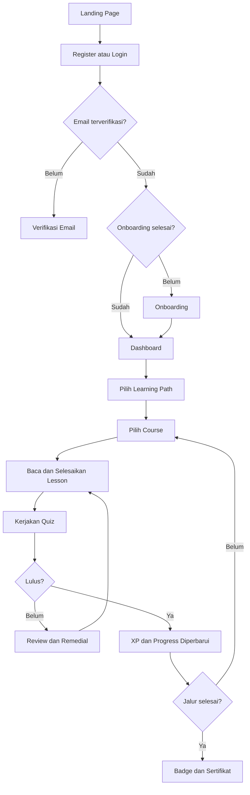

# Product Requirements Document
# Cyber Academy AI

## 1. Informasi Dokumen

| Bagian | Isi |
|--------|-----|
| Nama Produk | Cyber Academy AI |
| Jenis Produk | Aplikasi web pembelajaran cybersecurity |
| Platform | Web responsif berbasis React, TypeScript, Vite, Express, dan Firebase |
| Pengembang | Tidak dicantumkan di dalam source project |
| Status | Sudah dapat dibangun dan dijalankan, dengan beberapa fitur yang masih memiliki batasan |
| Versi Dokumen | 1.0 |
| Tanggal | 1 Agustus 2026 |

Dokumen ini dibuat dari audit ZIP project terbaru. README bukan satu-satunya acuan; route, komponen, service, data awal, konfigurasi Firebase, API Express, dan pengujian juga diperiksa.

## 2. Ringkasan Produk

Cyber Academy AI adalah aplikasi web untuk belajar cybersecurity secara bertahap. Materi disusun dalam tiga jalur, yaitu Pemula, Menengah, dan Lanjutan. Di dalamnya terdapat course, lesson, quiz, serta empat simulasi yang memberi latihan berbasis skenario.

Pengguna utamanya adalah pelajar atau pengguna umum yang ingin belajar dari dasar dan melanjutkan ke materi yang lebih sulit. Aplikasi memberi urutan belajar yang jelas, mengunci materi lanjutan sampai syarat sebelumnya selesai, dan menampilkan kemajuan pengguna.

Hasil belajar dicatat melalui progress, XP, level, streak, badge, riwayat quiz, dan sertifikat penyelesaian jalur. AI Tutor membantu menjawab pertanyaan, sedangkan AI Insight merangkum data belajar dan memberi saran lanjutan.

Data akun memakai Firebase Authentication. Profil disimpan di Firestore, avatar memakai Firebase Storage, sedangkan sebagian besar data belajar diakses melalui backend Express agar validasi dan pemberian XP dilakukan di server.

## 3. Latar Belakang

Materi cybersecurity dapat terasa rumit bagi pemula karena berisi banyak konsep, istilah, dan jenis ancaman. Jika tidak ada urutan yang jelas, pengguna dapat berpindah materi tanpa memahami dasar yang diperlukan.

Membaca teori saja juga belum cukup untuk melihat apakah materi sudah dipahami. Pengguna membutuhkan quiz, simulasi kasus, feedback, dan kesempatan mencoba kembali. Selain itu, kemajuan belajar mudah terasa tidak terlihat ketika tidak ada catatan lesson yang selesai atau hasil latihan sebelumnya.

Cyber Academy AI dibuat untuk menggabungkan materi, latihan, pencatatan progress, dan bantuan AI dalam satu aplikasi web. Pendekatan ini membantu pengguna belajar sesuai urutan dan melihat hasil aktivitas yang benar-benar sudah dikerjakan.

## 4. Masalah yang Ingin Diselesaikan

### Masalah 1 — Materi cybersecurity sulit diikuti tanpa urutan

Pengguna pemula dapat kesulitan menentukan materi yang harus dipelajari lebih dulu. Project membantu dengan tiga learning path, urutan course, dan penguncian lesson atau quiz berdasarkan progress sebelumnya.

### Masalah 2 — Pemahaman tidak cukup dinilai dari membaca materi

Pengguna perlu menguji pemahamannya setelah belajar. Setiap course memiliki quiz dengan nilai kelulusan, feedback jawaban, riwayat percobaan, dan rekomendasi lesson untuk dipelajari kembali.

### Masalah 3 — Latihan keamanan sering kurang dekat dengan situasi nyata

Konsep seperti phishing, penipuan WhatsApp, vishing, dan malware lebih mudah dipahami melalui contoh keputusan. Empat simulasi dalam project memberikan skenario, pilihan jawaban, penjelasan risiko, dan tip untuk setiap respons.

### Masalah 4 — Pengguna sulit melihat perkembangan belajarnya

Aplikasi mencatat lesson selesai, hasil quiz, hasil simulasi, XP, level, streak, badge, dan sertifikat. Dashboard dan halaman Progress merangkum data tersebut agar pengguna tahu posisi belajarnya.

### Masalah 5 — Pengguna membutuhkan bantuan saat menemui materi yang belum dipahami

AI Tutor dapat menerima pertanyaan umum, konteks lesson, remedial quiz, dan simulasi. AI Insight menggunakan data belajar pengguna untuk membuat ringkasan dan saran. Fitur AI memiliki batas pemakaian dan tetap dapat gagal jika layanan AI atau konfigurasi server tidak tersedia.

## 5. Tujuan Produk

### 5.1 Tujuan Utama

- Menyediakan jalur belajar cybersecurity dari tingkat Pemula sampai Lanjutan.
- Memastikan pengguna mengikuti urutan belajar melalui syarat penyelesaian lesson, quiz, course, dan learning path.
- Memberi latihan dan feedback melalui quiz serta simulasi.
- Mencatat hasil belajar secara terhubung dengan akun pengguna.
- Memberi bantuan belajar melalui AI Tutor dan AI Insight.

### 5.2 Tujuan Pendukung

- Menjaga motivasi pengguna melalui XP, level, streak, dan badge.
- Memberikan sertifikat internal setelah seluruh syarat sebuah learning path selesai.
- Menyediakan halaman admin untuk mengelola konten dan memantau aktivitas utama.
- Membuat fitur utama tetap dapat digunakan pada layar desktop, tablet, dan mobile.
- Menjaga perubahan progress dan hadiah XP tetap tervalidasi di server serta tidak diberikan dua kali untuk aktivitas yang sama.

Project tidak menetapkan target jumlah pengguna, pendapatan, waktu belajar, atau persentase kelulusan bisnis.

## 6. Batasan Produk

### 6.1 In Scope

- Landing page, halaman informasi, halaman privasi, syarat penggunaan, dan halaman 404.
- Registrasi, login, login Google, verifikasi email, reset password, dan logout.
- Onboarding berisi tujuan belajar, tingkat kemampuan, minat, dan waktu belajar.
- Dashboard, tiga learning path, 25 course, 79 lesson, dan 25 quiz dengan 160 soal.
- Empat simulasi: phishing email, penipuan WhatsApp, vishing call, dan analisis malware dalam sandbox fiktif.
- Progress, XP, lima level, streak, empat badge aktif, dan sertifikat learning path.
- AI Tutor, percakapan AI tersimpan, panel AI pada lesson, remedial AI, dan AI Insight.
- Profil, avatar, pengaturan akun, penggantian email, dan penggantian password.
- Halaman admin untuk pengguna, materi, quiz, simulasi, badge, sertifikat, statistik, dan audit log.
- Backend API Express, Firebase Authentication, Firestore, Firebase Storage, dan integrasi Vertex AI.

### 6.2 Out of Scope

Fitur berikut tidak ditemukan dalam implementasi project:

- pembayaran, langganan, atau marketplace;
- kelas live dan video conference;
- aplikasi Android atau iOS native;
- akun organisasi, kelas perusahaan, atau multi-tenant;
- leaderboard, forum, komunitas, atau pesan antarpengguna;
- push notification dan mode offline/PWA;
- video pembelajaran yang disimpan di dalam project;
- penghapusan akun secara mandiri dari aplikasi;
- penerbitan sertifikat profesi dari lembaga eksternal.

## 7. Target Pengguna

### 7.1 Pengguna Pemula

Pengguna ini membutuhkan pengenalan istilah dan kebiasaan keamanan dasar. Kendala utamanya adalah belum tahu urutan belajar. Bagian yang digunakan adalah onboarding, learning path Pemula, lesson, quiz, simulasi tingkat Pemula, AI Tutor, dan Dashboard.

### 7.2 Pengguna Tingkat Menengah

Pengguna ini sudah memahami dasar dan ingin memperluas pengetahuan serta latihan. Mereka menggunakan learning path Menengah, quiz dengan nilai kelulusan yang lebih tinggi, simulasi vishing, progress, dan AI Tutor untuk membahas bagian yang belum dipahami.

### 7.3 Pengguna Tingkat Lanjut

Pengguna ini membutuhkan materi yang lebih dalam dan latihan yang lebih menantang. Mereka menggunakan learning path Lanjutan, quiz terkait course, simulasi analisis malware, sertifikat, dan riwayat hasil untuk melihat pencapaian.

### 7.4 Admin

Admin bertugas mengelola pengguna dan konten yang disimpan di Firestore. Akses admin membutuhkan Firebase ID token dengan custom claim `admin`. Admin dapat mengelola learning path, course, lesson, quiz dan soal; mengubah status simulasi; melihat badge; mengelola status sertifikat; serta melihat audit log.

## 8. User Persona

| Persona | Latar Belakang | Kebutuhan | Kendala | Fitur yang Membantu |
|---------|-----------------|-----------|---------|---------------------|
| Mahasiswa pemula | Baru mengenal cybersecurity | Urutan materi dari dasar | Banyak istilah baru | Onboarding, jalur Pemula, lesson, AI Tutor |
| Pengguna yang ingin latihan ancaman sosial | Sudah pernah membaca tentang penipuan digital | Mencoba mengambil keputusan dalam skenario | Sulit menilai respons yang tepat | Simulasi phishing, WhatsApp scam, dan vishing beserta feedback |
| Pengguna yang mengejar penyelesaian jalur | Sudah belajar beberapa course | Mengetahui sisa materi dan hasil latihan | Progress tersebar di banyak aktivitas | Dashboard, Progress, XP, badge, dan sertifikat |
| Pengelola konten | Memelihara materi belajar | Mengatur publikasi dan isi konten | Harus menjaga hubungan path, course, lesson, dan quiz | Halaman admin dan validasi backend |

## 9. User Story

### 9.1 Autentikasi

> Sebagai pengguna baru, saya ingin mendaftar memakai email dan password, sehingga saya dapat menyimpan progress pada akun saya.

> Sebagai pengguna, saya ingin masuk dengan akun Google, sehingga saya tidak perlu membuat password baru.

> Sebagai pengguna yang lupa password, saya ingin menerima email reset, sehingga saya dapat mengakses akun kembali.

> Sebagai pemilik akun email/password, saya ingin mengganti email atau password setelah autentikasi ulang, sehingga akun tetap berada dalam kendali saya.

### 9.2 Pembelajaran

> Sebagai pengguna, saya ingin melihat jalur dan course yang tersedia, sehingga saya mengetahui urutan belajar.

> Sebagai pengguna, saya ingin melanjutkan lesson pertama yang belum selesai, sehingga saya tidak perlu mencari posisi terakhir secara manual.

> Sebagai pengguna, saya ingin course berikutnya terkunci sampai syaratnya selesai, sehingga urutan belajar tetap terjaga.

### 9.3 Quiz

> Sebagai pengguna, saya ingin mengerjakan quiz setelah semua lesson course selesai, sehingga pemahaman saya dapat dinilai.

> Sebagai pengguna, saya ingin melihat skor, penjelasan jawaban, dan rekomendasi materi, sehingga saya tahu bagian yang perlu diulang.

### 9.4 Simulasi

> Sebagai pengguna, saya ingin mencoba skenario ancaman digital, sehingga saya dapat berlatih memilih tindakan yang lebih aman.

> Sebagai pengguna, saya ingin mengulang simulasi dan melihat nilai terbaik, sehingga saya dapat memperbaiki hasil.

### 9.5 AI Tutor dan AI Insight

> Sebagai pengguna, saya ingin bertanya kepada AI Tutor dalam konteks materi, sehingga saya mendapat penjelasan tambahan.

> Sebagai pengguna, saya ingin menyimpan riwayat percakapan AI, sehingga diskusi sebelumnya dapat dibuka kembali.

> Sebagai pengguna, saya ingin melihat insight dari data belajar saya, sehingga saya mendapat saran aktivitas berikutnya.

### 9.6 Progress, Badge, dan Sertifikat

> Sebagai pengguna, saya ingin melihat XP, level, streak, dan progress jalur, sehingga perkembangan belajar saya terlihat.

> Sebagai pengguna, saya ingin mendapat badge setelah memenuhi syarat tertentu, sehingga pencapaian saya tercatat.

> Sebagai pengguna, saya ingin menerbitkan dan mengunduh sertifikat setelah satu learning path selesai, sehingga saya mempunyai bukti penyelesaian internal.

### 9.7 Profil

> Sebagai pengguna, saya ingin mengubah nama, bio, dan avatar, sehingga profil saya sesuai dengan identitas yang ingin ditampilkan.

### 9.8 Admin

> Sebagai admin, saya ingin mengelola struktur materi dan status publikasinya, sehingga katalog pengguna tetap teratur.

> Sebagai admin, saya ingin mengubah role atau status akun pengguna dengan pembatasan terhadap akun sendiri, sehingga pengelolaan akses lebih aman.

> Sebagai admin, saya ingin melihat audit log, sehingga perubahan penting dapat ditelusuri.

## 10. Fitur Utama

### 10.1 Landing Page dan Halaman Publik

Landing page dapat dibuka dari `/`. Isinya menjelaskan alur belajar, jalur materi, simulasi, AI, dan gamifikasi, lalu mengarahkan pengguna ke registrasi atau login. Layout menggunakan animasi dan menyesuaikan ukuran layar. Halaman publik lain adalah login, register, lupa password, verifikasi sertifikat, privasi, syarat penggunaan, dan 404.

Chat AI pada landing page hanya demo tampilan dengan jawaban statis dan timer, bukan panggilan Vertex AI. Landing page juga masih menyebut badge lama dan leaderboard mingguan, sedangkan sistem runtime hanya memiliki empat badge aktif dan tidak memiliki leaderboard. Bagian itu perlu dipahami sebagai ketidaksesuaian isi landing, bukan fitur yang tersedia.

### 10.2 Authentication

Pengguna dapat mendaftar dengan nama, email, password, konfirmasi password, dan persetujuan syarat. Password minimal delapan karakter serta harus memiliki huruf besar, huruf kecil, dan angka. Registrasi membuat akun Firebase Auth dan profil Firestore, lalu mengirim email verifikasi. Jika pembuatan profil gagal, akun Auth yang baru dibuat dihapus kembali.

Login mendukung email/password dan Google. Popup Google memiliki fallback redirect jika popup terblokir atau ditutup. Tersedia reset password dan pengiriman ulang verifikasi dengan jeda 60 detik. Kegagalan ditampilkan sebagai pesan yang dapat dibaca pengguna. Penghapusan akun mandiri belum tersedia.

### 10.3 Onboarding

Setelah email terverifikasi, pengguna baru mengikuti lima langkah: sambutan, tujuan belajar, tingkat kemampuan, minat, dan waktu belajar. Pengguna dapat menyelesaikan atau melewati proses dengan nilai bawaan. Setelah itu, route mengarah ke Dashboard.

### 10.4 Dashboard

Dashboard diakses melalui `/dashboard`. Halaman ini menampilkan XP, level, streak, progress jalur aktif, course yang sedang berjalan, tombol lanjut belajar, badge, dan sertifikat. Target lanjut belajar dipilih dari lesson pertama yang belum selesai.

Dashboard mengambil katalog dan beberapa data pengguna dari API. Error katalog memiliki tombol coba lagi. Beberapa kegagalan data progress atau pencapaian hanya dicatat ke console, sehingga halaman dapat tampil sebagian tanpa pesan error khusus.

### 10.5 Jalur Belajar, Course, dan Lesson

Daftar jalur berada di `/learn/paths`. Project memiliki 3 learning path, 25 course, dan 79 lesson. Data sumbernya terbagi menjadi Pemula 4 course/9 lesson, Menengah 10 course/32 lesson, dan Lanjutan 11 course/38 lesson. Saat aplikasi berjalan, katalog yang tampil berasal dari dokumen Firestore berstatus `published` melalui API, bukan langsung dari array data statis di browser.

Jalur setelahnya terkunci sampai jalur sebelumnya selesai. Di dalam jalur, course berikutnya terkunci sampai course sebelumnya selesai. Lesson ditampilkan berurutan dan quiz baru terbuka setelah semua lesson course selesai. Server memeriksa syarat ini kembali ketika pengguna menyelesaikan lesson atau mengirim quiz.

Halaman lesson memiliki pembaca materi, drawer daftar materi, panel AI kontekstual, dan tombol tandai selesai. Penyelesaian lesson bersifat idempoten: aktivitas yang sama tidak menambah XP dua kali. Jika data tidak ditemukan atau API gagal, halaman menampilkan keadaan error atau kosong yang sesuai.

### 10.6 Quiz

Terdapat 25 quiz dengan total 160 soal. Nilai kelulusan sesuai tingkat adalah 70, 75, atau 80. Endpoint soal publik tidak mengirim jawaban benar dan penjelasan sebelum jawaban dikumpulkan. Saat submit, server memeriksa autentikasi, kelengkapan lesson, ID soal, pilihan jawaban, skor, dan kelulusan.

Hasil quiz menampilkan skor, status remedial/hampir lulus/lulus, review jawaban, penjelasan, lesson yang disarankan, riwayat percobaan, dan nilai terbaik. Draft jawaban disimpan di `localStorage` per pengguna dan course. XP kelulusan hanya diberikan pada kelulusan pertama. Detail course dan hasil hampir lulus menampilkan nilai kelulusan dari `passingScore` quiz, sehingga angka di UI mengikuti konfigurasi 70, 75, atau 80.

### 10.7 Simulasi

Daftar simulasi berada di `/simulations`. Empat simulasi masing-masing memiliki lima skenario: phishing email, penipuan WhatsApp, vishing call, dan analisis malware. Pengguna melihat pengantar dan tutorial, memilih jawaban pada tiap skenario, menerima penjelasan risiko dan tip, lalu mendapat skor akhir.

Batas lulus seluruh simulasi adalah 75. Hadiah kelulusan pertama adalah 25, 30, 35, atau 40 XP sesuai simulasi. Server menyimpan riwayat percobaan dan nilai terbaik, serta mencegah XP ganda. Simulasi malware hanya berupa skenario sandbox fiktif; aplikasi tidak menjalankan file malware asli.

### 10.8 AI Tutor

AI Tutor dapat dibuka di `/ai-tutor` dan percakapan tertentu di `/ai-tutor/:conversationId`. Pengguna dapat membuat, memilih, dan menghapus percakapan. Riwayat pesan disimpan melalui backend dan hanya dapat diakses oleh pemilik akun. Konteks yang didukung mencakup pertanyaan umum, lesson, remedial quiz, dan simulasi.

Backend menyaring permintaan yang meminta password, OTP, private key, API key, atau aktivitas berbahaya. Respons AI divalidasi dengan schema sebelum dikirim ke UI. Batas penggunaan tutor adalah 20 permintaan per hari dengan jeda minimum 1,5 detik pada proses server yang sama. Jika layanan AI gagal, fitur belajar utama tetap dapat digunakan.

### 10.9 AI Insight

AI Insight berada di `/progress/insight`. Fitur ini membaca progress, percobaan quiz, dan percobaan simulasi, lalu meminta AI membuat ringkasan serta rekomendasi. Hasil tervalidasi disimpan sementara di `localStorage` berdasarkan UID dan dapat diperbarui manual.

Ada beberapa batasan. Jumlah lesson pada perhitungan insight ditulis tetap sebagai 12, sedangkan katalog source memiliki 79 lesson. Akibatnya, persentase yang dikirim ke AI dapat mencapai 100% terlalu cepat. Jumlah simulasi selesai juga dihitung dari percobaan, bukan simulasi berbeda yang lulus. Tautan rekomendasi masih menuju halaman jalur atau simulasi secara umum dan belum selalu membuka item yang disebut.

### 10.10 Progress, XP, Level, dan Streak

Progress dan XP dihitung melalui transaksi server. ID transaksi dibuat tetap per aktivitas agar penyelesaian ulang tidak memberi hadiah ganda. Level memiliki lima tahap dengan batas 100, 250, 450, dan 700 XP. Streak bertambah pada aktivitas belajar pertama yang menghasilkan reward dalam satu tanggal zona waktu Jakarta; aktivitas pada hari yang sama tidak menambah streak dan jeda hari akan mengulang dari satu.

Halaman Progress menampilkan ringkasan aktivitas dan jalur. Fitur reset meminta teks `RESET_MY_PROGRESS`. Implementasinya menghapus `userProgress` dan `xpTransactions`, lalu mengatur ulang total XP, level, dan streak. Reset tidak menghapus percobaan quiz, ringkasan quiz, percobaan simulasi, badge, sertifikat, atau riwayat AI. Dialog konfirmasi UI menjelaskan kedua bagian tersebut sebelum pengguna melanjutkan.

### 10.11 Badge

Empat badge aktif adalah Beginner Master, Intermediate Master, Advanced Master, dan Simulation Defender. Tiga badge pertama diberikan jika seluruh course, lesson, dan quiz pada jalur terkait selesai. Simulation Defender memerlukan kelulusan pada seluruh empat simulasi aktif. Evaluasi badge bersifat idempoten.

Admin dapat melihat daftar badge dan metadata progress pengguna, tetapi UI admin badge bersifat baca saja. Backend menyediakan perubahan terbatas; empat badge utama dikunci dan badge lama tidak dapat diaktifkan kembali. Tidak ada UI untuk membuat atau menghapus badge.

### 10.12 Sertifikat

Halaman `/certificates` menampilkan kelayakan, sertifikat yang sudah diterbitkan, preview, QR code, dan unduhan PDF. Satu sertifikat dibuat untuk satu pengguna dan satu learning path setelah seluruh course serta quiz pada jalur tersebut selesai. Kode menggunakan pola `CYBER-YYYY-XXXXXX`.

Sertifikat dapat diverifikasi secara publik melalui `/verify/certificate` atau `/verify/certificate/:code`. Hanya data terbatas yang dikembalikan. Admin dapat mencabut dan mengaktifkan kembali sertifikat. Sertifikat merupakan bukti penyelesaian internal aplikasi, bukan sertifikasi profesi dari lembaga luar.

### 10.13 Profil dan Pengaturan

Profil berada di `/profile`, sedangkan pengaturan menggunakan `/settings/profile`, `/settings/account`, dan `/settings/security`. Pengguna dapat mengubah nama, bio, dan avatar. Avatar dibatasi untuk JPEG, PNG, atau WebP dengan ukuran di bawah 2 MB.

Pergantian email dan password tersedia untuk akun berbasis password setelah autentikasi ulang. Pengguna Google diarahkan untuk mengelola kredensial melalui Google. Tidak ada pengaturan notifikasi atau tombol hapus akun.

### 10.14 Admin

Admin memiliki dashboard statistik, daftar pengguna, learning path, course, lesson, quiz, soal, simulasi, badge, sertifikat, dan audit log. Operasi materi memakai validasi Zod, pemeriksaan slug unik, hubungan induk-anak, status publikasi, serta pencegahan penghapusan saat masih mempunyai data anak.

Pengelolaan pengguna dapat mengubah custom claim admin dan status aktif/nonaktif. Admin tidak dapat menurunkan role atau menonaktifkan akunnya sendiri. Daftar pengguna mengambil sampai 100 data secara bawaan dan pencarian dilakukan pada data yang sudah diterima.

Sebagian route variasi seperti `/new`, `/:id`, dan `/:id/edit` diarahkan ke komponen daftar yang sama dan belum selalu membaca parameter URL untuk langsung membuka modal terkait. Pengecualian utamanya adalah editor quiz yang memakai parameter route. UI simulasi hanya menyediakan daftar dan perubahan status, sedangkan UI badge hanya baca. Audit log mencatat tindakan admin yang didukung.

## 11. Kebutuhan Fungsional

| ID | Kebutuhan | Prioritas | Status Implementasi |
|----|-----------|-----------|---------------------|
| FR-AUTH-01 | Pengguna dapat mendaftar dengan email dan password yang memenuhi aturan validasi | Tinggi | Sudah tersedia |
| FR-AUTH-02 | Pengguna dapat login dengan email/password atau Google | Tinggi | Sudah tersedia |
| FR-AUTH-03 | Pengguna dapat memverifikasi email dan meminta pengiriman ulang | Tinggi | Sudah tersedia |
| FR-AUTH-04 | Pengguna dapat mereset password melalui email | Tinggi | Sudah tersedia |
| FR-AUTH-05 | Pengguna dapat menghapus akun secara mandiri | Rendah | Belum tersedia |
| FR-ONBOARD-01 | Pengguna baru dapat mengisi atau melewati onboarding | Sedang | Sudah tersedia |
| FR-LEARN-01 | Pengguna dapat melihat jalur, course, dan lesson berstatus published | Tinggi | Sudah tersedia |
| FR-LEARN-02 | Sistem mengunci jalur, course, lesson, dan quiz sesuai urutan | Tinggi | Sudah tersedia |
| FR-LEARN-03 | Pengguna dapat menandai lesson selesai dan mendapat XP satu kali | Tinggi | Sudah tersedia |
| FR-QUIZ-01 | Pengguna dapat mengerjakan quiz setelah seluruh lesson course selesai | Tinggi | Sudah tersedia |
| FR-QUIZ-02 | Server menilai jawaban dan menyimpan percobaan, skor terbaik, serta kelulusan | Tinggi | Sudah tersedia |
| FR-QUIZ-03 | Hasil menampilkan review, penjelasan, dan saran lesson | Tinggi | Tersedia dengan batasan |
| FR-SIM-01 | Pengguna dapat mengerjakan empat simulasi berbasis skenario | Tinggi | Sudah tersedia |
| FR-SIM-02 | Sistem menyimpan riwayat, nilai terbaik, dan XP kelulusan pertama | Tinggi | Sudah tersedia |
| FR-AI-01 | Pengguna dapat bertanya kepada AI Tutor dengan konteks belajar | Sedang | Tersedia dengan batasan |
| FR-AI-02 | Pengguna dapat membuat, membuka, dan menghapus percakapan AI | Sedang | Sudah tersedia |
| FR-AI-03 | Sistem dapat membuat AI Insight dari data belajar pengguna | Sedang | Tersedia dengan batasan |
| FR-PROGRESS-01 | Sistem mencatat progress, XP, level, dan streak di server | Tinggi | Sudah tersedia |
| FR-PROGRESS-02 | Pengguna dapat mereset progress belajar dan XP sesuai cakupan endpoint | Sedang | Sudah tersedia |
| FR-BADGE-01 | Sistem dapat mengevaluasi dan memberi empat badge aktif | Sedang | Sudah tersedia |
| FR-CERT-01 | Pengguna yang memenuhi syarat dapat menerbitkan satu sertifikat per jalur | Sedang | Sudah tersedia |
| FR-CERT-02 | Sertifikat dapat diverifikasi secara publik dan diunduh sebagai PDF | Sedang | Sudah tersedia |
| FR-PROFILE-01 | Pengguna dapat mengubah nama, bio, dan avatar | Sedang | Sudah tersedia |
| FR-PROFILE-02 | Pengguna password dapat mengganti email dan password setelah autentikasi ulang | Tinggi | Sudah tersedia |
| FR-ADMIN-01 | Admin dapat melihat statistik dan audit log | Sedang | Sudah tersedia |
| FR-ADMIN-02 | Admin dapat mengelola learning path, course, lesson, quiz, dan soal | Tinggi | Sudah tersedia |
| FR-ADMIN-03 | Admin dapat mengelola status pengguna, simulasi, dan sertifikat | Tinggi | Sudah tersedia |
| FR-ADMIN-04 | Admin dapat membuat, mengubah, dan menghapus badge dari UI | Rendah | Belum tersedia |
| FR-ADMIN-05 | Semua route admin detail/edit/new membuka item langsung berdasarkan URL | Sedang | Tersedia dengan batasan |

## 12. Kebutuhan Nonfungsional

### 12.1 Performa

Vite memisahkan bundle React, Firebase, Firestore, Motion, ikon, dan beberapa halaman. Landing Page dan Lesson Detail dimuat secara lazy. Hasil build menunjukkan bundle utama sekitar 588 KB sebelum gzip dan chunk Firestore sekitar 468 KB sebelum gzip, sehingga initial load masih perlu diperhatikan pada koneksi lambat.

Tidak ditemukan aset raster atau video besar di source; sebagian besar visual memakai CSS, SVG, dan ikon. Banyak halaman sudah memiliki skeleton atau loading indicator. Dashboard melakukan beberapa permintaan katalog per jalur dan per course, sehingga jumlah request dapat bertambah mengikuti jumlah konten. Animasi landing cukup banyak, tetapi CSS menyediakan penyesuaian untuk `prefers-reduced-motion`.

### 12.2 Keamanan

Autentikasi menggunakan Firebase Auth dengan persistence lokal. Route pengguna memeriksa status login, verifikasi email, onboarding, dan status akun. Route admin memerlukan custom claim `admin` pada Firebase ID token. Backend memverifikasi token dengan pengecekan revoked token, dan operasi penting divalidasi kembali di server.

Firestore Rules menolak akses langsung secara bawaan. Client hanya dapat membaca dan memperbarui field profil miliknya yang diizinkan; data progress, XP, katalog, quiz, simulasi, badge, sertifikat, AI, dan audit dikelola melalui backend Admin SDK. Storage Rules membolehkan avatar dibaca publik dan hanya dapat ditulis pemilik dengan batas tipe serta ukuran.

Konfigurasi rahasia AI dan Firebase Admin dibaca dari environment, bukan ditanam sebagai nilai tetap dalam kode yang diperiksa. Integrasi AI memiliki penyaringan prompt sensitif, schema respons, timeout, retry, dan rate limit. Walau begitu, project tidak dapat dinyatakan sepenuhnya aman hanya dari audit source; konfigurasi environment dan aturan yang benar tetap harus diterapkan saat dijalankan.

### 12.3 Responsivitas

Komponen memakai breakpoint Tailwind untuk desktop, tablet, dan mobile. Navigasi samping dapat berubah menjadi drawer, tabel admin dapat digeser horizontal, dan konten memakai batas lebar. Drawer mobile mengunci scroll body serta mendukung tombol Escape. Pengujian source menunjukkan desain responsif sudah dipikirkan, tetapi pemeriksaan di berbagai perangkat fisik tetap belum tercatat dalam project.

### 12.4 Accessibility

Source menggunakan `aria-label`, role dialog, atribut progress bar, teks alternatif gambar, focus state, focus trap pada drawer, dukungan Escape, dan pemulihan fokus. Target tombol pada beberapa area juga dibuat cukup besar dan animasi dapat dikurangi.

Batasannya, dokumen HTML masih memakai `lang="en"` meskipun isi utama berbahasa Indonesia. Beberapa dialog masih memakai `alert` atau `confirm` bawaan browser, tabel mobile membutuhkan scroll horizontal, dan tidak ditemukan hasil pengujian screen reader atau audit WCAG formal.

### 12.5 Reliability

Backend memakai transaksi Firestore dan ID transaksi tetap untuk mencegah XP ganda. Input penting divalidasi dengan Zod, API mempunyai rate limit, dan banyak halaman memiliki loading, error, retry, serta empty state. API juga mengembalikan status 404, 409, atau error lain sesuai kondisi yang diperiksa.

Beberapa fetch sekunder hanya menulis error ke console sehingga pengguna bisa melihat data sebagian tanpa penjelasan. Rate limit AI disimpan di memori proses server; nilainya dapat kembali saat proses restart dan tidak terbagi otomatis ke banyak instance. Reset progress juga belum mencakup semua koleksi aktivitas.

### 12.6 Maintainability

Project memakai TypeScript dan memisahkan route backend, service, halaman, komponen, context, serta data katalog. Validasi schema memakai Zod. Pada audit final, typecheck, build production, dan 339 test dalam 36 file berhasil dijalankan.

Bagian yang perlu perhatian adalah beberapa komponen besar, penggunaan tipe `any` pada sebagian area admin dan service, serta keberadaan helper progress berbasis `localStorage` lama yang berdampingan dengan sistem progress backend. Kondisi ini dapat membingungkan saat ada perubahan berikutnya jika sumber data tidak dijaga dengan jelas.

## 13. Alur Pengguna Utama

### 13.1 Alur Registrasi

1. Pengguna membuka `/register`, mengisi nama, email, password, konfirmasi, dan persetujuan syarat.
2. Client memvalidasi form, lalu Firebase Auth membuat akun.
3. Aplikasi membuat profil Firestore dan mengirim email verifikasi.
4. Pengguna membuka link verifikasi, kembali ke aplikasi, lalu status akun dimuat ulang.
5. Pengguna yang sudah terverifikasi masuk ke onboarding sebelum Dashboard.

### 13.2 Alur Login

1. Pengguna membuka `/login` dan memilih email/password atau Google.
2. Firebase Auth memproses login dan aplikasi memuat profil pengguna.
3. Akun belum terverifikasi diarahkan ke halaman verifikasi; akun nonaktif dikembalikan ke login.
4. Pengguna yang belum onboarding diarahkan ke onboarding; pengguna lain masuk ke Dashboard.

### 13.3 Alur Belajar

1. Pengguna membuka Dashboard atau daftar learning path.
2. Pengguna memilih jalur dan course yang tidak terkunci.
3. Pengguna membaca lesson sesuai urutan dan menandainya selesai.
4. Server menyimpan progress serta memberi XP satu kali.
5. Setelah seluruh lesson selesai, quiz course terbuka. Course berikutnya terbuka setelah quiz lulus.

### 13.4 Alur Quiz

1. Pengguna membuka quiz dari course yang lesson-nya sudah selesai.
2. Aplikasi mengambil soal tanpa jawaban benar, lalu menyimpan draft pilihan secara lokal.
3. Pengguna menjawab seluruh soal dan mengirim jawaban.
4. Server memvalidasi serta menghitung skor berdasarkan nilai kelulusan quiz.
5. Hasil, review, rekomendasi lesson, riwayat, dan nilai terbaik ditampilkan. XP diberikan satu kali pada kelulusan pertama.

### 13.5 Alur Simulasi

1. Pengguna memilih satu simulasi dan membaca pengantar.
2. Pengguna menjawab lima skenario secara berurutan.
3. Server memeriksa setiap pilihan dan mengembalikan penjelasan, risiko, serta tip.
4. Setelah selesai, server menyimpan percobaan dan nilai terbaik.
5. Jika skor minimal 75, pengguna dinyatakan lulus dan mendapat XP pada kelulusan pertama.

### 13.6 Alur Mendapatkan Badge atau Sertifikat

1. Sistem mengevaluasi progress setelah aktivitas terkait.
2. Badge jalur diberikan jika semua course, lesson, dan quiz pada jalur selesai. Badge simulasi diberikan setelah empat simulasi lulus.
3. Untuk sertifikat, pengguna membuka halaman Certificates setelah sebuah learning path lengkap.
4. Server memeriksa kelayakan dan membuat satu sertifikat untuk jalur tersebut.
5. Pengguna dapat melihat, mengunduh PDF, atau membagikan kode verifikasi publik.

### 13.7 Alur Penggunaan AI Tutor

1. Pengguna membuka AI Tutor atau panel AI pada lesson/remedial.
2. Pengguna membuat percakapan atau memilih percakapan yang ada.
3. Backend memverifikasi identitas, kepemilikan konteks, batas penggunaan, dan keamanan prompt.
4. Vertex AI menghasilkan jawaban yang kemudian divalidasi oleh backend.
5. Pada AI Tutor utama, pertanyaan dan jawaban disimpan ke riwayat percakapan. Jika AI gagal, aplikasi menampilkan error tanpa mengubah progress belajar.

## 14. Diagram Alur

Simulasi dan AI Tutor dapat dibuka dari area pengguna setelah login. Keduanya mendukung proses belajar, tetapi tidak menggantikan syarat lesson dan quiz pada learning path.

## 15. Route dan Hak Akses

| Kelompok | Route | Akses dan Catatan |
|----------|-------|-------------------|
| Publik | `/`, `/login`, `/register`, `/forgot-password`, `/privacy`, `/terms`, `/verify/certificate`, `/verify/certificate/:code` | Dapat dibuka tanpa login; pengguna yang sudah siap masuk akan diarahkan dari halaman auth ke Dashboard |
| Verifikasi | `/verify-email` | Hanya untuk pengguna login yang emailnya belum terverifikasi |
| Onboarding | `/onboarding` | Untuk pengguna login, terverifikasi, dan belum menyelesaikan onboarding |
| Belajar | `/dashboard`, `/learn/paths`, `/learn/paths/:pathSlug`, `/learn/courses/:courseSlug`, route lesson, quiz, dan hasil quiz | Membutuhkan login, email terverifikasi, akun aktif, dan onboarding selesai |
| Aktivitas | `/simulations`, `/simulations/:simulationId`, `/progress`, `/progress/insight` | Proteksi pengguna yang sama |
| AI | `/ai-tutor`, `/ai-tutor/:conversationId` | Proteksi pengguna yang sama; respons membutuhkan konfigurasi AI backend |
| Pencapaian | `/badges`, `/certificates` | Proteksi pengguna yang sama |
| Akun | `/profile`, `/settings`, `/settings/profile`, `/settings/account`, `/settings/security` | Proteksi pengguna yang sama |
| Admin | `/admin` dan route users, learning-paths, courses, lessons, quizzes, simulations, badges, certificates, serta audit-logs | Membutuhkan custom claim admin; sebagian route detail/edit/new masih membuka halaman daftar umum |
| Fallback | `/home`, `*` | `/home` kembali ke `/`; route lain yang tidak dikenal membuka 404 |

Proteksi UI bukan satu-satunya pengaman. Endpoint data pengguna memverifikasi Firebase ID token, sedangkan endpoint admin juga memeriksa custom claim admin.

## 16. Data dan Integrasi

### 16.1 Struktur Konten yang Ditemukan

| Jalur | Course | Lesson | Quiz | Soal | Reward Jalur | Badge |
|-------|-------:|-------:|-----:|-----:|-------------:|-------|
| Pemula | 4 | 9 | 4 | 20 | 300 XP | Beginner Master |
| Menengah | 10 | 32 | 10 | 65 | 500 XP | Intermediate Master |
| Lanjutan | 11 | 38 | 11 | 75 | 800 XP | Advanced Master |
| Total | 25 | 79 | 25 | 160 | — | 3 badge jalur |

Badge aktif keempat adalah Simulation Defender. Reward lesson berada pada 10, 15, 25, atau 30 XP sesuai data lesson. Reward quiz berada pada 30, 35, 40, 50, 60, atau 75 XP. Pemberian reward runtime mengikuti konfigurasi dokumen yang dipublikasikan di Firestore.

### 16.2 Koleksi Firestore

Koleksi yang digunakan adalah `users`, `learningPaths`, `courses`, `lessons`, `quizzes`, `questions`, `userProgress`, `xpTransactions`, `quizAttempts`, `quizSummaries`, `simulations`, `simulationAttempts`, `badges`, `userBadges`, `certificates`, `aiConversations`, `aiMessages`, dan `adminAuditLogs`.

Profil dasar dapat diakses langsung oleh pemilik sesuai Firestore Rules. Koleksi belajar dan admin hanya diakses melalui backend. Avatar disimpan pada Firebase Storage.

### 16.3 Backend API

Backend menyediakan kelompok endpoint berikut:

- katalog publik untuk learning path, course, dan lesson berstatus published;
- progress pengguna, transaksi XP, penyelesaian lesson, dan reset progress;
- pengambilan quiz, soal tanpa kunci jawaban, submit attempt, hasil, dan summary;
- daftar simulasi, pemeriksaan jawaban, serta penyimpanan attempt;
- badge, sertifikat, kelayakan, verifikasi publik, dan unduhan;
- AI Tutor, AI Insight, percakapan, pesan, dan penyimpanan exchange;
- CRUD admin untuk materi dan quiz, serta pengelolaan pengguna, simulasi, badge, sertifikat, statistik, dan audit log.

Endpoint global lesson berdasarkan slug sudah didepresiasi dengan status 410. Aplikasi menggunakan pasangan slug course dan lesson agar slug lesson tidak dianggap unik secara global.

### 16.4 Firebase dan Vertex AI

Firebase client mengambil konfigurasi dari environment `VITE_*` atau file konfigurasi applet. Firebase Admin menggunakan credential bawaan lingkungan atau service account JSON dari environment. Database Firestore dapat dipilih melalui konfigurasi database ID.

Provider AI bawaan adalah Vertex AI dengan lokasi bawaan `global` dan model bawaan `gemini-2.5-flash`. Project juga mempunyai pilihan provider Gemini API, tetapi pemakaian Vertex membutuhkan project Google Cloud dan credential server yang benar. Credential tidak dikirim ke browser.

## 17. Kriteria Penerimaan

### 17.1 Autentikasi dan Akses

- Registrasi valid membuat akun Auth dan profil Firestore, lalu meminta verifikasi email.
- Form menolak nama terlalu pendek, email tidak valid, password yang tidak memenuhi aturan, konfirmasi berbeda, atau syarat yang belum disetujui.
- Pengguna belum terverifikasi tidak dapat membuka route belajar.
- Pengguna yang belum onboarding diarahkan ke onboarding.
- Akun nonaktif tidak dapat melanjutkan sesi pengguna.
- Route admin menolak pengguna tanpa custom claim admin, baik di UI maupun API.

### 17.2 Pembelajaran dan Quiz

- Katalog pengguna hanya menampilkan dokumen Firestore berstatus published.
- Course dan lesson hanya dapat diselesaikan sesuai urutan yang ditetapkan.
- Menyelesaikan lesson yang sama berulang kali tidak menambah XP lagi.
- Quiz tidak dapat dikirim sebelum semua lesson course selesai.
- Kunci jawaban tidak dikirim bersama daftar soal sebelum submit.
- Server menolak soal, opsi, atau payload quiz yang tidak sesuai.
- Quiz lulus jika skor mencapai nilai kelulusan milik quiz, lalu XP hanya diberikan pada kelulusan pertama.
- Hasil quiz dapat dibuka kembali oleh pemilik attempt dan tidak dapat dibaca pengguna lain.

### 17.3 Simulasi dan Pencapaian

- Setiap simulasi menampilkan lima skenario dan feedback setelah jawaban diperiksa server.
- Skor 75 atau lebih dinyatakan lulus, dan XP hanya diberikan sekali per simulasi.
- Badge jalur hanya diberikan setelah seluruh syarat jalur terpenuhi.
- Simulation Defender hanya diberikan setelah empat simulasi aktif lulus.
- Sertifikat hanya dapat dibuat setelah seluruh course dan quiz dalam jalur selesai.
- Kode sertifikat aktif dapat diverifikasi publik; sertifikat revoked menampilkan status yang sesuai.

### 17.4 AI

- Endpoint AI hanya menerima Firebase ID token yang valid.
- Percakapan hanya dapat dibaca atau dihapus oleh pemiliknya.
- Prompt yang meminta data rahasia atau bantuan berbahaya ditolak.
- Respons AI yang tidak sesuai schema tidak langsung diteruskan ke UI.
- Saat quota, timeout, atau provider gagal, pengguna menerima error dan data progress tidak berubah.

### 17.5 Profil, Data, dan Tampilan

- Pengguna hanya dapat mengubah field profil yang diizinkan untuk akunnya sendiri.
- Upload avatar menolak format selain JPEG/PNG/WebP dan ukuran 2 MB atau lebih.
- Pergantian email atau password meminta autentikasi ulang sesuai provider akun.
- Halaman utama tetap dapat digunakan pada desktop, tablet, dan mobile tanpa elemen navigasi utama hilang.
- Loading, data kosong, dan kegagalan API utama menampilkan keadaan yang dapat dipahami atau pilihan mencoba kembali.

### 17.6 Admin

- Perubahan materi admin divalidasi, slug unik dijaga, dan data induk yang masih memiliki anak tidak dapat dihapus sembarangan.
- Admin tidak dapat menonaktifkan atau menurunkan role akunnya sendiri.
- Tindakan admin yang didukung tercatat pada audit log.
- Perubahan status publikasi memengaruhi data katalog yang dapat dilihat pengguna.

## 18. Keterbatasan dan Temuan Audit

1. AI Insight masih memakai angka tetap 12 lesson, bukan total katalog 79 lesson, dan perhitungan simulasi memakai jumlah attempt.
2. Reset progress hanya membersihkan progress serta transaksi XP; attempt, badge, sertifikat, dan riwayat AI tetap ada.
3. Landing page menyebut badge lama dan leaderboard mingguan yang tidak ada pada sistem runtime. Demo chat di landing juga bukan AI aktif.
4. Sebagian route admin detail/edit/new belum membuka item sesuai parameter URL; banyak operasi tetap dilakukan melalui modal pada halaman daftar.
5. UI admin simulasi hanya mengubah status, UI badge hanya baca, dan tidak ada editor skenario simulasi.
6. Rate limit AI berada di memori satu proses server, sehingga tidak menjadi quota global jika aplikasi memakai beberapa instance.
7. Beberapa kegagalan fetch sekunder hanya dicatat ke console dan dapat membuat halaman tampil dengan data sebagian.
8. Halaman HTML masih memakai bahasa dokumen Inggris meskipun isi aplikasi berbahasa Indonesia.
9. Penghapusan akun mandiri, leaderboard, notifikasi, dan aplikasi mobile native tidak tersedia.

Temuan di atas adalah kondisi implementasi saat ZIP diaudit. PRD ini tidak menganggap teks promosi, route alias, atau konfigurasi yang belum aktif sebagai fitur yang sudah selesai.

## 19. Hasil Verifikasi Source

Audit mencakup route frontend, route backend, komponen halaman, service, data katalog, Firebase Rules, Storage Rules, autentikasi, proteksi role, progress dan XP, quiz, simulasi, badge, sertifikat, AI, halaman admin, serta keadaan loading/error/empty. Pemeriksaan teknis pada source menghasilkan:

- TypeScript typecheck: berhasil;
- 36 file test dengan total 339 test: seluruhnya berhasil;
- build production client dan server: berhasil.

Hasil tersebut menunjukkan source dapat melewati pemeriksaan otomatis yang tersedia. Hasil ini bukan pengganti pengujian deployment, konfigurasi layanan cloud, perangkat fisik, keamanan eksternal, atau accessibility formal karena hal-hal tersebut tidak dijalankan dalam audit ini.
