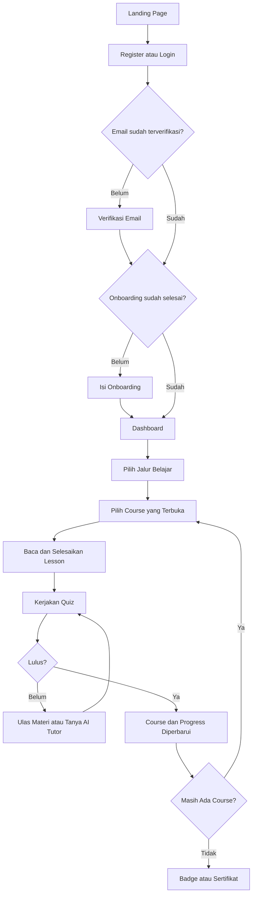

# Project Concept
# Cyber Academy AI

## 1. Identitas Project

| Bagian | Isi |
|--------|-----|
| Nama Project | Cyber Academy AI |
| Jenis Project | Aplikasi web pembelajaran keamanan siber |
| Platform | Web responsif untuk desktop, tablet, dan mobile |
| Bidang | Edukasi keamanan siber dan literasi digital |
| Target Pengguna | Pelajar, mahasiswa, masyarakat umum, serta pengguna yang ingin belajar keamanan siber secara bertahap |
| Status Project | Sudah memiliki alur pengguna, materi, evaluasi, simulasi, AI, pencatatan progress, dan panel admin; build dan test pada source ini berhasil |
| Pengembang | Salman Fidinillah |

Cyber Academy AI dikembangkan untuk FTI Festival 2026 pada kategori Web Development. Identitas pengembang dan tujuan lomba tersebut tercantum langsung pada footer aplikasi.

## 2. Ringkasan Ide

Cyber Academy AI adalah aplikasi web untuk belajar keamanan siber secara bertahap. Pengguna belajar melalui tiga jalur, yaitu Beginner, Intermediate, dan Advanced. Setiap jalur berisi course, lesson, serta quiz yang harus diselesaikan secara berurutan.

Project ini ditujukan untuk pengguna yang merasa materi keamanan siber masih rumit atau belum tahu harus mulai dari mana. Isi pembelajaran dibuat dalam bentuk materi terstruktur, contoh kasus, tips keamanan, poin penting, evaluasi quiz, dan latihan simulasi defensif.

Pengguna dapat melihat perkembangan belajar melalui Dashboard dan halaman Progress. Sistem juga mencatat XP, level, streak harian, badge, serta sertifikat berdasarkan pencapaian yang benar-benar telah dipenuhi.

AI Tutor dipakai untuk membantu menjelaskan materi, mendampingi remedial quiz, dan membahas konteks simulasi. AI Insight memakai data progress, hasil quiz, dan hasil simulasi untuk membuat ringkasan belajar serta saran fokus berikutnya.

## 3. Latar Belakang

Keamanan siber sering terasa sulit bagi orang yang baru mulai belajar. Banyak istilah teknis muncul tanpa urutan yang jelas, sehingga pengguna bisa bingung memilih materi dasar yang perlu dipahami lebih dahulu.

Membaca teori saja juga belum cukup untuk melatih kewaspadaan. Pengguna perlu mencoba mengambil keputusan pada situasi seperti email phishing, penipuan melalui chat, telepon palsu, dan tanda perilaku malware. Latihan tersebut perlu dibuat aman agar tidak memakai target, malware, atau serangan nyata.

Selain materi dan latihan, pengguna membutuhkan tanda perkembangan yang mudah dilihat. Tanpa progress yang tercatat, pengguna sulit mengetahui lesson yang sudah selesai, course yang sudah lulus, serta bagian yang masih perlu diulang.

Project ini menggabungkan alur belajar, evaluasi, simulasi, pencatatan pencapaian, dan bantuan AI dalam satu aplikasi web. Seluruh materi Advanced dan AI Tutor diarahkan pada pembelajaran defensif, legal, dan berizin.

## 4. Masalah yang Dihadapi Pengguna

### Masalah 1 — Bingung Memulai Belajar Cybersecurity

Pengguna pemula dapat menemukan banyak materi keamanan siber, tetapi belum tentu tahu urutan belajarnya. Jika materi dasar dan lanjutan bercampur, pengguna bisa melewatkan fondasi penting atau berhenti karena merasa terlalu sulit.

### Masalah 2 — Materi Terasa Terlalu Teknis

Istilah keamanan siber dapat sulit dipahami jika hanya diberikan sebagai definisi. Pengguna membutuhkan penjelasan yang lebih sederhana, contoh kasus, tips, dan rangkuman agar materi dapat dihubungkan dengan penggunaan internet sehari-hari.

### Masalah 3 — Kurang Latihan Mengambil Keputusan

Pengguna perlu berlatih mengenali tanda ancaman, bukan hanya menghafal teori. Tanpa latihan, pengguna mungkin memahami arti phishing tetapi masih ragu saat menghadapi pesan, panggilan, atau file yang mencurigakan.

### Masalah 4 — Tidak Mengetahui Perkembangan Belajar

Pengguna dapat kehilangan arah jika tidak tahu lesson mana yang sudah selesai, quiz mana yang sudah lulus, atau jalur mana yang masih terkunci. Progress yang tidak terlihat juga membuat langkah berikutnya kurang jelas.

### Masalah 5 — Sulit Mendapat Penjelasan Tambahan

Satu penjelasan materi belum tentu cocok untuk semua pengguna. Ketika jawaban quiz salah atau ada konsep yang belum dipahami, pengguna membutuhkan tempat untuk bertanya dengan konteks yang sesuai.

### Masalah 6 — Motivasi Belajar Mudah Turun

Belajar secara mandiri membutuhkan dorongan yang terlihat. Jika tidak ada pencapaian kecil, pengguna bisa merasa tidak berkembang meskipun sudah menyelesaikan beberapa materi.

## 5. Ide Solusi

Cyber Academy AI menyusun materi dalam jalur Beginner, Intermediate, dan Advanced. Jalur dan course dibuka secara berurutan. Pengguna harus menyelesaikan jalur sebelumnya untuk membuka jalur berikutnya, serta lulus course sebelumnya untuk membuka course setelahnya.

Setiap course memiliki lesson yang dapat dibaca satu per satu. Lesson memuat tujuan, isi materi, contoh kasus, tips keamanan, dan poin penting. Setelah semua lesson pada course selesai, quiz course terbuka. Course baru dinyatakan selesai setelah pengguna lulus quiz.

Empat simulasi memberi latihan defensif melalui skenario fiktif. Pengguna membaca konteks dan bukti, memilih tindakan, menerima feedback, lalu melihat hasil. Simulasi tidak menjalankan malware atau serangan nyata.

Dashboard menampilkan ringkasan XP, level, streak, jalur aktif, badge, sertifikat, serta rekomendasi lesson berikutnya. Halaman Progress menampilkan perkembangan lesson, course, jalur, riwayat XP, hasil quiz, dan hasil simulasi.

AI Tutor menyediakan percakapan umum dan percakapan berkonteks lesson, remedial, atau simulasi. AI Insight menganalisis data belajar yang dikirim aplikasi dan memberi ringkasan, topik yang kuat, bagian yang perlu ditingkatkan, rekomendasi, serta tips belajar.

XP diberikan satu kali untuk penyelesaian lesson, kelulusan pertama quiz, dan kelulusan pertama simulasi. Pencatatan tersebut dilakukan oleh backend agar pengulangan aktivitas tidak memberikan XP ganda. Badge dan sertifikat juga diperiksa berdasarkan data progress yang tersimpan.

## 6. Tujuan Project

### 6.1 Tujuan Utama

Tujuan utama Cyber Academy AI adalah membantu pengguna mempelajari keamanan siber melalui alur yang terarah, latihan yang aman, dan perkembangan belajar yang dapat dilihat.

### 6.2 Tujuan Pendukung

- Menyusun materi dari tingkat Beginner sampai Advanced.
- Memberi penjelasan melalui lesson, contoh kasus, tips, dan rangkuman.
- Menguji pemahaman melalui quiz pada setiap course.
- Memberi latihan pengambilan keputusan melalui simulasi defensif.
- Membantu pengguna melihat progress lesson, course, dan jalur belajar.
- Menambah motivasi melalui XP, level, streak, dan badge.
- Memberi sertifikat setelah seluruh syarat jalur terpenuhi.
- Menyediakan AI Tutor untuk pertanyaan tambahan dan remedial.
- Menyediakan AI Insight berdasarkan aktivitas belajar pengguna.
- Membuat pembelajaran dapat digunakan melalui web pada ukuran layar yang berbeda.

## 7. Target Pengguna

### 7.1 Pemula yang Baru Mengenal Cybersecurity

Kelompok ini membutuhkan urutan belajar yang jelas dan penjelasan dasar. Fitur yang paling membantu adalah jalur Beginner, lesson, contoh kasus, quiz, serta AI Tutor.

### 7.2 Pelajar dan Mahasiswa

Pelajar dan mahasiswa membutuhkan materi yang dapat dipelajari mandiri, latihan, serta catatan pencapaian. Dashboard, Progress, quiz, badge, dan sertifikat membantu mereka mengikuti perkembangan belajar.

### 7.3 Pengguna Tingkat Menengah dan Lanjutan

Pengguna yang sudah memahami dasar dapat melanjutkan ke jalur Intermediate dan Advanced. Jalur ini baru terbuka setelah prasyarat sebelumnya selesai sehingga urutan pembelajaran tetap terjaga.

### 7.4 Pengguna yang Ingin Berlatih Menghadapi Ancaman Digital

Kelompok ini membutuhkan latihan yang lebih dekat dengan situasi sehari-hari. Empat simulasi membantu mereka berlatih mengenali email phishing, scam melalui WhatsApp, vishing, dan indikator malware dalam skenario fiktif.

### 7.5 Administrator

Administrator membutuhkan akses untuk mengelola pengguna dan konten. Panel admin menyediakan statistik, pengguna, learning path, course, lesson, quiz, question, simulasi, daftar badge, sertifikat, dan audit log. Akses admin diperiksa melalui custom claim Firebase, bukan hanya nilai role yang tampil pada profil.

## 8. User Persona Singkat

| Persona | Latar Belakang | Tujuan | Kendala | Fitur yang Membantu |
|---------|-----------------|--------|---------|---------------------|
| Mahasiswa Pemula | Menggunakan internet setiap hari tetapi belum pernah belajar keamanan siber secara terarah | Memahami dasar perlindungan akun dan data | Bingung memilih materi awal dan istilah terasa teknis | Jalur Beginner, lesson, quiz, AI Tutor |
| Pengguna Tingkat Menengah | Sudah memahami password, phishing, dan privasi dasar | Mempelajari pertahanan jaringan, aplikasi, malware, dan topik lanjutan | Membutuhkan urutan materi dan evaluasi yang jelas | Jalur Intermediate, progress course, quiz, remedial |
| Pengguna yang Ingin Praktik | Lebih mudah belajar melalui contoh situasi | Melatih keputusan saat menemukan ancaman digital | Tidak memiliki tempat latihan yang aman | Simulasi defensif, feedback per tahap, riwayat skor |
| Administrator Konten | Bertugas menjaga pengguna dan materi aplikasi | Memperbarui katalog serta memantau status sistem | Membutuhkan akses khusus dan catatan perubahan | Panel admin, pengelolaan konten, status akun, audit log |

## 9. Nilai Utama Produk

### 9.1 Belajar Bertahap

Tiga jalur dan course disusun berurutan. Penguncian jalur dan course diperiksa pada tampilan serta backend sehingga pengguna mengikuti prasyarat yang sudah ditentukan.

### 9.2 Teori dan Latihan dalam Satu Aplikasi

Pengguna tidak hanya membaca lesson. Pemahaman diuji melalui quiz dan dilatih melalui empat simulasi defensif dengan feedback pada setiap keputusan.

### 9.3 Bantuan AI yang Berkonteks

AI Tutor dapat menerima konteks lesson, topik remedial, dan detail simulasi. Sistem menolak permintaan yang berbahaya, percobaan manipulasi prompt, serta input yang terdeteksi mengandung credential sensitif.

### 9.4 Progress yang Terlihat

Progress lesson, course, dan jalur disimpan di Firestore melalui backend. Dashboard dan halaman Progress menyajikan data tersebut bersama XP, level, streak, quiz, simulasi, badge, dan sertifikat.

### 9.5 Pencapaian Berdasarkan Data Belajar

Empat badge milestone diberikan setelah persyaratan dipenuhi. Sertifikat jalur hanya dapat diterbitkan ketika seluruh course selesai dan seluruh quiz pada jalur tersebut lulus. Sertifikat memiliki kode verifikasi, halaman verifikasi publik, QR code, dan unduhan PDF.

### 9.6 Tampilan Ramah untuk Berbagai Ukuran Layar

Aplikasi memakai layout responsif, sidebar desktop yang dapat diciutkan, drawer pada mobile, kartu yang menyesuaikan ukuran layar, serta dukungan pengurangan animasi melalui preferensi `prefers-reduced-motion`.

## 10. Fitur Utama

### 10.1 Landing Page

Landing Page menjelaskan ide pembelajaran, fitur, masalah dan solusi, langkah mulai belajar, jalur belajar, simulasi, preview AI Tutor, gamifikasi, FAQ, serta ajakan untuk mendaftar atau login. Preview AI pada halaman ini memakai jawaban contoh lokal, bukan permintaan ke Vertex AI.

### 10.2 Registrasi dan Login

Pengguna dapat mendaftar dan login dengan email/password atau Google. Registrasi email membuat profil Firestore, mengirim verifikasi email, lalu mengarahkan pengguna ke halaman verifikasi. Tersedia juga pengiriman ulang verifikasi, pemeriksaan status verifikasi, logout, dan reset password.

### 10.3 Onboarding

Setelah akun terverifikasi, pengguna yang belum menyelesaikan onboarding diminta mengisi tujuan belajar, tingkat kemampuan, minat, dan waktu belajar. Data tersebut disimpan pada profil dan dipakai untuk menampilkan fokus belajar di Dashboard.

### 10.4 Dashboard

Dashboard menjadi ringkasan utama setelah login. Halaman ini menampilkan rekomendasi lesson berikutnya, total XP, level, streak, progress jalur aktif, jumlah badge, status sertifikat, daftar course pada jalur aktif, serta akses ke AI Insight dan AI Tutor.

### 10.5 Jalur Belajar

Tersedia tiga jalur belajar dengan susunan berikut:

| Jalur | Jumlah Course |
|-------|--------------:|
| Beginner | 4 |
| Intermediate | 10 |
| Advanced | 11 |
| Total | 25 |

Secara keseluruhan source memuat 79 lesson, 25 quiz, dan 160 question. Jalur berikutnya terkunci sampai jalur sebelumnya selesai.

### 10.6 Course dan Lesson

Setiap course menampilkan deskripsi, hasil belajar, durasi, reward XP, daftar lesson, dan status progress. Lesson dibaca melalui tampilan satu kolom dengan daftar materi pada drawer. Pengguna dapat menandai lesson selesai dan membuka AI Tutor dengan konteks lesson tersebut.

Penyelesaian lesson diperiksa backend. Sistem memperbarui progress lesson, menghitung progress course dan jalur, memberikan XP satu kali, memperbarui level, serta mencatat streak berdasarkan tanggal Asia/Jakarta.

### 10.7 Quiz

Setiap course memiliki satu quiz. Quiz baru terbuka setelah seluruh lesson pada course selesai. Jawaban diperiksa di backend, sedangkan kunci jawaban tidak dikirim pada endpoint daftar question.

Hasil quiz menampilkan skor, status lulus, hampir lulus, atau perlu remedial, pembahasan soal, lesson yang disarankan, skor terbaik, dan riwayat percobaan. XP hanya diberikan pada kelulusan pertama. Course dinyatakan selesai setelah quiz lulus.

### 10.8 Simulasi

Tersedia empat simulasi aktif:

- Detektif Email Phishing.
- WhatsApp Scam dan Kurir Paket Palsu.
- Vishing: Telepon CS Bank Gadungan.
- Sandbox Analisis Malware Dasar.

Setiap simulasi memiliki tutorial, beberapa skenario, pilihan tindakan, feedback, skor, batas kelulusan 75, riwayat percobaan, dan reward XP pada kelulusan pertama. Seluruh skenario bersifat fiktif dan defensif.

### 10.9 AI Tutor

AI Tutor mendukung percakapan umum, lesson, remedial, dan simulasi. Percakapan serta pesan disimpan pada koleksi Firestore milik pengguna. Pengguna dapat membuat, membuka, melanjutkan, dan menghapus percakapan.

Backend membatasi panjang input dan frekuensi penggunaan. Sistem menyaring credential, menghapus OTP yang terdeteksi, menolak permintaan ofensif, dan menolak instruksi untuk membocorkan prompt atau memanipulasi XP.

### 10.10 AI Insight

AI Insight mengambil progress keseluruhan, jumlah lesson selesai, hasil quiz terbaru, dan hasil simulasi terbaru. Hasilnya berupa ringkasan, topik yang sudah kuat, bagian yang perlu diperbaiki, rekomendasi, dan tips belajar. AI Insight hanya tersedia bagi pengguna yang sudah login.

### 10.11 Progress, XP, Level, dan Streak

Halaman Progress menyatukan progress jalur, course, lesson, transaksi XP, quiz, dan simulasi. XP dicatat sebagai transaksi yang memiliki sumber dan kunci idempotensi.

Level terdiri dari level 1 sampai 5 dengan ambang XP yang ditentukan backend. Streak bertambah ketika pengguna memperoleh reward belajar pada hari berikutnya dan kembali ke 1 jika jeda lebih dari satu hari. Perhitungan tanggal memakai zona waktu Asia/Jakarta.

Pengguna juga dapat menyetel ulang progress belajar dari halaman Progress. Reset menghapus penyelesaian materi dan transaksi XP, lalu mengembalikan XP, level, dan streak ke nilai awal. Riwayat kuis, simulasi, badge, sertifikat, dan AI tetap dipertahankan serta dijelaskan pada dialog konfirmasi.

### 10.12 Badge

Terdapat empat badge milestone aktif:

| Badge | Syarat |
|-------|--------|
| Beginner Master | Menyelesaikan seluruh course dan lesson Beginner serta lulus seluruh quiz wajib |
| Intermediate Master | Menyelesaikan seluruh course dan lesson Intermediate serta lulus seluruh quiz wajib |
| Advanced Master | Menyelesaikan seluruh course dan lesson Advanced serta lulus seluruh quiz wajib |
| Simulation Defender | Lulus seluruh simulasi aktif yang diwajibkan |

Progress badge dihitung dari data server. Definisi badge lama tetap disimpan sebagai legacy dan tidak menjadi badge aktif.

### 10.13 Sertifikat

Sertifikat tersedia untuk setiap jalur belajar. Pengguna harus menyelesaikan seluruh lesson dan course serta lulus seluruh quiz pada jalur yang dipilih. Simulasi tidak menjadi syarat sertifikat jalur.

Setelah memenuhi syarat, pengguna dapat memasukkan nama penerima dan menerbitkan sertifikat. Sertifikat dapat diunduh sebagai PDF, memiliki QR code, kode verifikasi publik, dan status aktif atau dicabut. Satu pengguna memiliki satu dokumen sertifikat untuk setiap jalur.

### 10.14 Profil dan Pengaturan

Halaman Profil menampilkan data pengguna dan ringkasan belajar. Pada Pengaturan Profil, pengguna dapat mengubah nama, bio, dan avatar. Avatar JPEG, PNG, atau WebP dengan ukuran di bawah 2 MB diunggah ke Firebase Storage.

Pengguna email/password dapat mengganti email setelah autentikasi ulang dan mengganti password. Untuk akun Google, perubahan email dan password utama diarahkan ke pengaturan akun Google. Pengaturan juga menyediakan reset progress belajar.

### 10.15 Admin

Panel admin hanya dapat dibuka oleh akun dengan custom claim `admin`. Fitur yang tersedia meliputi:

- melihat statistik konten, simulasi, sertifikat, dan audit terbaru;
- mencari pengguna, mengubah role, dan mengaktifkan atau menonaktifkan akun;
- membuat, membaca, memperbarui, dan menghapus learning path, course, serta lesson;
- membuat dan mengelola quiz beserta question;
- mempublikasikan atau menjadikan simulasi sebagai draft;
- melihat badge aktif dan badge legacy;
- melihat, mencabut, atau mengaktifkan kembali sertifikat;
- melihat audit log perubahan admin.

## 11. Alur Penggunaan Singkat

Pengguna membuka Landing Page lalu memilih register atau login. Pengguna yang mendaftar melalui email harus memverifikasi email terlebih dahulu. Setelah itu, pengguna baru menyelesaikan onboarding dan masuk ke Dashboard.

Dari Dashboard, pengguna memilih jalur yang sudah terbuka, membuka course pertama, lalu membaca lesson secara berurutan. Setelah seluruh lesson selesai, quiz terbuka. Jika belum lulus, pengguna dapat membaca rekomendasi materi, bertanya kepada AI Tutor, dan mengulang quiz. Jika lulus, course selesai dan course berikutnya terbuka.

Progress, XP, level, dan streak diperbarui oleh backend setelah aktivitas yang memenuhi syarat. Ketika seluruh persyaratan tercapai, pengguna dapat memperoleh badge atau menerbitkan sertifikat jalur.

Simulasi dan AI Tutor juga dapat dibuka langsung dari sidebar setelah pengguna login. AI Insight dibuka dari Dashboard atau halaman Progress.

## 12. Ruang Lingkup Project

Ruang lingkup implementasi saat ini meliputi:

- aplikasi web publik dan area setelah login;
- autentikasi email/password dan Google;
- verifikasi email, reset password, dan onboarding;
- tiga jalur, 25 course, 79 lesson, 25 quiz, dan 160 question;
- penguncian jalur, course, dan quiz berdasarkan prasyarat;
- empat simulasi defensif;
- AI Tutor beserta riwayat percakapan;
- AI Insight berdasarkan data belajar;
- progress, XP, lima level, dan streak harian;
- empat badge milestone;
- sertifikat jalur, PDF, QR code, dan verifikasi publik;
- profil, avatar, pengaturan akun, keamanan, dan reset progress;
- panel admin dan audit log;
- API Express untuk katalog, progress, quiz, simulasi, AI, badge, sertifikat, pengguna, dan konten admin;
- penyimpanan data melalui Firebase Authentication, Firestore, dan Firebase Storage.

## 13. Teknologi yang Digunakan

| Bagian | Teknologi | Penggunaan dalam Project |
|--------|-----------|--------------------------|
| Frontend | React 19, TypeScript | Membangun halaman dan komponen aplikasi |
| Routing | React Router DOM 7 | Route publik, pengguna, admin, parameter course, lesson, quiz, simulasi, dan sertifikat |
| Build Tool | Vite 6, esbuild | Build frontend dan bundle server production |
| Styling | Tailwind CSS 4, CSS | Layout responsif dan gaya neo-brutalist pastel |
| Animasi | Motion | Animasi Landing Page dan transisi komponen |
| Ikon | Lucide React | Ikon navigasi dan tampilan fitur |
| Backend | Express 4, TypeScript | Menyediakan API dan menyajikan hasil build frontend |
| Validasi | Zod | Validasi input API dan output terstruktur AI |
| Autentikasi | Firebase Authentication | Email/password, Google, verifikasi email, reset password, dan ID token |
| Database | Cloud Firestore | Profil, katalog, progress, XP, quiz, simulasi, badge, sertifikat, riwayat AI, dan audit log |
| Penyimpanan File | Firebase Storage | Upload avatar pengguna |
| Akses Server Firebase | Firebase Admin SDK | Verifikasi token, custom claim admin, transaksi, dan akses data server |
| AI | Google Gen AI SDK dengan Vertex AI sebagai provider default | AI Tutor dan AI Insight dengan model default `gemini-2.5-flash` |
| Dokumen | jsPDF, QRCode | Pembuatan PDF sertifikat dan QR code verifikasi |
| Testing | Vitest, Testing Library, Supertest, jsdom | Unit test, component test, dan API test |

Server production membaca environment variable `PORT`, menyajikan folder `dist`, dan dapat digunakan pada lingkungan container seperti Cloud Run. Namun, ZIP ini tidak menyertakan Dockerfile, konfigurasi service Cloud Run, atau pipeline deployment, sehingga status deployment Cloud Run tidak dapat dibuktikan hanya dari source ini.

File `firebase.json` hanya mengatur Firestore rules, Firestore indexes, dan Storage rules. Tidak ada bagian `hosting` atau rewrite ke backend, sehingga Firebase Hosting tidak tercatat sebagai konfigurasi deployment pada ZIP ini.

## 14. Gambaran Data dan Keamanan

Katalog utama disimpan pada collection `learningPaths`, `courses`, `lessons`, `quizzes`, dan `questions`. Data pengguna dan aktivitas belajar disimpan pada `users`, `userProgress`, `xpTransactions`, `quizAttempts`, `quizSummaries`, `simulationAttempts`, `userBadges`, `certificates`, `aiConversations`, dan `aiMessages`.

Client hanya diberi akses langsung ke dokumen profil pengguna sendiri. Katalog, progress, XP, quiz, simulasi, badge, sertifikat, dan riwayat AI diakses melalui API backend yang memakai Firebase Admin SDK. Endpoint pengguna memeriksa Firebase ID token, sedangkan endpoint admin juga memeriksa custom claim admin.

Mutasi penting memakai transaksi Firestore dan kunci idempotensi. Tujuannya agar penyelesaian lesson, quiz, atau simulasi yang sama tidak memberikan XP berulang. Endpoint tertentu juga memakai pembatasan request.

## 15. Batasan Project

- Project hanya menyediakan aplikasi web. Tidak ada aplikasi Android, iOS, atau desktop native di dalam ZIP.
- Katalog saat ini terbatas pada tiga jalur, 25 course, 79 lesson, 25 quiz, 160 question, dan empat simulasi yang tersedia di source.
- Simulasi memakai skenario pilihan tindakan. Project tidak menjalankan serangan, malware, mesin virtual, atau sandbox file nyata.
- AI Tutor dan AI Insight membutuhkan konfigurasi provider AI serta credential server yang benar. Jika AI tidak tersedia, materi, quiz, dan simulasi tetap dapat digunakan, tetapi bantuan AI tidak berjalan.
- Kuota AI pada source disimpan di memori proses server. Kuota tersebut dapat kembali ke kondisi awal ketika instance server dimulai ulang dan tidak dibagikan antarinstance.
- Streak dihitung berdasarkan hari kalender Asia/Jakarta saat pengguna memperoleh reward baru, bukan berdasarkan durasi belajar atau sekadar membuka halaman.
- Sertifikat merupakan sertifikat kelulusan dari aplikasi untuk jalur yang diselesaikan. Source tidak menunjukkan hubungan dengan lembaga sertifikasi profesi eksternal.
- Definisi simulasi berada pada source dan disinkronkan ke Firestore. Panel admin hanya mengubah status publikasi simulasi, bukan menyunting seluruh isi skenario.
- Panel admin badge hanya menampilkan badge aktif dan legacy. Metadata empat badge utama dikunci oleh definisi sistem.
- Source tidak menyertakan Dockerfile, file konfigurasi Cloud Run, atau konfigurasi Firebase Hosting. Karena itu, proses deployment perlu disiapkan di luar ZIP ini.
- Penggunaan penuh bergantung pada koneksi internet, Firebase, Firestore indexes, Storage, serta credential backend.

## 16. Alasan Project Layak Dikembangkan

Cyber Academy AI sudah memiliki hubungan yang jelas antara masalah dan fitur. Pengguna yang bingung memulai diberi jalur berurutan. Pengguna yang membutuhkan latihan mendapat quiz dan simulasi. Pengguna yang kesulitan memahami materi mendapat bantuan AI. Perkembangan belajar dicatat melalui progress dan pencapaian.

Project ini juga sudah mempunyai dasar teknis untuk dikembangkan lebih lanjut. Pemisahan frontend, API, service, validasi, autentikasi, data belajar, dan panel admin membuat perubahan konten dapat dilakukan tanpa mengubah seluruh alur aplikasi.

Pencatatan progress dan reward dilakukan oleh backend, bukan hanya oleh tampilan. Hal ini penting karena XP, kelulusan, badge, dan sertifikat memiliki syarat yang dapat diperiksa dari data pengguna.

Materi dan AI diarahkan pada penggunaan defensif. Simulasi memakai skenario fiktif, sedangkan AI menolak permintaan berbahaya dan data credential. Arah ini sesuai untuk aplikasi edukasi yang digunakan pelajar, mahasiswa, dan masyarakat umum.

## 17. Status Verifikasi Source

Audit dokumen ini dilakukan terhadap ZIP `Cyber-Academy-AI-FINAL-HERO-TOP-LABEL-2026-08-01(12).zip`. Pemeriksaan mencakup struktur project, seluruh route React, komponen publik dan terproteksi, route admin, service frontend, API Express, model data, aturan Firestore dan Storage, konfigurasi AI, serta script build dan test.

Hasil verifikasi pada source tersebut:

- TypeScript check berhasil tanpa error.
- Build production frontend dan server berhasil.
- 36 file test berhasil dijalankan.
- 339 test lulus.
- Tidak ada seed, migrasi, atau deployment yang dijalankan selama audit.

## 18. Penutup

Cyber Academy AI adalah project pembelajaran keamanan siber berbasis web yang menggabungkan materi terarah, evaluasi, simulasi defensif, bantuan AI, dan pencatatan perkembangan belajar. Implementasi saat ini sudah mencakup alur pengguna dari registrasi sampai pencapaian badge dan sertifikat, termasuk pengelolaan konten melalui panel admin.

Project ini masih memiliki batas pada deployment, ketergantungan layanan, bentuk simulasi, dan pengelolaan beberapa konten. Meskipun begitu, dasar produk dan alur belajarnya sudah jelas serta dapat dilanjutkan sesuai kebutuhan pengguna dan hasil evaluasi berikutnya.
