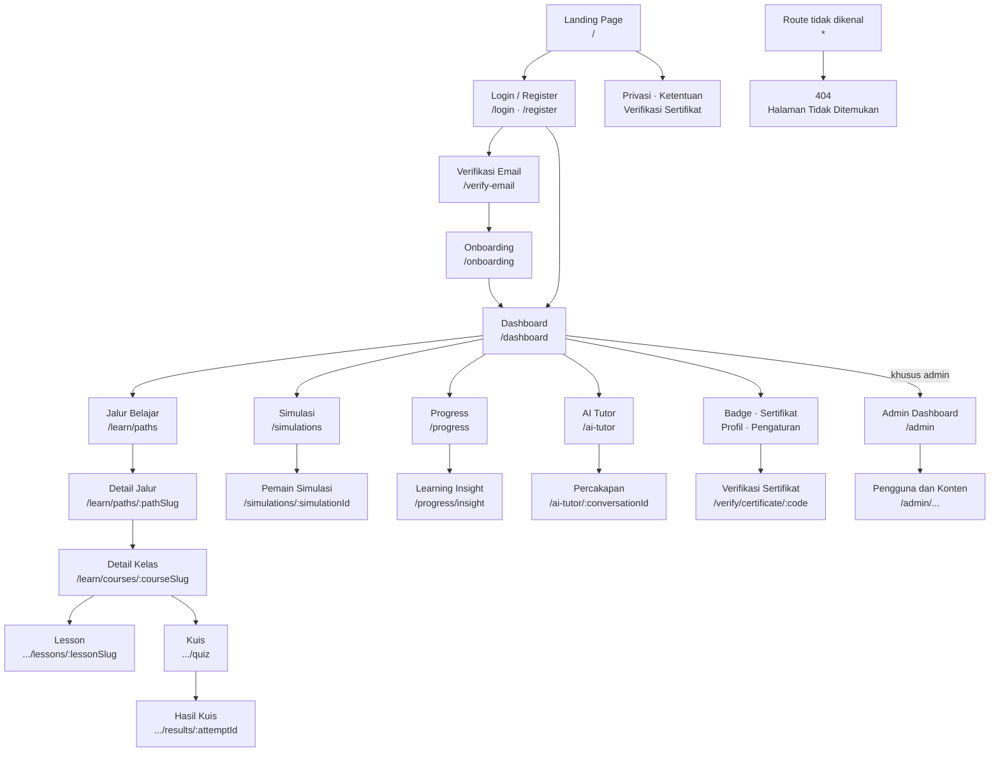

# Sitemap Cyber Academy AI

## 1. Pengantar

Sitemap ini menunjukkan susunan halaman dan hubungan navigasi yang digunakan di Cyber Academy AI. Isinya disusun dari konfigurasi router, komponen halaman, navbar, sidebar, breadcrumb, footer, dan tombol navigasi yang ditemukan di source code project.

Dokumen ini juga membedakan halaman yang bisa dibuka oleh umum, halaman untuk pengguna yang sudah login, serta halaman khusus admin. Route dinamis ditulis memakai nama parameter yang sama seperti di dalam source code.

## 2. Gambaran Umum Struktur Aplikasi

Cyber Academy AI memakai `BrowserRouter` dan mengatur route utama melalui komponen `Routes` di `App.tsx`. Susunan halamannya terbagi menjadi beberapa bagian berikut.

- **Halaman publik**, yaitu landing page, verifikasi sertifikat, kebijakan privasi, dan syarat ketentuan.
- **Halaman autentikasi**, yaitu login, register, lupa kata sandi, verifikasi email, dan onboarding.
- **Area pengguna**, yaitu dashboard, jalur belajar, simulasi, progress, AI Tutor, badge, sertifikat, profil, dan pengaturan.
- **Area pembelajaran**, yaitu detail jalur, detail kelas, lesson, kuis, dan hasil kuis.
- **Area admin**, yaitu dashboard admin serta halaman pengelolaan pengguna dan konten.
- **Halaman sistem**, yaitu route lama yang diarahkan ke landing page, fallback 404, tampilan loading, dan tampilan error.

Halaman publik memakai navbar dan footer. Area pengguna memakai sidebar aplikasi, sedangkan area admin memakai sidebar admin. Pada layar kecil, kedua sidebar tersebut ditampilkan sebagai drawer dari tombol menu di topbar.

## 3. Sitemap Utama

```text
Cyber Academy AI
├── Halaman Publik
│   ├── Landing Page — `/`
│   │   ├── Beranda — bagian atas landing page
│   │   ├── Fitur — `#features-sec`
│   │   ├── Jalur Belajar — `#paths-sec`
│   │   └── FAQ — `#faq-sec`
│   ├── Verifikasi Sertifikat — `/verify/certificate`
│   ├── Verifikasi Sertifikat berdasarkan kode — `/verify/certificate/:code`
│   ├── Kebijakan Privasi — `/privacy`
│   ├── Syarat & Ketentuan — `/terms`
│   └── Route lama Beranda — `/home` → redirect ke `/`
├── Authentication dan Persiapan Akun
│   ├── Login — `/login`
│   ├── Register — `/register`
│   ├── Lupa Kata Sandi — `/forgot-password`
│   ├── Verifikasi Email — `/verify-email`
│   └── Onboarding — `/onboarding`
├── Area Pengguna
│   ├── Dashboard — `/dashboard`
│   ├── Jalur Belajar
│   │   ├── Daftar Jalur — `/learn/paths`
│   │   └── Detail Jalur — `/learn/paths/:pathSlug`
│   ├── Pembelajaran
│   │   ├── Detail Kelas — `/learn/courses/:courseSlug`
│   │   ├── Lesson — `/learn/courses/:courseSlug/lessons/:lessonSlug`
│   │   ├── Kuis Kelas — `/learn/courses/:courseSlug/quiz`
│   │   └── Hasil Kuis — `/learn/courses/:courseSlug/quiz/results/:attemptId`
│   ├── Simulasi
│   │   ├── Daftar Simulasi — `/simulations`
│   │   └── Pemain Simulasi — `/simulations/:simulationId`
│   ├── Progress
│   │   ├── Progress Belajar — `/progress`
│   │   └── Learning Insight — `/progress/insight`
│   ├── AI Tutor
│   │   ├── Halaman AI Tutor — `/ai-tutor`
│   │   └── Sesi Percakapan — `/ai-tutor/:conversationId`
│   ├── Badge — `/badges`
│   ├── Sertifikat — `/certificates`
│   ├── Profil — `/profile`
│   └── Pengaturan
│       ├── Menu Pengaturan — `/settings`
│       ├── Ubah Profil — `/settings/profile`
│       ├── Kelola Akun — `/settings/account`
│       └── Keamanan — `/settings/security`
├── Area Admin
│   ├── Admin Dashboard — `/admin`
│   ├── Pengguna
│   │   ├── Daftar Pengguna — `/admin/users`
│   │   ├── Detail Pengguna — `/admin/users/:id`
│   │   └── Edit Pengguna — `/admin/users/:id/edit`
│   ├── Learning Paths
│   │   ├── Daftar — `/admin/learning-paths`
│   │   ├── Tambah — `/admin/learning-paths/new`
│   │   ├── Detail — `/admin/learning-paths/:id`
│   │   └── Edit — `/admin/learning-paths/:id/edit`
│   ├── Courses
│   │   ├── Daftar — `/admin/courses`
│   │   ├── Tambah — `/admin/courses/new`
│   │   ├── Detail — `/admin/courses/:id`
│   │   └── Edit — `/admin/courses/:id/edit`
│   ├── Lessons
│   │   ├── Daftar — `/admin/lessons`
│   │   ├── Tambah — `/admin/lessons/new`
│   │   ├── Detail — `/admin/lessons/:id`
│   │   └── Edit — `/admin/lessons/:id/edit`
│   ├── Quizzes
│   │   ├── Daftar — `/admin/quizzes`
│   │   ├── Tambah — `/admin/quizzes/new`
│   │   ├── Detail — `/admin/quizzes/:id`
│   │   └── Edit — `/admin/quizzes/:id/edit`
│   ├── Simulations
│   │   ├── Daftar — `/admin/simulations`
│   │   ├── Tambah — `/admin/simulations/new`
│   │   ├── Detail — `/admin/simulations/:id`
│   │   └── Edit — `/admin/simulations/:id/edit`
│   ├── Badges
│   │   ├── Daftar — `/admin/badges`
│   │   ├── Tambah — `/admin/badges/new`
│   │   ├── Detail — `/admin/badges/:id`
│   │   └── Edit — `/admin/badges/:id/edit`
│   ├── Certificates
│   │   ├── Daftar — `/admin/certificates`
│   │   ├── Detail — `/admin/certificates/:id`
│   │   └── Cabut Sertifikat — `/admin/certificates/:id/revoke`
│   └── Audit Logs — `/admin/audit-logs`
└── Halaman Sistem
    └── Halaman Tidak Ditemukan — `*`
```

Bagian `#features-sec`, `#paths-sec`, dan `#faq-sec` bukan route React Router. Ketiganya adalah target scroll pada landing page `/`.

## 4. Diagram Sitemap



Diagram menunjukkan jalur utama yang dipakai pengguna. Detail seluruh route, termasuk setiap mode tambah, detail, edit, dan pencabutan pada area admin, dicantumkan pada tabel berikutnya.

## 5. Daftar Route dan Hak Akses

### 5.1 Route publik dan authentication

| Halaman | Route | Akses dan perilaku |
|---|---|---|
| Landing Page | `/` | Untuk pengunjung. Pengguna yang sudah memenuhi proses akun diarahkan ke dashboard. |
| Login | `/login` | Untuk pengunjung yang belum login. |
| Register | `/register` | Untuk pengunjung yang belum login. |
| Lupa Kata Sandi | `/forgot-password` | Untuk pengunjung yang belum login. |
| Verifikasi Sertifikat | `/verify/certificate` | Bisa dibuka tanpa login dan menerima kode dari form. |
| Verifikasi Sertifikat berdasarkan kode | `/verify/certificate/:code` | Bisa dibuka tanpa login. Kode langsung dibaca dari URL. |
| Kebijakan Privasi | `/privacy` | Bisa dibuka oleh pengunjung maupun pengguna yang sudah login. |
| Syarat & Ketentuan | `/terms` | Bisa dibuka oleh pengunjung maupun pengguna yang sudah login. |
| Verifikasi Email | `/verify-email` | Hanya untuk pengguna yang sudah login tetapi emailnya belum terverifikasi. |
| Onboarding | `/onboarding` | Hanya untuk pengguna yang sudah login, emailnya sudah terverifikasi, dan onboarding belum selesai. |

Route `/`, `/login`, `/register`, dan `/forgot-password` berada di dalam `PublicRoute`. Jika sesi pengguna sudah lengkap, route tersebut tidak ditampilkan lagi dan pengguna diarahkan sesuai status akunnya.

### 5.2 Route pengguna

Semua route pada tabel ini berada di dalam `ProtectedRoute`. Pengguna harus sudah login, email sudah terverifikasi, akun tidak dinonaktifkan, dan onboarding sudah selesai.

| Kelompok | Halaman | Route |
|---|---|---|
| Utama | Dashboard | `/dashboard` |
| Jalur belajar | Daftar Jalur | `/learn/paths` |
| Jalur belajar | Detail Jalur | `/learn/paths/:pathSlug` |
| Pembelajaran | Detail Kelas | `/learn/courses/:courseSlug` |
| Pembelajaran | Lesson | `/learn/courses/:courseSlug/lessons/:lessonSlug` |
| Pembelajaran | Kuis Kelas | `/learn/courses/:courseSlug/quiz` |
| Pembelajaran | Hasil Kuis | `/learn/courses/:courseSlug/quiz/results/:attemptId` |
| Simulasi | Daftar Simulasi | `/simulations` |
| Simulasi | Pemain Simulasi | `/simulations/:simulationId` |
| Progress | Progress Belajar | `/progress` |
| Progress | Learning Insight | `/progress/insight` |
| AI Tutor | Halaman AI Tutor | `/ai-tutor` |
| AI Tutor | Sesi Percakapan | `/ai-tutor/:conversationId` |
| Pencapaian | Badge | `/badges` |
| Pencapaian | Sertifikat | `/certificates` |
| Akun | Profil | `/profile` |
| Pengaturan | Menu Pengaturan | `/settings` |
| Pengaturan | Ubah Profil | `/settings/profile` |
| Pengaturan | Kelola Akun | `/settings/account` |
| Pengaturan | Keamanan | `/settings/security` |

### 5.3 Route admin

Semua route admin dilindungi oleh `AdminRoute`. Selain sudah login dan memiliki email terverifikasi, pengguna harus memiliki status admin. Pengguna biasa yang mencoba membuka area ini diarahkan ke `/dashboard`.

| Bagian | Route daftar | Route tambah | Route detail | Route tindakan lain |
|---|---|---|---|---|
| Admin Dashboard | `/admin` | — | — | — |
| Users | `/admin/users` | — | `/admin/users/:id` | `/admin/users/:id/edit` |
| Learning Paths | `/admin/learning-paths` | `/admin/learning-paths/new` | `/admin/learning-paths/:id` | `/admin/learning-paths/:id/edit` |
| Courses | `/admin/courses` | `/admin/courses/new` | `/admin/courses/:id` | `/admin/courses/:id/edit` |
| Lessons | `/admin/lessons` | `/admin/lessons/new` | `/admin/lessons/:id` | `/admin/lessons/:id/edit` |
| Quizzes | `/admin/quizzes` | `/admin/quizzes/new` | `/admin/quizzes/:id` | `/admin/quizzes/:id/edit` |
| Simulations | `/admin/simulations` | `/admin/simulations/new` | `/admin/simulations/:id` | `/admin/simulations/:id/edit` |
| Badges | `/admin/badges` | `/admin/badges/new` | `/admin/badges/:id` | `/admin/badges/:id/edit` |
| Certificates | `/admin/certificates` | — | `/admin/certificates/:id` | `/admin/certificates/:id/revoke` |
| Audit Logs | `/admin/audit-logs` | — | — | — |

Beberapa variasi URL admin memakai komponen halaman pengelolaan yang sama. Route kuis memiliki editor tersendiri untuk mode tambah, detail, dan edit. Route tetap dicantumkan satu per satu karena semuanya memang terdaftar di router.

## 6. Navigasi yang Tersedia

### 6.1 Navbar dan footer halaman publik

Navbar desktop dan mobile memiliki susunan tujuan yang sama.

| Menu atau tombol | Tujuan |
|---|---|
| Logo / Beranda | Landing page `/` dan scroll ke atas |
| Fitur | Landing page `/`, lalu scroll ke `#features-sec` |
| Jalur Belajar | Landing page `/`, lalu scroll ke `#paths-sec` |
| FAQ | Landing page `/`, lalu scroll ke `#faq-sec` |
| Masuk | `/login` |
| Mulai Belajar dengan Google | `/register` |
| Dashboard / identitas pengguna | `/dashboard` saat pengguna sudah login |
| Keluar | Logout, lalu kembali ke halaman publik |

Footer menyediakan tautan ke landing page, bagian Jalur Belajar, bagian FAQ, `/simulations`, `/ai-tutor`, `/privacy`, dan `/terms`. Tautan Simulasi serta AI Tutor menuju route yang dilindungi. Jika dibuka oleh pengunjung yang belum login, `ProtectedRoute` akan mengarahkannya ke `/login`.

### 6.2 Sidebar pengguna

Sidebar pengguna menampilkan menu berikut pada desktop maupun drawer mobile.

| Menu | Route |
|---|---|
| Dashboard | `/dashboard` |
| Jalur Belajar | `/learn/paths` |
| Simulasi | `/simulations` |
| AI Tutor | `/ai-tutor` |
| Progress | `/progress` |
| Badge | `/badges` |
| Sertifikat | `/certificates` |
| Profil | `/profile` |
| Pengaturan | `/settings` |

Pengguna dengan hak admin mendapat satu menu tambahan, yaitu **Panel Admin** yang menuju `/admin`. Logo di bagian atas sidebar kembali ke `/dashboard`, sedangkan tombol Keluar mengakhiri sesi dan mengarah ke `/login`.

### 6.3 Sidebar admin

Sidebar admin berisi Admin Dashboard, Users, Learning Paths, Courses, Lessons, Quizzes, Simulations, Badges, dan Certificates. Menu **Kembali ke Aplikasi** menuju `/dashboard`, sedangkan tombol Keluar mengarah ke `/login` setelah sesi berakhir.

Route `/admin/audit-logs` tersedia di router, tetapi tidak dicantumkan sebagai menu di sidebar admin dan tidak muncul dalam daftar Quick Actions pada Admin Dashboard. Quick Actions yang tersedia hanya menuju Users, Learning Paths, Courses, Lessons, dan Quizzes.

### 6.4 Breadcrumb, tombol kembali, dan navigasi mobile

Area pengguna dan admin menampilkan breadcrumb sesuai route aktif. Breadcrumb dapat membawa pengguna kembali ke dashboard, daftar jalur, detail kelas, menu pengaturan, atau halaman induk di area admin.

Tombol kembali memakai riwayat browser jika riwayat sebelumnya tersedia. Jika halaman dibuka langsung, tombol memakai route induk yang sudah ditentukan sebagai tujuan cadangan.

Pada layar kecil, topbar membuka drawer yang memuat menu yang sama seperti sidebar desktop. Drawer otomatis tertutup setelah route berubah dan juga bisa ditutup melalui tombol tutup, area overlay, atau tombol `Escape`.

## 7. Alur Perpindahan Halaman

### 7.1 Alur akun baru

1. Pengunjung membuka landing page `/`.
2. Tombol daftar membuka `/register`.
3. Pendaftaran email dan kata sandi yang berhasil membuka `/verify-email`.
4. Setelah email terverifikasi, pengguna diarahkan ke `/onboarding` jika onboarding belum selesai.
5. Setelah onboarding selesai, pengguna masuk ke `/dashboard`.

Login atau pendaftaran dengan Google mencoba membuka `/dashboard`. Jika data akun belum memenuhi syarat, route guard tetap mengarahkan pengguna ke tahap verifikasi atau onboarding yang sesuai.

### 7.2 Alur belajar

1. Dashboard atau sidebar membuka `/learn/paths`.
2. Pengguna memilih jalur dan masuk ke `/learn/paths/:pathSlug`.
3. Kelas yang dipilih membuka `/learn/courses/:courseSlug`.
4. Dari detail kelas, pengguna dapat membuka lesson di `/learn/courses/:courseSlug/lessons/:lessonSlug`.
5. Lesson dapat dilanjutkan ke lesson berikutnya. Setelah lesson terakhir, pengguna kembali ke detail kelas.
6. Setelah syarat materi terpenuhi, kuis dibuka melalui `/learn/courses/:courseSlug/quiz`.
7. Pengiriman kuis membuka hasil di `/learn/courses/:courseSlug/quiz/results/:attemptId`.

Dari hasil kuis, pengguna dapat kembali ke kelas, mengulang kuis, membuka lesson yang direkomendasikan, melihat hasil percobaan lain, atau memulai sesi remedial di AI Tutor.

### 7.3 Alur fitur pendukung

- **Simulasi:** `/simulations` → `/simulations/:simulationId` → kembali ke daftar simulasi atau lanjut ke `/learn/paths`.
- **Progress:** `/progress` → `/progress/insight`. Rekomendasi dari Learning Insight dapat menuju jalur belajar, simulasi, atau dashboard.
- **AI Tutor:** `/ai-tutor` → `/ai-tutor/:conversationId`. Percakapan juga dapat dimulai dari lesson atau hasil kuis.
- **Badge:** `/badges` → `/learn/paths` atau `/simulations`, tergantung target badge yang dipilih.
- **Sertifikat:** `/certificates` → `/verify/certificate/:code`. Halaman verifikasi dapat kembali ke landing page.
- **Profil dan pengaturan:** `/profile` → `/settings` atau `/settings/profile`; dari `/settings` pengguna dapat memilih pengaturan profil, akun, atau keamanan.

### 7.4 Alur admin

Admin membuka `/admin` dari menu Panel Admin pada sidebar pengguna. Dari Admin Dashboard atau sidebar admin, admin dapat berpindah ke halaman pengelolaan pengguna, learning path, course, lesson, quiz, simulation, badge, dan sertifikat. Halaman anak memakai route `/new`, `/:id`, `/:id/edit`, atau `/:id/revoke` sesuai jenis datanya.

## 8. Parameter Route Dinamis

| Parameter | Digunakan pada | Isi yang diwakili |
|---|---|---|
| `:pathSlug` | `/learn/paths/:pathSlug` | Identitas jalur belajar yang dipilih. |
| `:courseSlug` | Route detail kelas, lesson, kuis, dan hasil kuis | Slug kelas yang sedang dibuka. |
| `:lessonSlug` | `/learn/courses/:courseSlug/lessons/:lessonSlug` | Slug lesson di dalam kelas. |
| `:attemptId` | `/learn/courses/:courseSlug/quiz/results/:attemptId` | Identitas percobaan kuis. |
| `:simulationId` | `/simulations/:simulationId` | Identitas simulasi. |
| `:conversationId` | `/ai-tutor/:conversationId` | Identitas sesi percakapan AI Tutor. |
| `:code` | `/verify/certificate/:code` | Kode verifikasi sertifikat. |
| `:id` | Route detail dan tindakan di area admin | Identitas data admin yang sedang dibuka. |

Nama parameter di atas mengikuti penulisan pada konfigurasi router. Parameter `:id` memang dipakai bersama pada beberapa jenis data admin.

## 9. Redirect, Loading, dan Halaman Error

| Kondisi | Hasil |
|---|---|
| Membuka `/home` | Langsung diarahkan ke landing page `/`. |
| Belum login dan membuka route pengguna atau admin | Diarahkan ke `/login`. |
| Email pengguna belum terverifikasi | Diarahkan ke `/verify-email`. |
| Onboarding pengguna belum selesai | Diarahkan ke `/onboarding`. |
| Pengguna biasa membuka route admin | Diarahkan ke `/dashboard`. |
| Akun berstatus dinonaktifkan | Diarahkan ke `/login`. |
| Membuka route yang tidak terdaftar | Menampilkan halaman 404 melalui route `*`. |
| Data kelas, hasil kuis, simulasi, atau percakapan tidak ditemukan | Menampilkan state error di dalam route yang sedang dibuka, bukan route baru. |
| Sesi atau halaman sedang dimuat | Menampilkan `LoadingBoundary`, bukan halaman dengan URL tersendiri. |
| Terjadi error saat render | `ErrorBoundary` menampilkan pesan error dan tombol muat ulang pada URL yang sama. |

Halaman 404 menyediakan tombol kembali. Jika pengguna sudah memiliki sesi, tersedia tombol menuju `/dashboard`; jika belum, tombol mengarah ke landing page `/`.

## 10. Catatan Akhir

Sitemap ini hanya memuat route dan hubungan navigasi yang ditemukan pada source code project. Nama halaman, parameter dinamis, aturan akses, redirect, serta target menu ditulis mengikuti implementasi yang ada tanpa menambahkan halaman baru.
