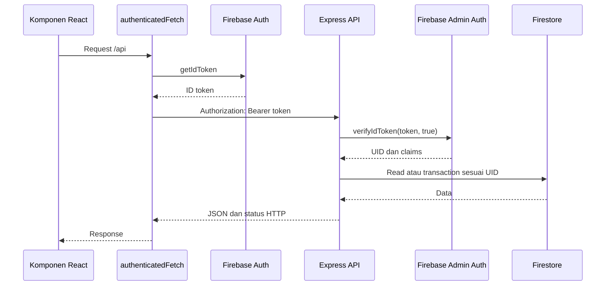
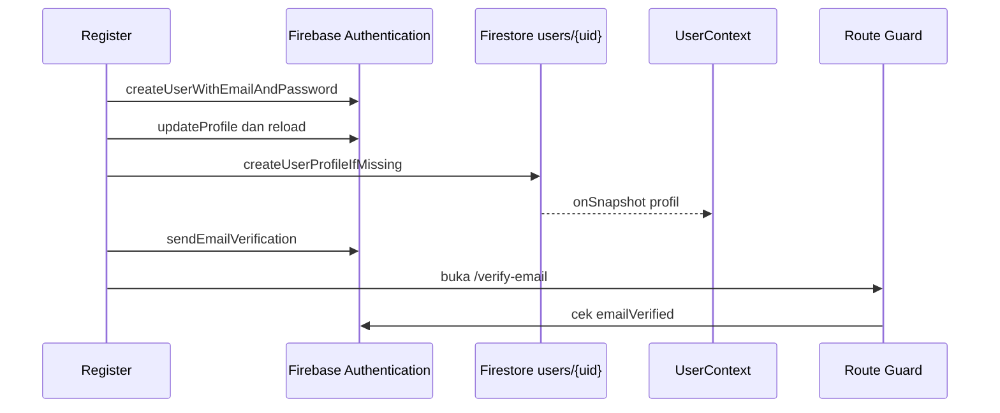
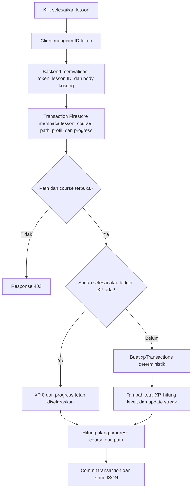
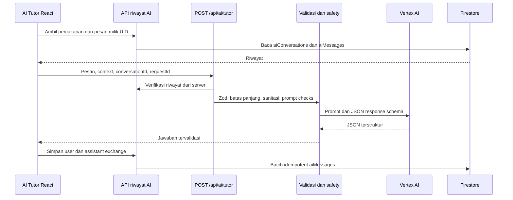
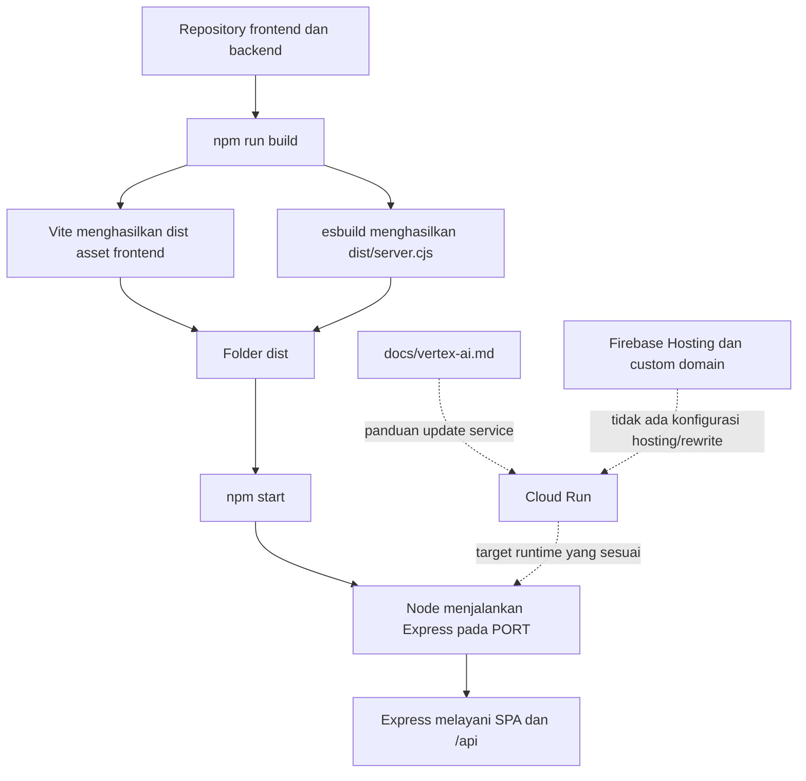

# System Architecture
# Cyber Academy AI

## 1. Pengantar

Dokumen ini menjelaskan susunan teknis Cyber Academy AI berdasarkan audit langsung terhadap ZIP `Cyber-Academy-AI-FINAL-HERO-TOP-LABEL-2026-08-01(9).zip`. Acuan yang dipakai adalah source code, konfigurasi, rules, service, route, script, dan test di dalam ZIP tersebut.

Cyber Academy AI menghubungkan aplikasi React di browser, backend Express, Firebase Authentication, Cloud Firestore, Firebase Storage, dan layanan AI dari Google. Dokumen ini juga membedakan bagian yang sudah terbukti dari konfigurasi project dengan bagian deployment yang baru tertulis sebagai panduan.

## 2. Gambaran Umum Arsitektur

Cyber Academy AI adalah aplikasi web client-server dalam satu repository. Frontend dibuat dengan React, TypeScript, React Router, Tailwind CSS, dan Vite. Backend dibuat dengan Express dan TypeScript. Frontend selalu memakai path API relatif seperti `/api/catalog/learning-paths`, sehingga browser menghubungi origin yang sama dengan aplikasi.

Saat development, `server.ts` memasang Vite sebagai middleware. Saat production, hasil build frontend di folder `dist/` dilayani oleh Express, sedangkan backend yang sudah dibundel berjalan dari `dist/server.cjs`. Jadi frontend dan backend disiapkan untuk satu proses runtime dan satu hasil build.

Firebase Client SDK dipakai langsung di browser untuk autentikasi, dokumen profil milik pengguna, listener profil, dan upload avatar. Data penting seperti katalog, progress, XP, quiz, simulasi, badge, sertifikat, riwayat AI, dan operasi admin lewat backend menggunakan Firebase Admin SDK.

Integrasi AI berjalan di backend melalui `@google/genai`. Provider default adalah Vertex AI dengan Application Default Credentials. Source juga menyediakan pilihan `gemini-api`, tetapi provider yang dipakai bergantung pada environment runtime.

Kode mendukung pola runtime Cloud Run karena membaca `PORT`, bind ke `0.0.0.0`, menggunakan Application Default Credentials, dan memiliki panduan Cloud Run. Namun ZIP ini tidak berisi `Dockerfile`, `cloudbuild.yaml`, atau manifest Cloud Run. `firebase.json` juga tidak memiliki blok `hosting`, `public`, atau `rewrites`. Karena itu revision, traffic, Firebase Hosting rewrite, dan custom domain aktif tidak dapat diverifikasi dari source ini.

## 3. Diagram Arsitektur Utama


Diagram Mermaid berikut memakai hubungan yang sama dengan gambar PNG dan siap dirender di GitHub.

```mermaid
flowchart TB
    U[Pengguna] --> B[Browser]

    subgraph FE[Frontend React dan Vite]
        UI[Halaman dan komponen]
        CTX[UserContext dan route guard]
        SVC[Service frontend]
        UI --> CTX
        UI --> SVC
    end

    B --> UI
    CTX --> AUTH[Firebase Authentication]
    SVC -->|profil pengguna| FCLIENT[Firebase Client SDK]
    FCLIENT --> DB[(Cloud Firestore)]
    FCLIENT -->|avatar| ST[Firebase Storage]

    SVC -->|request relatif /api| API[Express API]
    API --> MW[Token dan role middleware]
    MW --> ADMIN[Firebase Admin SDK]
    ADMIN --> AUTH
    ADMIN --> DB
    API --> AI[@google/genai]
    AI --> VERTEX[Vertex AI]

    API -->|production static files| DIST[dist frontend]
    RUNTIME[Runtime Node.js yang membaca PORT] --> API
    RUNTIME --> DIST

    CLOUD[Cloud Run disebut dalam panduan deployment] -. target runtime dan manifest tidak ada .-> RUNTIME
    HOST[Firebase Hosting dan custom-domain rewrite] -. tidak ditemukan di firebase.json .-> RUNTIME
```

Garis penuh menunjukkan hubungan yang ditemukan di implementasi. Garis putus-putus menunjukkan bagian deployment yang disebut dalam panduan atau diminta sebagai target, tetapi konfigurasi aktifnya tidak tersimpan di ZIP.

## 4. Komponen Utama Sistem

| Komponen | Teknologi | Fungsi | Lokasi implementasi |
| --- | --- | --- | --- |
| Frontend | React 19, TypeScript | Menampilkan halaman, state tampilan, form, loading, dan error | `src/main.tsx`, `src/App.tsx`, `src/components/` |
| Routing | React Router DOM | Mengatur route publik, pengguna, verifikasi, onboarding, dan admin | `src/App.tsx`, `src/components/navigation/RouteGuards.tsx`, `src/components/navigation/Layouts.tsx` |
| State pengguna | React Context | Menyimpan Firebase user, profil Firestore, status admin, loading, dan error autentikasi | `src/contexts/UserContext.tsx` |
| Service frontend | Fetch API dan Firebase Client SDK | Memanggil API relatif serta melakukan operasi Firebase yang memang diizinkan dari client | `src/services/`, `src/lib/firebaseClient.ts`, sebagian fungsi aktif di `src/lib/learningStore.ts` |
| Backend | Node.js, Express, TypeScript | Menyediakan API, validasi, static file serving, dan pembuatan PDF sertifikat | `server.ts`, `server/routes/`, `server/services/` |
| Validasi backend | Zod | Memvalidasi payload admin, quiz, simulasi, AI, sertifikat, dan riwayat AI | `server/validation/`, file route terkait |
| Autentikasi | Firebase Authentication | Email/password, Google Sign-In, verifikasi email, reset password, ID token, dan custom claim admin | `src/services/authService.ts`, `server/middleware/auth.ts` |
| Database | Cloud Firestore | Menyimpan profil, katalog, progress, XP, quiz, simulasi, badge, sertifikat, riwayat AI, dan audit admin | `server/services/`, `firestore.rules`, `firestore.indexes.json` |
| Storage | Firebase Storage | Menyimpan avatar pengguna | `src/services/userService.ts`, `storage.rules` |
| AI | `@google/genai`, Vertex AI | Menjawab AI Tutor dan membuat AI Learning Insight | `server/config/aiConfig.ts`, `server/services/aiProvider.ts`, `server/routes/aiRoutes.ts` |
| Dokumen sertifikat | jsPDF, QRCode | Membuat PDF sertifikat saat endpoint download dipanggil | `server.ts` |
| Build | Vite, esbuild | Membuat asset frontend dan bundle CommonJS backend | `package.json`, `vite.config.ts` |
| Testing | Vitest, Testing Library, Supertest, jsdom | Menguji service, route, middleware, komponen, data, dan validasi | file `*.test.ts` dan `*.test.tsx` di `src/`, `server/`, dan `scripts/` |

## 5. Arsitektur Frontend

### Framework dan entry point

Entry point frontend berada di `src/main.tsx`. File ini memasang `StrictMode`, `UserProvider`, `BrowserRouter`, lalu merender `App` ke elemen `#root`.

`src/App.tsx` berisi konfigurasi route dan wrapper yang meneruskan data pengguna atau parameter URL ke komponen halaman. `LandingPage` dan `LessonDetail` dimuat dengan `React.lazy` dan `Suspense`; komponen lain diimpor langsung.

### Routing dan layout

Route dibagi menjadi beberapa lapisan:

- `PublicRoute` untuk landing, login, register, dan lupa password;
- `VerificationRoute` untuk akun yang belum memverifikasi email;
- `OnboardingRoute` untuk akun terverifikasi yang belum menyelesaikan onboarding;
- `ProtectedRoute` untuk halaman belajar pengguna;
- `AdminRoute` untuk halaman admin dengan custom claim `admin === true`;
- `PublicLayout`, `UserLayout`, dan `AdminLayout` untuk susunan tampilan masing-masing area.

Proteksi route di browser memeriksa sesi, profil, `accountStatus`, verifikasi email, onboarding, dan claim admin. Proteksi ini membantu navigasi UI, tetapi operasi penting tetap harus dilindungi di backend karena route guard browser dapat dilewati melalui request langsung.

### Context dan state

Tidak ada Redux, Zustand, atau library state global lain. State global autentikasi memakai React Context di `src/contexts/UserContext.tsx`.

`UserContext` melakukan hal berikut:

- mendengar perubahan Firebase Auth dengan `onAuthStateChanged`;
- membaca custom claim admin dengan `getIdTokenResult`;
- mendengar profil `users/{uid}` secara real-time dengan `onSnapshot`;
- menangani profil yang belum selesai dibuat pada alur registrasi;
- mengeluarkan akun yang status profilnya `disabled`;
- menyediakan refresh profil dan logout ke komponen.

State halaman seperti form, loading, error, data katalog, progress, dan hasil quiz memakai `useState`, `useEffect`, dan hook React lain di masing-masing komponen.

### Service frontend

Folder `src/services/` memisahkan komunikasi menurut kebutuhan:

- `apiClient.ts`: menambahkan ID token ke header `Authorization`;
- `authService.ts`: operasi Firebase Authentication;
- `userService.ts`: profil Firestore dan avatar Storage;
- `catalogService.ts`: katalog publik dari Express API;
- `learningStateService.ts`: progress, XP, complete lesson, dan reset;
- `quizService.ts`: pemuatan dan pengiriman quiz;
- `simulationService.ts`: katalog, pengecekan jawaban, dan attempt simulasi;
- `achievementService.ts`: badge dan sertifikat;
- `adminContentService.ts` dan `adminService.ts`: operasi admin.

`src/lib/learningStore.ts` masih berisi sejumlah helper lama berbasis `localStorage`. Alur progress utama di komponen saat ini sudah memakai `learningStateService` dan backend. Bagian aktif dari file tersebut masih menjadi adapter untuk riwayat AI Tutor, AI Insight, verifikasi sertifikat publik, dan beberapa helper remedial.

### Loading, error, dan empty state

Komponen memakai state lokal untuk loading dan error. `LoadingBoundary` dipakai pada perpindahan route dan lazy loading. `ErrorBoundary` membungkus seluruh route. Beberapa halaman menyediakan tombol coba lagi atau refresh, sedangkan service mengubah response API yang gagal menjadi pesan error Bahasa Indonesia.

Tidak ada satu mekanisme retry umum untuk seluruh request. Retry khusus ditemukan pada `authenticatedFetch` saat menerima `401`, pada provider AI untuk error sementara, dan pada UI tertentu melalui tombol muat ulang.

### Struktur frontend yang ditemukan

```text
src/
├── components/
│   ├── admin/
│   ├── lesson/
│   └── navigation/
├── contexts/
├── lib/
├── pages/
├── services/
├── App.tsx
├── main.tsx
├── index.css
├── data.ts
├── intermediate_data.ts
├── advanced_data.ts
├── live_catalog_additions.ts
├── quiz_data.ts
├── simulationCatalog.ts
└── types.ts
```

## 6. Arsitektur Backend

### Runtime dan entry point

Backend memakai Node.js dan Express. Entry point-nya adalah `server.ts`.

Saat server dimulai, file ini:

1. memuat `.env` dengan `dotenv`;
2. membuat Express app;
3. memuat konfigurasi AI dan membuat provider;
4. memasang parser JSON dengan batas `64kb`;
5. memasang route modular;
6. melayani Vite middleware saat development atau folder `dist/` saat production;
7. mendengar pada `0.0.0.0` dan port dari `PORT`, dengan fallback `3000`.

### Route API

Route utama yang dipasang oleh `server.ts` adalah:

| Prefix | Isi | Akses utama |
| --- | --- | --- |
| `/api/health` | Status server dan status konfigurasi AI | Publik |
| `/api/catalog/*` | Learning path, course, dan lesson published | Publik |
| `/api/me/*` | Progress, XP, reset, badge, sertifikat, attempt, dan riwayat AI | Token Firebase |
| `/api/quizzes/*` | Metadata quiz, soal aman, dan submit attempt | GET publik; submit memakai token |
| `/api/simulations/*` | Daftar, cek jawaban, dan submit simulasi | Daftar publik; proses attempt memakai token |
| `/api/ai/*` | AI Tutor dan AI Insight | Token Firebase |
| `/api/admin/*` | Konten, pengguna, audit, quiz, simulasi, badge, dan sertifikat | Token Firebase dan claim admin |
| `/api/certificates/verify/*` | Verifikasi sertifikat | Publik dengan rate limit |
| `/api/certificates/download/*` | PDF sertifikat | Publik dengan format kode dan rate limit |

Request `/api` yang tidak cocok dihentikan dengan response JSON `404`. Setelah itu barulah route SPA dipakai, sehingga client API tidak salah menerima `index.html` sebagai response sukses.

### Middleware dan service layer

`server/middleware/auth.ts` menangani token dan role. Route memanggil fungsi di `server/services/` untuk logika data. Validasi Zod berada di route atau `server/validation/`.

Service backend utama meliputi:

- `contentService.ts` untuk katalog dan CRUD konten;
- `learningStateService.ts` untuk progress, XP, level, streak, dan reset;
- `quizService.ts` untuk quiz dan question;
- `simulationService.ts` untuk simulasi dan scoring;
- `achievementService.ts` untuk badge dan sertifikat;
- `aiProvider.ts`, `aiStructuredOutput.ts`, `aiSafety.ts`, dan `aiHistoryService.ts` untuk AI;
- `adminUserService.ts` dan `auditService.ts` untuk operasi admin.

Firebase Admin SDK diinisialisasi satu kali di `server/firebaseAdmin.ts`. Credential dipilih dari `FIREBASE_SERVICE_ACCOUNT_JSON` jika disediakan atau Application Default Credentials jika tidak. Firestore database ID dibaca dari `firebase-applet-config.json` bila file tersebut tersedia.

### Static file serving

Pada production, Express menjalankan `express.static(distPath)` dan mengirim `dist/index.html` untuk route non-API yang tidak cocok. Ini membuat browser dapat membuka route SPA secara langsung selama request memang masuk ke proses Express.

## 7. Hubungan Frontend dan Backend

Frontend menggunakan `fetch` bawaan browser. Tidak ada Axios. Semua URL API berbentuk relatif, sehingga tidak ada base URL backend terpisah di source.

Request publik memakai `fetch` langsung. Request privat memakai `authenticatedFetch`:



Jika response pertama berstatus `401`, `authenticatedFetch` meminta token baru dengan `getIdToken(user, true)` lalu mencoba sekali lagi. Jika masih `401`, client melakukan sign out dan menampilkan pesan bahwa sesi berakhir.

Header `Content-Type: application/json` ditambahkan otomatis untuk body berbentuk string. Response error umumnya berbentuk `{ error: string }`; endpoint AI Insight memakai objek error yang juga memiliki `code` dan `retryable`.

## 8. Arsitektur Autentikasi

### Registrasi email dan password



Flag `emailRegistrationInProgress` dan `pendingEmailRegistrationProfileUid` menjaga `UserContext` tetap pada loading saat Auth state berubah lebih cepat daripada pembuatan profil. Jika pembuatan profil gagal, kode mencoba menghapus Firebase Auth user agar tidak meninggalkan akun tanpa profil.

Jika akun sudah dibuat dan profil sudah ada tetapi pengiriman email verifikasi gagal, registrasi melempar pesan khusus. Pengguna dapat mencoba mengirim ulang email dari halaman verifikasi.

### Login dan Google Sign-In

Login email memakai `signInWithEmailAndPassword`, lalu memastikan profil Firestore tersedia. Login Google memakai popup. Jika popup diblokir atau ditutup, kode mencoba `signInWithRedirect`; hasil redirect diproses saat `UserContext` dimuat.

Persistence Auth diatur ke `browserLocalPersistence`. Reset password memakai `sendPasswordResetEmail`. Perubahan email dan password meminta re-autentikasi password terlebih dahulu.

### Profil dan admin

Profil berada di `users/{uid}` dan didengar real-time. Claim admin dibaca dari ID token, bukan dari field `role` yang dapat ditampilkan di profil. Backend juga mengecek `decodedToken.admin === true` melalui `requireAdmin`.

Middleware backend memverifikasi token dengan pengecekan revoked token. Middleware ini memastikan token dan UID valid, tetapi tidak memeriksa `emailVerified` atau `accountStatus` secara umum. Beberapa service mengecek profil aktif lagi, sedangkan route AI hanya bergantung pada token. Karena itu proteksi email dan status akun tidak seragam di semua endpoint backend.

## 9. Arsitektur Data Firestore

Project memakai collection tingkat atas, bukan subcollection. Collection yang benar-benar diakses source adalah:

| Collection | Fungsi | Jalur akses utama |
| --- | --- | --- |
| `users` | Profil, role tampilan, status akun, total XP, level, dan streak | Client untuk profil sendiri; Admin SDK untuk data server |
| `learningPaths` | Katalog jalur belajar | Backend dan seed |
| `courses` | Katalog kelas | Backend dan seed |
| `lessons` | Katalog materi | Backend dan seed |
| `userProgress` | Progress lesson, course, path, dan simulasi | Backend saja |
| `xpTransactions` | Ledger XP idempotent | Backend saja |
| `quizzes` | Metadata quiz | Backend dan seed |
| `questions` | Soal, opsi, jawaban benar, dan penjelasan | Backend dan seed |
| `quizAttempts` | Setiap attempt quiz | Backend saja |
| `quizSummaries` | Ringkasan attempt dan status lulus | Backend saja |
| `simulations` | Metadata simulasi published | Backend; definisi default dapat dibuat dari source |
| `simulationAttempts` | Hasil simulasi pengguna | Backend saja |
| `badges` | Definisi badge | Backend; definisi aktif diselaraskan dari source |
| `userBadges` | Badge yang diterima pengguna | Backend saja |
| `certificates` | Metadata dan status sertifikat | Backend saja |
| `aiConversations` | Metadata percakapan AI Tutor | Backend saja |
| `aiMessages` | Pesan pengguna dan jawaban AI | Backend saja |
| `adminAuditLogs` | Catatan perubahan admin | Backend saja |

### Data langsung dari client

Client hanya membaca, membuat, dan memperbarui dokumen profilnya sendiri sesuai field yang diizinkan `firestore.rules`. Listener `onSnapshot` juga hanya dipakai untuk profil tersebut.

### Data melalui backend

Rules menolak akses Firebase Client SDK ke katalog, progress, XP, quiz, simulasi, badge, sertifikat, riwayat AI, dan audit admin. Backend memakai Admin SDK, kemudian menerapkan token, UID, claim admin, validasi, dan transaction di layer aplikasi.

### Data dari source dan seed

Katalog source berada di `src/data.ts`, `src/intermediate_data.ts`, `src/advanced_data.ts`, `src/live_catalog_additions.ts`, dan `src/quiz_data.ts`. `scripts/seed-content.ts` memvalidasi data lalu merencanakan upsert ke lima collection katalog. Mode default adalah dry-run dan target default emulator. Script menolak dokumen tak dikenal dan tidak menghapus otomatis.

UI katalog utama tetap mengambil data published dari backend. Beberapa data source masih dipakai di landing page dan sebagai konteks tambahan AI Tutor. Skenario visual simulasi berada di `src/simulationCatalog.ts`, sedangkan kunci jawaban server berada di `server/simulationDefinitions.ts`.

## 10. Arsitektur Progress, XP, Level, dan Streak

Penyelesaian lesson wajib melalui `POST /api/me/lessons/:lessonId/complete`.



Backend memeriksa lesson, course, dan learning path published. Urutan path dan course juga diperiksa server-side. Document ID progress memakai pola deterministik seperti `uid__lesson__lessonId`, `uid__course__courseId`, dan `uid__path__pathId`.

XP lesson berasal dari `lessonData.xpReward` dengan fallback `15`. Ledger XP lesson memakai ID `uid__lesson__lessonId`, sehingga request berulang tidak menambah XP lagi. Level dihitung dengan batas yang ada di `learningStateService.ts`: level 1 di bawah 100 XP, level 2 di bawah 250, level 3 di bawah 450, level 4 di bawah 700, dan level 5 mulai 700 XP.

Streak menggunakan tanggal Asia/Jakarta. Aktivitas pertama memberi streak 1, aktivitas hari berikutnya menambah streak, jeda lebih dari satu hari mengulang ke 1, dan aktivitas pada hari yang sama tidak menambah lagi. Pada complete lesson, streak berubah hanya ketika XP baru benar-benar diberikan.

Badge tidak otomatis dievaluasi di transaction complete lesson. Evaluasi badge terjadi saat client memanggil endpoint khusus `POST /api/me/badges/evaluate`.

## 11. Arsitektur Quiz

Metadata quiz published dimuat melalui `GET /api/quizzes/course/:courseId`. Soal dimuat melalui `GET /api/quizzes/:quizId/questions`.

Backend menghapus `correctOptionId` dan `explanation` sebelum soal dikirim ke browser. Jawaban sementara pengguna disimpan di `localStorage` agar form tidak langsung hilang saat reload, tetapi penilaian akhir tidak memakai nilai dari client.

Saat submit:

1. client mengirim map `questionId -> optionId` ke endpoint attempt dengan ID token;
2. backend memeriksa profil aktif, quiz, course, learning path, dan progress lesson;
3. backend memastikan semua ID soal dan opsi valid;
4. backend membandingkan jawaban dengan `correctOptionId` dari Firestore;
5. skor dihitung dan dibandingkan dengan `passingScore` quiz, fallback `70`;
6. attempt dan summary disimpan;
7. jika pertama kali lulus, XP quiz dibuat melalui transaction idempotent;
8. course ditandai selesai dan progress path dihitung ulang.

Ledger XP quiz memakai ID `uid__quiz__quizId`. Riwayat attempt tetap dapat bertambah setiap submit, tetapi hadiah pertama tidak diberikan lagi. Endpoint submit dibatasi 10 request per 15 menit per IP.

Jawaban benar dan penjelasan muncul pada response review setelah submit. Ini berguna untuk pembelajaran, tetapi bukan mekanisme anti-cheat penuh. Source tidak mengklaim ada proctoring atau pengawasan ujian.

## 12. Arsitektur Simulasi

Tampilan skenario dan langkah simulasi berasal dari `src/simulationCatalog.ts`. Backend memiliki kunci jawaban terpisah di `server/simulationDefinitions.ts` dan menghitung hasil di `server/services/simulationService.ts`.

`GET /api/simulations` mengembalikan metadata published. Sebelum membaca, service menjalankan `ensureDefaultSimulations()`. Jika dokumen default belum ada, endpoint ini dapat menulis metadata simulasi dari definisi server ke Firestore.

Pada mode modern, UI dapat memeriksa satu tindakan melalui `POST /api/simulations/:simulationId/check`. Hasil final dikirim ke `POST /api/simulations/:simulationId/attempts`. Backend menghitung skor, passing score, best score, jumlah attempt, progress, dan XP.

XP hanya diberikan pada kelulusan pertama karena ledger memakai ID `uid__simulation__simulationId`. Attempt tetap disimpan untuk setiap pengiriman. Empat definisi simulasi server memiliki passing score dan XP masing-masing; nilai tersebut dapat dibaca dari dokumen Firestore, dengan definisi source sebagai fallback.

Badge simulasi tidak langsung dibuat oleh service simulasi. Badge `Simulation Defender` diberikan ketika endpoint evaluasi badge menemukan semua simulasi aktif yang diwajibkan sudah lulus.

## 13. Arsitektur Badge dan Sertifikat

### Badge

Empat definisi badge aktif berada di `server/services/badgeDefinitions.ts`:

- Beginner Master;
- Intermediate Master;
- Advanced Master;
- Simulation Defender.

`ensureBadgeDefinitions()` menyelaraskan definisi aktif ke collection `badges` dan menonaktifkan badge lain sebagai legacy. Proses ini dipanggil saat katalog atau evaluasi badge dibuka, sehingga read API badge dapat menghasilkan write sinkronisasi jika definisinya belum sesuai.

Endpoint evaluasi tidak menerima progress dari client. Backend membaca katalog, progress, ringkasan quiz, dan attempt simulasi, lalu membuat `userBadges` dengan ID deterministik `uid__badge__badgeId`. Pembuatan dilakukan dalam transaction dan aman terhadap pemberian badge ganda.

### Sertifikat

Kelayakan sertifikat diperiksa per learning path. Backend membutuhkan path published, semua course selesai, semua quiz terkait lulus, dan progress path selesai.

Metadata sertifikat disimpan di collection `certificates` dengan ID `uid__path__learningPathId`. Jika dokumen sudah ada dan tidak dicabut, request berikutnya memperbarui nama penerima tanpa membuat sertifikat kedua.

PDF tidak disimpan ke Firebase Storage. Field `pdfPath` menunjuk ke endpoint `/api/certificates/download/:certificateCode`. `server.ts` membuat PDF dan QR code di memory saat endpoint download dipanggil, lalu langsung mengirim buffer sebagai response.

Verifikasi kode sertifikat bersifat publik, tetapi response dibatasi pada nama penerima, learning path, tanggal, kode, issuer, dan status. Endpoint verifikasi dan download memakai rate limit terpisah.

## 14. Arsitektur AI Tutor dan AI Insight

### Provider dan credential

`server/config/aiConfig.ts` menerima dua provider: `vertex` dan `gemini-api`. Nilai default adalah `vertex`. Pada mode Vertex, `@google/genai` dibuat dengan `vertexai: true`, project, location, model, dan API version `v1`.

Credential Vertex tidak dikirim dari browser. Client hanya memanggil Express. Runtime backend menggunakan Application Default Credentials atau identitas service account yang tersedia pada lingkungan tempat proses dijalankan.

### Alur AI Tutor



Jika `conversationId` dikirim, backend mengambil riwayat milik UID dari Firestore. Riwayat dari client hanya menjadi fallback ketika conversation ID tidak ada. Pesan dibatasi, diringkas ke history terbaru, dan disanitasi sebelum masuk prompt.

Filter awal mendeteksi credential, OTP, prompt injection, dan permintaan berbahaya tertentu. Credential menyebabkan request ditolak. OTP diganti dengan penanda. Prompt injection dan permintaan berbahaya diarahkan ke jawaban defensif tanpa memanggil model.

Provider meminta response JSON dengan schema. Hasil diparse dan diperiksa lagi memakai Zod. Error sementara seperti timeout, 429, dan beberapa 5xx dapat dicoba ulang dengan jeda. AI Tutor memiliki quota in-memory 20 request per hari per UID dan jarak minimal 1,5 detik. Deduplication request ID juga disimpan di memory selama 60 detik.

Percakapan AI Tutor memang disimpan. Browser menyimpan pasangan pesan setelah jawaban diterima melalui endpoint `/api/me/ai/conversations/:conversationId/exchanges`. Request ID diubah menjadi ID pesan deterministik agar penyimpanan exchange yang sama tidak menggandakan pesan.

### Alur AI Insight

AI Insight menerima jumlah lesson selesai, hasil quiz terbaru, hasil simulasi terbaru, dan persentase progress. Backend membatasi data yang masuk prompt, meminta JSON sesuai schema, dan memvalidasi output dengan Zod.

Jika output kosong atau terpotong, service mencoba satu kali lagi khusus untuk masalah format tersebut. Error AI Insight dikembalikan dengan code dan status retry. Hasil yang berhasil disimpan di `localStorage` browser dengan key per UID. Tidak ditemukan penyimpanan AI Insight ke Firestore.

Quota AI Insight adalah 10 request per hari per UID dengan jarak minimal 2 detik. Karena quota dan deduplicator memakai `Map` di memory proses, nilainya tidak dibagi antar-instance dan hilang saat instance restart.

## 15. Firebase Storage

Firebase Storage benar-benar dipakai untuk avatar pengguna.

Alurnya:

1. client memeriksa sesi, ukuran maksimum 2 MB, dan MIME type JPEG, PNG, atau WEBP;
2. file diunggah ke `users/{uid}/avatar/{timestamp_filename}`;
3. client mengambil download URL;
4. URL disinkronkan ke profil Firebase Auth;
5. URL juga ditulis ke field `photoURL` pada dokumen `users/{uid}`.

`storage.rules` mengizinkan read publik untuk avatar dan write hanya untuk UID pemilik. Rules juga memeriksa ukuran di bawah 2 MB dan content type gambar yang diizinkan.

Source tidak menghapus avatar lama saat pengguna mengunggah file baru. Sertifikat dan file materi tidak disimpan di Storage.

## 16. Firestore Rules dan Keamanan Data

`firestore.rules` memakai default deny. Pengecualian client hanya ada pada `users/{uid}`:

- pengguna dapat membaca profil sendiri;
- pembuatan profil harus memakai UID sendiri, role `user`, status `active`, onboarding `false`, field terbatas, dan tipe data yang diperiksa;
- update hanya mengizinkan field profil seperti nama, bio, foto, tujuan belajar, level kemampuan, minat, waktu belajar, onboarding, dan timestamp tertentu.

Semua collection lain yang tercantum di rules menolak read dan write dari Firebase Client SDK. Operasi tersebut harus melalui Express dan Admin SDK.

Admin SDK melewati Firestore Rules. Karena itu keamanan operasi server bergantung pada middleware, validasi route, pengecekan UID atau claim, dan logika service. Rules tidak menggantikan validasi backend.

`firestore.indexes.json` menyediakan index untuk query katalog, progress, XP, simulation attempt, dan AI message. Query baru tetap dapat membutuhkan index tambahan bila pola akses berubah.

## 17. Proteksi API

Token dikirim melalui header:

```text
Authorization: Bearer <Firebase ID token>
```

`authenticateUser` menolak header yang hilang, format selain tepat dua bagian, token kosong, token tidak valid, dan token yang dicabut. Verifikasi memakai `verifyIdToken(token, true)`. UID dan claim admin yang sudah decoded ditempelkan ke request server.

`requireAdmin` menolak request tanpa user dengan `401` dan user tanpa claim admin dengan `403`.

Endpoint publik yang ditemukan meliputi health, katalog published, metadata dan soal quiz yang sudah disaring, daftar simulasi, daftar badge aktif, verifikasi sertifikat, dan download sertifikat. Endpoint progress, attempt, AI, badge pengguna, sertifikat pengguna, serta seluruh admin membutuhkan token. Tidak semua endpoint publik hanya read murni: daftar simulasi dan badge dapat menjalankan sinkronisasi definisi melalui Admin SDK.

Rate limit ditemukan pada submit quiz, complete lesson, reset progress, simulasi, verifikasi sertifikat, dan download sertifikat. AI memiliki quota aplikasi sendiri selain validasi request.

## 18. Environment Variable dan Secret

### Konfigurasi publik Firebase client

Source membaca variabel berikut dan fallback ke `firebase-applet-config.json`:

- `VITE_FIREBASE_API_KEY`;
- `VITE_FIREBASE_AUTH_DOMAIN`;
- `VITE_FIREBASE_PROJECT_ID`;
- `VITE_FIREBASE_STORAGE_BUCKET`;
- `VITE_FIREBASE_MESSAGING_SENDER_ID`;
- `VITE_FIREBASE_APP_ID`;
- `VITE_FIREBASE_MEASUREMENT_ID`;
- `VITE_FIREBASE_FIRESTORE_DATABASE_ID`.

Nilai konfigurasi Firebase web memang dikirim ke browser dan bukan service-account credential. Dokumen ini tidak menampilkan nilainya.

### Konfigurasi backend

Backend membaca:

- `PORT` dan `NODE_ENV`;
- `FIREBASE_PROJECT_ID`, `GOOGLE_CLOUD_PROJECT`, atau `GCP_PROJECT`;
- `FIREBASE_SERVICE_ACCOUNT_JSON` sebagai pilihan credential inline;
- `AI_PROVIDER`;
- `GOOGLE_CLOUD_LOCATION`;
- `GEMINI_MODEL`;
- `GEMINI_API_KEY` hanya untuk provider `gemini-api`;
- `AI_REQUEST_TIMEOUT_MS`;
- `AI_MAX_INPUT_CHARS`;
- `AI_MAX_HISTORY_MESSAGES`;
- `AI_MAX_OUTPUT_TOKENS`;
- `AI_INSIGHT_MAX_OUTPUT_TOKENS`;
- `AI_MAX_RETRIES`.

Untuk Vertex AI, project dibutuhkan dan API key tidak dipakai. Panduan project memilih Application Default Credentials dan service account runtime. `.gitignore` mengecualikan `.env*`, file service account, dan file key.

## 19. Arsitektur Deployment

Konfigurasi yang dapat diverifikasi dari source adalah proses build dan runtime Node.js. Hubungan deployment yang terbukti dan yang belum terbukti digambarkan berikut.



`docs/vertex-ai.md` berisi contoh pengaturan service account, environment AI, dan update service Cloud Run. File tersebut adalah panduan operasional, bukan manifest deployment yang membuktikan resource aktif.

Tidak ada file yang menyatakan revision, pembagian traffic, URL service, atau hasil deployment terakhir. Audit ini juga tidak membuka Google Cloud Console dan tidak melakukan deployment.

## 20. Firebase Hosting dan Custom Domain

`firebase.json` pada ZIP hanya memiliki blok `firestore` dan `storage`. Tidak ada:

- `hosting`;
- folder `public`;
- rewrite ke Cloud Run;
- service ID Cloud Run;
- region hosting rewrite;
- header cache hosting.

Konfigurasi Firebase client menetapkan `siberaga.web.id` sebagai `authDomain` production. Nilai tersebut dipakai untuk alur Firebase Authentication, tetapi tidak membuktikan bahwa situs terhubung melalui Firebase Hosting.

Karena `firebase.json` tidak memiliki blok hosting atau rewrite, hubungan `custom domain -> Firebase Hosting -> Cloud Run` tetap tidak dapat dipastikan dari ZIP ini. Konfigurasi pemetaan domain dan traffic production berada di luar file deployment yang tersedia di repository.

Firebase Authentication tetap memerlukan domain production berada di daftar Authorized domains. Source hanya menyediakan penanganan error `auth/unauthorized-domain` dan panduan manual; daftar domain aktual tidak tersimpan di repository.

## 21. Proses Build

Script build yang ditemukan:

```json
"build": "vite build && esbuild server.ts --bundle --platform=node --format=cjs --packages=external --sourcemap --outfile=dist/server.cjs",
"start": "node dist/server.cjs"
```

Urutannya:

1. Vite membangun frontend ke `dist/`;
2. esbuild membundel `server.ts` menjadi `dist/server.cjs` dan source map;
3. dependency Node dibiarkan external;
4. `npm start` menjalankan bundle server;
5. Express melayani asset statis dan SPA fallback dari folder yang sama.

`vite.config.ts` membagi chunk Firebase Auth, Firestore, Storage, React, motion, icon, dan dokumen. Landing page dan lesson detail juga memakai lazy loading dari React.

Tidak ada script build Docker atau build backend terpisah. Tidak ada script deployment di `package.json`.

## 22. Struktur Folder Project

```text
project/
├── src/
│   ├── components/
│   ├── contexts/
│   ├── lib/
│   ├── pages/
│   └── services/
├── server/
│   ├── config/
│   ├── middleware/
│   ├── routes/
│   ├── services/
│   └── validation/
├── scripts/
├── docs/
├── server.ts
├── package.json
├── vite.config.ts
├── tsconfig.json
├── firebase.json
├── firebase-applet-config.json
├── firestore.rules
├── firestore.indexes.json
└── storage.rules
```

`src/` berisi frontend dan data source. `server/` berisi backend modular. `scripts/` berisi seed, validator, export katalog, migrasi badge, dan pengaturan admin. `docs/` berisi panduan teknis yang sudah ada. File konfigurasi Firebase di root mengatur rules dan index, bukan Firebase Hosting.

## 23. Arsitektur Testing dan Validasi

Project memakai Vitest. Test komponen memakai Testing Library dan jsdom. Test endpoint dan middleware memakai Supertest. Test mencakup autentikasi, route guard, API AI, content, progress, quiz, simulasi, badge, sertifikat, seed, responsive layout, dan data katalog.

Script yang tersedia:

- `npm test` menjalankan `vitest run`;
- `npm run typecheck` menjalankan `tsc --noEmit`;
- `npm run lint` juga menjalankan `tsc --noEmit`;
- `npm run build` menjalankan build frontend dan backend.

Tidak ada dependency atau konfigurasi ESLint yang dipakai oleh script `lint`. Tidak ada angka coverage yang dapat diklaim.

Validasi pada salinan audit menghasilkan:

- 36 file test lulus;
- 339 test lulus;
- typecheck lulus;
- build production lulus.

Build menghasilkan asset frontend di `dist/assets/`, `dist/index.html`, `dist/server.cjs`, dan source map backend.

## 24. Alur Request Utama

| Proses | Dari | Menuju | Data | Hasil |
| --- | --- | --- | --- | --- |
| Login email | Browser | Firebase Authentication | Email dan password | Sesi Firebase dan profil pengguna |
| Login Google | Browser | Firebase Authentication | OAuth popup atau redirect | Sesi Firebase dan profil pengguna |
| Memuat profil | Browser | Firestore Client SDK | UID sesi | Listener real-time `users/{uid}` |
| Memuat katalog | Browser | Express `/api/catalog/*` | ID atau slug | Learning path, course, dan lesson published |
| Menyelesaikan lesson | Browser | Express `/api/me/lessons/:id/complete` | ID token dan lesson ID | Progress, XP, level, dan streak hasil transaction |
| Mengirim quiz | Browser | Express `/api/quizzes/:id/attempts` | ID token dan jawaban | Skor server, attempt, summary, XP, dan progress course |
| Menjalankan simulasi | Browser | Express `/api/simulations/:id/*` | ID token, scenario, dan jawaban | Feedback, skor, attempt, progress, dan XP |
| Evaluasi badge | Browser | Express `/api/me/badges/evaluate` | ID token dan body kosong | Progress badge dan badge baru bila memenuhi syarat |
| Membuat sertifikat | Browser | Express `/api/me/certificates` | ID token, path ID, dan nama opsional | Metadata sertifikat idempotent |
| Download sertifikat | Browser | Express `/api/certificates/download/:code` | Kode sertifikat | PDF yang dibuat saat request |
| AI Tutor | Browser | Express `/api/ai/tutor` | ID token, pesan, konteks, dan request ID | JSON jawaban AI tervalidasi |
| Menyimpan riwayat AI | Browser | Express `/api/me/ai/*` | ID token dan exchange | `aiConversations` dan `aiMessages` |
| AI Insight | Browser | Express `/api/ai/insight` | Ringkasan progress, quiz, dan simulasi | Insight tervalidasi dan cache lokal |
| Upload avatar | Browser | Firebase Storage | File gambar | Download URL dan pembaruan profil |

## 25. Batas Kepercayaan Sistem

### Browser

Browser dianggap tidak tepercaya untuk nilai XP, skor, status kelulusan, UID target, badge, sertifikat, dan role admin. Client hanya mengirim input seperti lesson ID, pilihan jawaban, pesan AI, atau data profil yang diizinkan.

Jawaban sementara quiz dan cache AI Insight berada di `localStorage`, sehingga nilainya dapat diubah pengguna. Data ini tidak menjadi sumber keputusan XP atau kelulusan backend.

### Firebase Authentication

Firebase Authentication menjadi penerbit identitas. Backend hanya percaya UID dan claim setelah ID token diverifikasi. Client route guard memakai status Auth untuk navigasi, tetapi tidak menggantikan verifikasi server.

### Backend

Backend menjadi batas kepercayaan untuk katalog published, progress, XP, scoring, badge, sertifikat, riwayat AI, dan admin. Admin SDK mempunyai akses luas, sehingga kesalahan validasi backend dapat berdampak langsung pada Firestore.

### Firestore dan Storage

Firestore menyimpan state utama. Client hanya boleh menyentuh profilnya sendiri. Storage menerima avatar berdasarkan UID token dan aturan ukuran serta MIME type.

### Vertex AI

Vertex AI menerima prompt yang sudah dirangkai backend. Output model tidak langsung dipercaya; response diperiksa sebagai JSON dan divalidasi dengan schema sebelum dikirim ke browser.

## 26. Penanganan Error

Frontend menangkap error dari Firebase dan API lalu mengubahnya menjadi pesan pengguna. Halaman penting memiliki loading state, error card, empty state, atau tombol muat ulang. `ErrorBoundary` menjadi perlindungan terakhir untuk error render React.

Backend memakai status HTTP `400`, `401`, `403`, `404`, `409`, `410`, `413`, `422`, `429`, `500`, `502`, dan `503` sesuai kasus yang ditemukan. Format error belum sepenuhnya seragam: banyak endpoint memakai `{ error: string }`, sedangkan AI Insight memakai objek error terstruktur.

Firestore error di server ditulis ke console dan dikembalikan sebagai pesan yang ditentukan route. Client user service membuat log error berisi informasi sesi untuk debugging; log tersebut perlu tetap dijaga agar tidak mengumpulkan data lebih banyak dari yang dibutuhkan.

AI mempunyai timeout, retry untuk error sementara, validasi output, deteksi response terpotong, dan pesan fallback bahwa fitur materi, quiz, dan simulasi masih dapat dipakai. AI Insight menandai apakah error bisa dicoba ulang.

Tidak ada retry global untuk Firestore atau request katalog. Kegagalan jaringan umumnya meminta pengguna menekan tombol coba lagi atau mengulangi aksi.

## 27. Logging dan Monitoring

Logging memakai `console.log`, `console.warn`, dan `console.error`. AI Insight menulis log JSON ringkas dengan severity, error code, panjang response, finish reason, latency, model, dan provider tanpa mencetak prompt atau credential.

Endpoint `/api/health` mengembalikan status service, timestamp, provider AI, dan apakah konfigurasi AI lengkap. Endpoint ini tidak memanggil model.

Tidak ditemukan integrasi monitoring khusus seperti Sentry, Prometheus, Grafana, OpenTelemetry aplikasi, atau dashboard health. Jika dijalankan di Cloud Run, output console dapat terbaca oleh logging platform runtime, tetapi konfigurasi alert dan dashboard tidak ada di repository.

## 28. Performa dan Caching

Optimasi yang ditemukan:

- Vite manual chunks memisahkan modul besar;
- Landing Page dan Lesson Detail memakai lazy loading;
- Express melayani asset statis production;
- AI Insight disimpan di `localStorage` per UID sampai pengguna meminta refresh;
- query katalog memakai filter status dan index Firestore;
- XP, progress, dan attempt memakai transaction atau batch agar konsisten.

Tidak ditemukan header `Cache-Control` khusus di Express atau `firebase.json`. Tidak ada service worker, CDN config, image optimizer, atau cache backend katalog.

`express.static` dapat menghasilkan header standar Express seperti ETag, tetapi source tidak menambahkan kebijakan cache jangka panjang. Nama file hasil Vite memakai hash, sehingga asset cocok untuk caching bila lapisan hosting mengaturnya.

## 29. Skalabilitas

State utama disimpan di Firebase Authentication, Firestore, dan Storage, bukan hanya memory server. Ini membuat data pengguna tetap tersedia jika proses backend restart.

Firestore transaction dan document ID deterministik membantu konsistensi saat request yang sama terjadi lebih dari sekali. Query tertentu bergantung pada index yang disediakan di `firestore.indexes.json`.

Jika runtime menggunakan Cloud Run, proses Node dapat dijalankan pada lebih dari satu instance. Namun quota AI dan request deduplication saat ini memakai `Map` di memory masing-masing instance. Batas tersebut tidak global dan akan ter-reset saat instance dibuat ulang.

Pemanggilan AI bergantung pada quota, latency, dan izin Vertex AI. Biaya Firestore dan AI akan mengikuti jumlah request. Tidak ada queue untuk pekerjaan AI atau pembuatan PDF; semuanya diproses di dalam request HTTP.

## 30. Risiko Arsitektur

| Risiko | Dampak | Mitigasi yang ada |
| --- | --- | --- |
| Auth state berubah sebelum profil selesai dibuat | UI sempat menganggap profil hilang | Flag registrasi pending, listener tetap loading, dan profil ditunggu lewat `onSnapshot` |
| Pembuatan profil gagal setelah akun Auth dibuat | Akun tanpa profil | Registrasi mencoba menghapus Auth user yang baru dibuat |
| Request complete lesson atau quiz dikirim ulang | XP ganda | Transaction Firestore dan ID ledger XP deterministik |
| Client mengubah skor atau progress lokal | Data belajar tidak benar | Scoring, progress, XP, badge, dan sertifikat dihitung backend |
| Response AI bukan JSON yang sesuai | UI gagal membaca jawaban | JSON response schema, parser, Zod, pemeriksaan truncation, dan retry terbatas |
| Pesan AI berisi credential atau instruksi berbahaya | Kebocoran data atau penyalahgunaan | Sanitasi OTP, penolakan credential, deteksi prompt injection, dan pengalihan defensif |
| Seed tidak sinkron dengan Firestore | Katalog berbeda dengan source | Dry-run default, validasi referensi, guard project, penolakan dokumen tak dikenal, dan batch upsert |
| Quota AI berbasis memory | Batas berbeda antar-instance atau hilang saat restart | Batas per proses sudah ada; belum ada quota global di Firestore atau layanan lain |
| Upload avatar berulang | File lama tertinggal di Storage | Validasi ukuran dan tipe ada; cleanup file lama belum ditemukan |
| Status email atau akun tidak diperiksa seragam di semua API | User dengan token valid dapat mencapai endpoint tertentu walau guard UI menolak | Token selalu diverifikasi pada endpoint privat; beberapa service mengecek profil aktif, tetapi pemeriksaan belum merata |
| Firebase Hosting atau custom domain tidak tercatat | Dokumentasi deployment mudah berbeda dari kondisi production | Belum ada mitigasi berbasis source; perlu menyimpan konfigurasi atau bukti deployment |
| Definisi simulasi client dan server berubah tidak bersamaan | UI dan kunci jawaban tidak cocok | Test scoring dan katalog tersedia, tetapi definisi tetap berada di dua sisi source |
| Firestore index belum sesuai query baru | Request gagal meminta index | Index yang dibutuhkan alur saat ini disimpan di `firestore.indexes.json` |
| Kegagalan jaringan | Data gagal dimuat atau aksi harus diulang | Loading/error state, retry 401 sekali, tombol refresh, dan idempotensi beberapa mutation |

## 31. Batasan Arsitektur Saat Ini

- Aplikasi membutuhkan koneksi internet untuk Firebase dan AI.
- AI bergantung pada konfigurasi, izin, quota, model, dan ketersediaan layanan Google.
- Frontend dan backend dibangun sebagai satu service Node, bukan service terpisah.
- Sebagian definisi katalog dan simulasi masih berada di source untuk seed atau kebutuhan UI.
- AI Insight hanya dicache di browser dan tidak disimpan sebagai histori server.
- Quota AI dan deduplication hanya berlaku per proses.
- Monitoring masih berupa health endpoint dan console log.
- PDF sertifikat dibuat saat request dan tidak disimpan sebagai file permanen.
- Storage avatar belum memiliki cleanup file lama.
- Konfigurasi Firebase Hosting, rewrite, custom domain, revision, dan traffic Cloud Run tidak ada di ZIP.
- Tidak ada Dockerfile atau pipeline deployment yang dapat diaudit.

## 32. Catatan Audit

1. Frontend dan backend berada dalam satu repository dan satu script build.
2. Express production melayani frontend `dist` sekaligus endpoint `/api`.
3. API frontend memakai URL relatif, sehingga arsitektur mengharapkan origin frontend dan API yang sama.
4. Firebase Client SDK dan Firebase Admin SDK mempunyai tugas berbeda. Client menangani Auth, profil sendiri, dan avatar; Admin menangani data penting lain.
5. Core progress, XP, quiz, simulasi, badge, dan sertifikat bersifat server-authoritative.
6. `src/lib/learningStore.ts` masih memuat helper lama berbasis `localStorage`, tetapi komponen progress utama sudah memakai service backend. Fungsi AI aktif masih berada di file ini.
7. AI Tutor menyimpan percakapan dan pesan di Firestore. AI Insight tidak disimpan ke Firestore dan memakai cache lokal.
8. Badge dan simulasi memiliki proses `ensure` yang dapat menulis definisi ke Firestore saat endpoint daftar dibuka.
9. Sertifikat disimpan sebagai metadata Firestore; PDF dibuat on-demand oleh Express.
10. Firestore rules menolak semua collection penting dari client, kecuali operasi terbatas pada profil sendiri.
11. Admin dilindungi di client dan server memakai claim ID token.
12. Middleware API tidak memeriksa email verified atau status profil secara seragam.
13. Source siap berjalan pada runtime yang menyediakan Node, dependency, `PORT`, dan credential, tetapi cara container atau source deployment tidak dikunci oleh file project.
14. Firebase Hosting dan custom domain tidak dapat dibuktikan dari `firebase.json` saat ini.
15. Test, typecheck, dan build lulus pada salinan project yang diaudit. Tidak ada source yang diperbaiki atau diubah selama audit.

## 33. Penutup

Cyber Academy AI dibangun sebagai aplikasi React dan Express dalam satu repository. Browser menangani tampilan, autentikasi Firebase, profil sendiri, dan avatar, sedangkan backend menjadi jalur utama untuk katalog, progress, XP, quiz, simulasi, badge, sertifikat, dan AI.

Arsitektur aplikasi dan alur datanya dapat ditelusuri dari source. Bagian deployment Cloud Run mempunyai dukungan runtime dan panduan, tetapi konfigurasi Firebase Hosting, rewrite, custom domain, serta kondisi resource production perlu dibuktikan dari konfigurasi lain karena tidak tersedia di ZIP yang diaudit.
