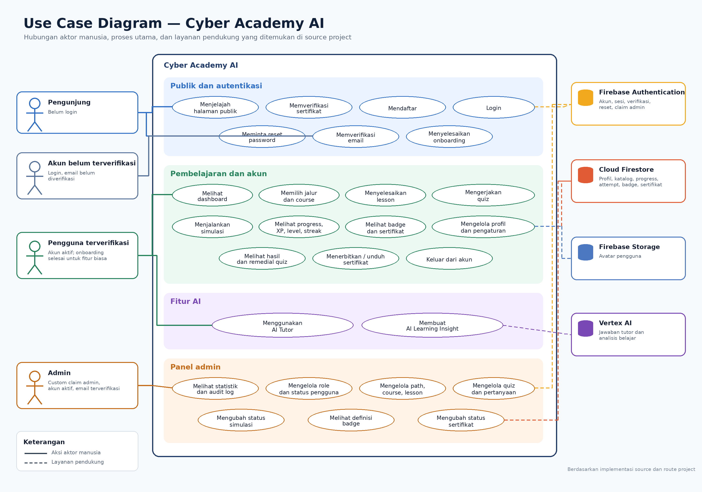

# Use Case Cyber Academy AI

## 1. Pengantar

Dokumentasi ini menunjukkan siapa saja yang berhubungan dengan Cyber Academy AI dan tindakan yang dapat dilakukan oleh setiap aktor. Isinya disusun dari route, halaman, komponen, service frontend, endpoint Express, Firebase, Vertex AI, aturan akses, dan test yang benar-benar ada di project.

Use case tidak dibuat hanya dari nama menu. Setiap proses di bawah sudah ditelusuri sampai ke aksi pengguna, validasi, pemanggilan layanan, penyimpanan data, hasil berhasil, dan kondisi gagal yang terlihat di source.

## 2. Tujuan Use Case

- Membantu memahami hubungan pengguna dengan fitur Cyber Academy AI.
- Menjelaskan perbedaan akses pengunjung, akun yang belum terverifikasi, pengguna terverifikasi, dan admin.
- Menunjukkan alur utama, alur alternatif, kondisi gagal, dan hasil dari setiap proses.
- Menjadi acuan saat menguji fitur dari sisi tampilan dan backend.

## 3. Aktor Sistem

### 3.1 Aktor manusia

| Aktor | Keterangan | Hak Akses Umum |
|---|---|---|
| Pengunjung | Orang yang belum login. | Membuka landing page, bagian fitur, jalur belajar, FAQ, kebijakan privasi, ketentuan layanan, halaman login, register, lupa password, dan verifikasi sertifikat publik. |
| Pemilik akun belum terverifikasi | Pengguna sudah login dan memiliki profil Firestore, tetapi `emailVerified` masih `false`. | Membuka halaman verifikasi email, mengecek status verifikasi, mengirim ulang email verifikasi, dan keluar untuk mengganti akun. Route publik dan route aplikasi mengarahkannya ke `/verify-email`. |
| Pengguna terverifikasi | Akun aktif dengan email terverifikasi. Sebelum onboarding selesai, aksesnya diarahkan ke `/onboarding`. Setelah onboarding selesai, pengguna dapat memakai seluruh route aplikasi biasa. | Menjalankan onboarding, membuka dashboard, belajar, mengerjakan kuis dan simulasi, memakai AI Tutor dan AI Insight, melihat progress, badge, sertifikat, profil, serta pengaturan akun. |
| Admin | Pengguna yang memiliki Firebase custom claim `admin: true`, profil aktif, dan email terverifikasi. | Membuka panel admin, melihat statistik dan audit log, mengelola pengguna, learning path, course, lesson, kuis, pertanyaan, status simulasi, daftar badge, dan status sertifikat. Admin tidak boleh menurunkan role atau menonaktifkan akunnya sendiri. |

### 3.2 Sistem eksternal

| Sistem | Peran dalam use case |
|---|---|
| Firebase Authentication | Membuat akun, login email/password, login Google, mengirim verifikasi email dan reset password, menjaga sesi, menerbitkan ID token, menyimpan custom claim admin, serta menonaktifkan akun. |
| Cloud Firestore | Menyimpan profil, katalog belajar, progress, transaksi XP, hasil kuis dan simulasi, badge, sertifikat, riwayat AI, dan audit log admin. Sebagian besar data aplikasi hanya dapat diakses melalui backend. |
| Firebase Storage | Menyimpan avatar pada path milik pengguna. File dibatasi ke JPG, PNG, atau WEBP dengan ukuran kurang dari 2 MB. |
| Vertex AI | Menghasilkan jawaban AI Tutor dan AI Learning Insight. Permintaan melewati validasi, batas penggunaan, penyaringan data sensitif, dan pemeriksaan keamanan sebelum dikirim. |

Browser dan backend Express tidak diperlakukan sebagai aktor. Keduanya adalah bagian dari Cyber Academy AI. Penyimpanan lokal browser dipakai untuk jawaban kuis sementara dan cache AI Insight, tetapi bukan sumber utama progress atau XP.

## 4. Diagram Use Case Utama

Diagram berikut menjadi versi yang dapat dirender langsung di GitHub.

```mermaid
flowchart LR
    Guest[Pengunjung]
    Pending[Akun belum terverifikasi]
    User[Pengguna terverifikasi]
    Admin[Admin]

    subgraph App[Cyber Academy AI]
        direction TB
        subgraph Public[Publik dan autentikasi]
            Browse((Menjelajah halaman publik))
            VerifyCert((Memverifikasi sertifikat))
            Register((Mendaftar))
            Login((Login))
            Reset((Meminta reset password))
            VerifyEmail((Memverifikasi email))
            Onboarding((Menyelesaikan onboarding))
        end

        subgraph Learning[Pembelajaran dan akun]
            Dashboard((Melihat dashboard))
            Catalog((Memilih jalur dan course))
            Lesson((Membaca dan menyelesaikan lesson))
            Quiz((Mengerjakan quiz))
            Simulation((Menjalankan simulasi))
            Progress((Melihat progress, XP, level, streak))
            Achievement((Melihat badge dan sertifikat))
            Account((Mengelola profil dan pengaturan))
            Logout((Keluar dari akun))
        end

        subgraph AI[Fitur AI]
            Tutor((Menggunakan AI Tutor))
            Insight((Membuat AI Insight))
        end

        subgraph AdminArea[Panel admin]
            AdminStats((Melihat statistik dan audit log))
            AdminUsers((Mengelola role dan status pengguna))
            AdminContent((Mengelola path, course, dan lesson))
            AdminQuiz((Mengelola quiz dan pertanyaan))
            AdminSupport((Mengelola status simulasi dan sertifikat))
            AdminBadges((Melihat definisi badge))
        end
    end

    Auth[Firebase Authentication]
    DB[Cloud Firestore]
    Storage[Firebase Storage]
    Vertex[Vertex AI]

    Guest --> Browse
    Guest --> VerifyCert
    Guest --> Register
    Guest --> Login
    Guest --> Reset

    Pending --> VerifyEmail
    Pending --> Logout

    User --> Onboarding
    User --> Dashboard
    User --> Catalog
    User --> Lesson
    User --> Quiz
    User --> Simulation
    User --> Progress
    User --> Achievement
    User --> Account
    User --> Tutor
    User --> Insight
    User --> Logout

    Admin --> AdminStats
    Admin --> AdminUsers
    Admin --> AdminContent
    Admin --> AdminQuiz
    Admin --> AdminSupport
    Admin --> AdminBadges

    Register -. memakai .-> Auth
    Login -. memakai .-> Auth
    Reset -. memakai .-> Auth
    VerifyEmail -. memakai .-> Auth
    Account -. memakai .-> Storage
    Tutor -. meminta jawaban .-> Vertex
    Insight -. meminta analisis .-> Vertex

    Dashboard -. membaca .-> DB
    Lesson -. memperbarui .-> DB
    Quiz -. menyimpan hasil .-> DB
    Simulation -. menyimpan hasil .-> DB
    Achievement -. membaca dan menerbitkan .-> DB
    AdminContent -. mengelola .-> DB
    AdminUsers -. sinkronisasi .-> Auth
    AdminUsers -. sinkronisasi .-> DB
```

Hubungan aktor pada diagram menunjukkan akses yang tersedia melalui tampilan aplikasi. Firebase Authentication, Firestore, Firebase Storage, dan Vertex AI ditampilkan sebagai sistem pendukung, bukan pengguna manusia.

## 5. Batas Akses

| Kondisi | Route yang dapat dibuka | Jika mencoba route lain |
|---|---|---|
| Belum login | `/`, `/login`, `/register`, `/forgot-password`, `/verify/certificate`, `/verify/certificate/:code`, `/privacy`, `/terms` | Route pengguna dan admin diarahkan ke `/login`. |
| Login, profil tersedia, email belum terverifikasi | `/verify-email` | Route publik dan route aplikasi diarahkan ke `/verify-email`. |
| Email terverifikasi, onboarding belum selesai | `/onboarding` | Route publik dan route pengguna biasa diarahkan ke `/onboarding`. |
| Email terverifikasi, onboarding selesai, akun aktif | Seluruh route pengguna biasa | `/admin/*` diarahkan ke `/dashboard` jika custom claim admin tidak ada. |
| Admin terverifikasi dan akun aktif | Seluruh route admin. Admin juga dapat kembali ke aplikasi biasa. | Akses backend admin ditolak dengan 401 jika token tidak valid dan 403 jika claim admin tidak ada. |
| Akun berstatus `disabled` | Tidak dapat memakai aplikasi. Context akan logout dan route guard mengarahkannya ke login. | Pesan akun dinonaktifkan disimpan agar dapat ditampilkan pada alur login. |

Catatan: `AdminRoute` tidak memeriksa `onboardingCompleted`, sedangkan route pengguna biasa tetap memeriksanya. Jadi admin terverifikasi dapat membuka panel admin meskipun onboarding belum selesai, tetapi saat kembali ke route pengguna biasa ia tetap mengikuti aturan onboarding.

## 6. Daftar Use Case

| ID | Use Case | Aktor utama | Route utama |
|---|---|---|---|
| UC-01 | Menjelajah halaman publik | Pengunjung | `/`, `/privacy`, `/terms` |
| UC-02 | Memverifikasi sertifikat publik | Pengunjung | `/verify/certificate`, `/verify/certificate/:code` |
| UC-03 | Mendaftar dengan email dan password | Pengunjung | `/register` |
| UC-04 | Login dengan email dan password | Pengunjung | `/login` |
| UC-05 | Login atau daftar dengan Google | Pengunjung | `/login`, `/register` |
| UC-06 | Meminta reset password | Pengunjung | `/forgot-password` |
| UC-07 | Memverifikasi email | Pemilik akun belum terverifikasi | `/verify-email` |
| UC-08 | Menyelesaikan atau melewati onboarding | Pengguna terverifikasi | `/onboarding` |
| UC-09 | Keluar dari akun | Pengguna dan admin | Sidebar, navbar, `/verify-email` |
| UC-10 | Melihat dashboard dan melanjutkan belajar | Pengguna | `/dashboard` |
| UC-11 | Memilih jalur belajar dan course | Pengguna | `/learn/paths`, `/learn/paths/:pathSlug`, `/learn/courses/:courseSlug` |
| UC-12 | Membaca dan menyelesaikan lesson | Pengguna | `/learn/courses/:courseSlug/lessons/:lessonSlug` |
| UC-13 | Mengerjakan kuis course | Pengguna | `/learn/courses/:courseSlug/quiz` |
| UC-14 | Melihat hasil, riwayat, dan remedial kuis | Pengguna | `/learn/courses/:courseSlug/quiz/results/:attemptId` |
| UC-15 | Menjalankan simulasi keamanan | Pengguna | `/simulations`, `/simulations/:simulationId` |
| UC-16 | Menggunakan AI Tutor dan riwayat percakapan | Pengguna | `/ai-tutor`, `/ai-tutor/:conversationId` |
| UC-17 | Membuat AI Learning Insight | Pengguna | `/progress/insight` |
| UC-18 | Melihat dan mereset progress belajar | Pengguna | `/progress` |
| UC-19 | Melihat dan mengevaluasi badge | Pengguna | `/badges` |
| UC-20 | Menerbitkan, membagikan, dan mengunduh sertifikat | Pengguna | `/certificates` |
| UC-21 | Melihat dan mengubah profil | Pengguna | `/profile`, `/settings/profile` |
| UC-22 | Mengubah email atau password | Pengguna email/password | `/settings/account`, `/settings/security` |
| UA-01 | Melihat dashboard admin dan audit log | Admin | `/admin`, `/admin/audit-logs` |
| UA-02 | Mengelola role dan status pengguna | Admin | `/admin/users` dan variasinya |
| UA-03 | Mengelola learning path | Admin | `/admin/learning-paths` dan variasinya |
| UA-04 | Mengelola course | Admin | `/admin/courses` dan variasinya |
| UA-05 | Mengelola lesson | Admin | `/admin/lessons` dan variasinya |
| UA-06 | Mengelola kuis dan pertanyaan | Admin | `/admin/quizzes` dan variasinya |
| UA-07 | Mengubah status simulasi | Admin | `/admin/simulations` dan variasinya |
| UA-08 | Melihat definisi badge | Admin | `/admin/badges` dan variasinya |
| UA-09 | Mencabut atau mengaktifkan sertifikat | Admin | `/admin/certificates` dan variasinya |

## 7. Detail Use Case Publik dan Autentikasi

### UC-01 — Menjelajah halaman publik

| Bagian | Penjelasan |
|---|---|
| Aktor | Pengunjung |
| Syarat awal | Tidak ada sesi pengguna yang sudah siap masuk ke aplikasi. |
| Pemicu | Pengunjung membuka landing page atau memilih tautan publik. |
| Alur utama | Sistem menampilkan landing page. Pengunjung dapat berpindah ke bagian fitur, jalur belajar, FAQ, simulasi, AI Tutor, badge, login, register, kebijakan privasi, dan ketentuan layanan. FAQ dapat dibuka dan ditutup. |
| Alur alternatif | Tautan ke fitur yang membutuhkan akun tetap dapat ditekan, lalu `ProtectedRoute` mengarahkannya ke login. `/home` dialihkan ke `/`. |
| Kondisi gagal | Route yang tidak dikenali menampilkan halaman 404 dengan pilihan kembali atau menuju beranda. |
| Hasil | Pengunjung memperoleh informasi produk atau berpindah ke proses autentikasi. |

### UC-02 — Memverifikasi sertifikat publik

| Bagian | Penjelasan |
|---|---|
| Aktor | Pengunjung |
| Syarat awal | Memiliki kode dengan format `CYBER-YYYY-XXXXXX`, atau memasukkan kode pada form. |
| Pemicu | Membuka route verifikasi atau menekan tombol verifikasi. |
| Alur utama | Kode dinormalisasi menjadi huruf besar, backend mencari sertifikat di Firestore, lalu menampilkan nama penerima, jalur belajar, tanggal terbit, kode, penerbit, dan status valid. |
| Alur alternatif | Route tanpa parameter menyediakan form. Route dengan parameter langsung menjalankan verifikasi. |
| Kondisi gagal | Format salah menghasilkan 400, kode tidak ditemukan menghasilkan 404, sertifikat dicabut menghasilkan 410, dan terlalu banyak permintaan menghasilkan 429. Data sensitif seperti UID, email, dan hash tidak dikirim ke publik. |
| Hasil | Keaslian dan status sertifikat dapat diperiksa tanpa login. |
| Endpoint | `GET /api/certificates/verify/:certificateCode` |

### UC-03 — Mendaftar dengan email dan password

| Bagian | Penjelasan |
|---|---|
| Aktor | Pengunjung |
| Syarat awal | Belum login dan menyetujui ketentuan layanan serta kebijakan privasi. |
| Pemicu | Mengisi nama, email, password, konfirmasi password, lalu menekan tombol daftar. |
| Alur utama | Frontend memeriksa kelengkapan, nama minimal 2 karakter, format email, password minimal 8 karakter dengan huruf besar, huruf kecil, dan angka, serta kecocokan konfirmasi. Firebase Authentication membuat akun. Nama Auth diperbarui, profil awal dibuat di `users/{uid}`, lalu email verifikasi dikirim. Halaman menampilkan petunjuk mengecek inbox atau spam dan berpindah ke `/verify-email`. |
| Alur alternatif | Jika listener auth berjalan lebih cepat daripada pembuatan profil, route guard tetap berada pada state loading sampai profil tersedia. |
| Kondisi gagal | Email sudah dipakai, password lemah, jaringan bermasalah, atau konfigurasi Auth tidak tersedia menghasilkan pesan gagal. Jika pembuatan profil Firestore gagal, akun Auth yang baru dibuat dicoba untuk dihapus agar tidak menjadi akun tanpa profil. Jika pengiriman email verifikasi gagal setelah profil berhasil dibuat, akun tetap ada dan pengguna menerima pesan bahwa email belum dapat dikirim. |
| Hasil | Akun dan profil aktif dibuat, tetapi akses aplikasi menunggu email terverifikasi. |
| Sistem | Firebase Authentication dan Cloud Firestore |

### UC-04 — Login dengan email dan password

| Bagian | Penjelasan |
|---|---|
| Aktor | Pengunjung |
| Syarat awal | Memiliki akun email/password dan belum login. |
| Pemicu | Mengisi email dan password lalu menekan tombol masuk. |
| Alur utama | Frontend memeriksa kelengkapan dan format email. Firebase Authentication memvalidasi kredensial. Jika profil belum ada, aplikasi mencoba membuat profil bawaan. Context memuat profil dan route guard menentukan tujuan berikutnya. |
| Alur alternatif | Email belum terverifikasi diarahkan ke `/verify-email`. Email sudah terverifikasi tetapi onboarding belum selesai diarahkan ke `/onboarding`. Jika semuanya selesai, pengguna masuk ke `/dashboard`. |
| Kondisi gagal | Kredensial salah, akun dinonaktifkan, terlalu banyak percobaan, gangguan jaringan, atau profil gagal dimuat menampilkan state error. Pengguna dapat mencoba sinkronisasi profil lagi atau keluar. |
| Hasil | Sesi lokal Firebase aktif dan halaman dipilih sesuai status akun. |

### UC-05 — Login atau daftar dengan Google

| Bagian | Penjelasan |
|---|---|
| Aktor | Pengunjung |
| Syarat awal | Browser dapat menjalankan alur Google dan domain sudah diizinkan di Firebase Authentication. |
| Pemicu | Menekan tombol masuk atau daftar dengan Google. |
| Alur utama | Firebase membuka pemilihan akun Google dengan scope email dan profil. Setelah berhasil, profil Firestore dibuat jika belum ada. Route guard kemudian memeriksa status verifikasi dan onboarding. |
| Alur alternatif | Jika popup diblokir atau ditutup, implementasi mencoba alur redirect. Hasil redirect diproses saat aplikasi dimuat kembali. |
| Kondisi gagal | Pengguna membatalkan proses, domain tidak diizinkan, email sudah terkait metode lain, atau jaringan gagal. |
| Hasil | Sesi Firebase tersedia dan pengguna diarahkan sesuai status onboarding. |

### UC-06 — Meminta reset password

| Bagian | Penjelasan |
|---|---|
| Aktor | Pengunjung |
| Syarat awal | Memasukkan alamat email dengan format yang valid. |
| Pemicu | Menekan tombol kirim tautan atur ulang. |
| Alur utama | Firebase Authentication menerima permintaan reset password. Form selalu menampilkan pesan umum: jika email terdaftar, tautan sudah dikirim. |
| Alur alternatif | Jika Firebase mengembalikan error, UI tetap memakai pesan umum agar tidak membocorkan apakah sebuah email terdaftar. |
| Kondisi gagal | Email kosong atau formatnya salah ditolak sebelum permintaan dikirim. |
| Hasil | Email pemulihan diminta tanpa membuka informasi keberadaan akun. |
| Batasan | Project tidak memiliki route `/reset-password`. Penggantian password dari tautan email ditangani oleh action handler Firebase, bukan halaman khusus di aplikasi ini. |

### UC-07 — Memverifikasi email

| Bagian | Penjelasan |
|---|---|
| Aktor | Pemilik akun belum terverifikasi |
| Syarat awal | Sudah login, profil tersedia, dan `emailVerified` masih `false`. |
| Pemicu | Membuka tautan di email lalu kembali ke aplikasi dan menekan “Saya Sudah Memverifikasi”. |
| Alur utama | Aplikasi me-reload Firebase user, memperbarui context dan profil, lalu memeriksa status verifikasi. Jika sudah benar, pengguna menuju onboarding atau dashboard sesuai profil. |
| Alur alternatif | Pengguna dapat mengirim ulang email. Setelah berhasil, tombol memiliki cooldown 60 detik. Pengguna juga dapat keluar untuk mengganti akun. |
| Kondisi gagal | Email belum diklik, pengiriman ulang gagal, reload user gagal, atau sesi hilang. |
| Hasil | Akses berpindah dari tahap verifikasi ke onboarding atau aplikasi. |

### UC-08 — Menyelesaikan atau melewati onboarding

| Bagian | Penjelasan |
|---|---|
| Aktor | Pengguna terverifikasi |
| Syarat awal | Profil aktif, email terverifikasi, dan `onboardingCompleted` masih `false`. |
| Pemicu | Mengikuti lima langkah onboarding atau memilih lewati. |
| Alur utama | Pengguna memilih tujuan belajar, tingkat kemampuan, topik minat, dan waktu belajar. Data disimpan ke profil Firestore bersama `onboardingCompleted: true`, profil dimuat ulang, lalu pengguna menuju dashboard. |
| Alur alternatif | Tombol lewati menyimpan nilai bawaan: melindungi diri, beginner, minat password dan phishing, serta 15 menit per hari. Pilihan kosong pada penyelesaian normal juga memakai nilai bawaan. |
| Kondisi gagal | Jika penyimpanan profil gagal, pengguna tetap berada di onboarding dan dapat mencoba lagi. |
| Hasil | Profil memiliki preferensi belajar dan route pengguna biasa terbuka. |

### UC-09 — Keluar dari akun

| Bagian | Penjelasan |
|---|---|
| Aktor | Pemilik akun belum terverifikasi, pengguna, dan admin |
| Syarat awal | Ada sesi Firebase aktif. |
| Pemicu | Menekan tombol keluar pada halaman verifikasi, navbar, sidebar pengguna, atau sidebar admin. |
| Alur utama | Firebase Authentication menghapus sesi. Context membersihkan Auth user, profil, status admin, dan error, lalu aplikasi menuju beranda atau login sesuai layout. |
| Kondisi gagal | Jika proses sign-out gagal, context menampilkan pesan kesalahan keluar. |
| Hasil | Route terlindungi tidak lagi dapat dibuka. |

## 8. Detail Use Case Pengguna

### UC-10 — Melihat dashboard dan melanjutkan belajar

| Bagian | Penjelasan |
|---|---|
| Syarat awal | Login, email terverifikasi, onboarding selesai, dan akun aktif. |
| Alur utama | Dashboard memuat katalog, progress, badge, sertifikat, XP, level, dan streak. Sistem mencari lesson pertama yang belum selesai pada jalur aktif. Pengguna dapat melanjutkan lesson, membuka jalur, progress, AI Insight, AI Tutor, simulasi, badge, atau sertifikat. |
| Alur alternatif | Jika belum ada progress, dashboard menawarkan mulai belajar. Jika seluruh lesson yang ditemukan selesai, tombol mengarah ke jalur belajar. |
| Kondisi gagal | Kegagalan katalog menampilkan tombol coba lagi. Kegagalan progress atau pencapaian dicatat dan bagian yang masih tersedia tetap dirender. |
| Hasil | Pengguna melihat ringkasan akun dan tujuan belajar berikutnya. |

### UC-11 — Memilih jalur belajar dan course

| Bagian | Penjelasan |
|---|---|
| Syarat awal | Akses pengguna biasa sudah terbuka. |
| Alur utama | Aplikasi memuat learning path dan course berstatus published dari backend, lalu menggabungkannya dengan progress milik pengguna. Pengguna memilih jalur dan membuka course yang tersedia. |
| Aturan akses | Jalur pertama terbuka. Jalur berikutnya terbuka setelah jalur sebelumnya berstatus completed. Course pertama pada sebuah jalur terbuka. Course berikutnya terbuka setelah course sebelumnya completed, yang terjadi setelah kuis lulus. |
| Alur alternatif | Course yang pernah dimulai menampilkan lanjutkan. Course selesai menampilkan status selesai. |
| Kondisi gagal | Jalur atau course kosong menampilkan empty state. Katalog atau progress gagal dimuat menampilkan coba lagi. Course terkunci tidak dinavigasikan dari daftar. |
| Hasil | Pengguna sampai pada halaman course dan dapat memilih lesson atau kuis yang sudah terbuka. |
| Endpoint utama | `GET /api/catalog/learning-paths`, `GET /api/catalog/learning-paths/:id/courses`, `GET /api/catalog/course-by-slug/:slug`, `GET /api/me/progress` |

### UC-12 — Membaca dan menyelesaikan lesson

| Bagian | Penjelasan |
|---|---|
| Syarat awal | Route pengguna terbuka; lesson, course, dan path berstatus published. Penyelesaian course dan path sebelumnya juga harus memenuhi aturan backend. |
| Alur utama | Pengguna membuka lesson, membaca objective, isi, contoh kasus, tips, dan ringkasan. Pengguna dapat membuka drawer daftar materi dan panel AI. Saat menekan selesai, backend mengambil UID dari token, memvalidasi katalog dan urutan course/path, lalu menulis progress lesson, course, path, transaksi XP, level, dan streak dalam transaksi Firestore. |
| Alur alternatif | Penyelesaian lesson yang sama tetap berhasil tetapi menghasilkan `xpEarned: 0`. Setelah selesai, pengguna dapat menuju lesson berikutnya atau kembali ke course untuk mengambil kuis. |
| Kondisi gagal | Lesson tidak ada atau belum published, parent tidak valid, course/path terkunci, profil tidak ada, sesi berakhir, atau penyimpanan gagal. Tombol penyelesaian memakai pengunci agar klik ganda tidak membuat dua permintaan. |
| Hasil | Lesson berstatus completed. Course dapat mencapai 100% lesson tetapi tetap `in_progress` sampai kuis lulus. XP dan streak hanya bertambah pada penyelesaian pertama. |
| Endpoint | `POST /api/me/lessons/:lessonId/complete` |

### UC-13 — Mengerjakan kuis course

| Bagian | Penjelasan |
|---|---|
| Syarat awal | Seluruh lesson course selesai. Path dan course sebelumnya tidak terkunci. Kuis dan soal berstatus published. |
| Alur utama | Aplikasi mengambil kuis dan soal tanpa kunci jawaban. Pengguna memilih opsi, berpindah antarsoal, dan jawaban sementara disimpan per UID dan course di `localStorage`. Pada soal terakhir, pengguna mengonfirmasi pengiriman. Backend memastikan semua soal dijawab dengan ID dan opsi yang valid, menghitung skor, membuat attempt dan summary, lalu mengirim pembahasan. |
| Alur alternatif | Pengguna dapat keluar dan kembali; jawaban sementara dimuat lagi. Jika pernah mengerjakan, skor terbaik ditampilkan. Kuis dapat diulang. |
| Kondisi gagal | Kuis belum dipublikasikan, tidak memiliki soal, lesson belum selesai, jumlah jawaban tidak cocok, opsi tidak valid, route terkunci, sesi berakhir, atau rate limit tercapai. |
| Hasil lulus | Course menjadi completed. Path diperbarui berdasarkan jumlah course selesai. XP kuis diberikan hanya pada kelulusan pertama. |
| Hasil tidak lulus | Attempt tetap tersimpan dengan status `almost_passed` atau `remedial_required`; course belum selesai dan pengguna dapat mengulang. |
| Endpoint | `GET /api/quizzes/course/:courseId`, `GET /api/quizzes/:quizId/questions`, `POST /api/quizzes/:quizId/attempts` |

### UC-14 — Melihat hasil, riwayat, dan remedial kuis

| Bagian | Penjelasan |
|---|---|
| Syarat awal | Attempt yang diminta dimiliki oleh UID dari token. |
| Alur utama | Aplikasi memuat course, attempt, lesson, summary, dan seluruh riwayat attempt untuk kuis tersebut. Halaman menampilkan skor, status lulus, pembahasan, skor terbaik, dan jumlah percobaan. |
| Alur alternatif | Jika belum lulus, pengguna dapat membuka lesson yang direkomendasikan, memulai percakapan AI remedial, atau mengulang kuis. Riwayat attempt lain dapat dibuka. |
| Kondisi gagal | Attempt tidak ada atau dimiliki pengguna lain menghasilkan hasil tidak ditemukan. |
| Hasil | Pengguna mengetahui bagian yang salah dan memiliki jalur untuk belajar ulang. |
| Endpoint | `GET /api/me/quiz-attempts/:attemptId`, `GET /api/me/quiz-attempts`, `GET /api/me/quiz-summaries/:quizId` |

### UC-15 — Menjalankan simulasi keamanan

| Bagian | Penjelasan |
|---|---|
| Syarat awal | Simulasi berstatus published dan pengguna memiliki sesi valid. |
| Alur utama | Daftar simulasi memuat katalog dan riwayat. Pengguna membuka intro, tutorial, lalu memilih aksi pada setiap skenario. Backend memeriksa jawaban dan mengirim penjelasan. Setelah tahap terakhir, backend menghitung skor dari answer key server, menyimpan attempt dan progress, lalu menampilkan hasil. |
| Alur alternatif | Simulasi dapat diulang. Halaman menampilkan skor terbaik, jumlah percobaan, dan apakah sudah lulus. |
| Kondisi gagal | Simulasi tidak ditemukan, tidak published, jawaban tidak valid, belum memilih aksi, penyimpanan gagal, sesi berakhir, atau rate limit tercapai. |
| Hasil | Attempt tersimpan. Jika lulus pertama kali, XP diberikan satu kali. Percobaan berikutnya tetap tersimpan tanpa XP ganda. |
| Endpoint | `GET /api/simulations`, `GET /api/me/simulation-attempts`, `POST /api/simulations/:simulationId/check`, `POST /api/simulations/:simulationId/attempts` |

### UC-16 — Menggunakan AI Tutor dan riwayat percakapan

| Bagian | Penjelasan |
|---|---|
| Syarat awal | Pengguna memiliki sesi valid. Vertex AI harus tersedia untuk menghasilkan jawaban. |
| Alur utama | Aplikasi memuat percakapan milik UID. Jika belum ada, percakapan general dibuat. Pengguna dapat membuat, memilih, dan menghapus percakapan. Saat pesan dikirim, backend memuat konteks serta riwayat yang benar, membersihkan input, memeriksa prompt injection dan permintaan berbahaya, meminta jawaban terstruktur ke Vertex AI, lalu menyimpan pasangan pesan ke Firestore. |
| Konteks | Percakapan dapat bertipe general, lesson, remedial, atau simulation. Lesson juga menyediakan panel AI tanpa membuat percakapan sampai pengguna memilih mode layar penuh. |
| Alur alternatif | Pertanyaan lanjutan dari respons dapat ditekan. Input yang memuat OTP atau data sensitif dibersihkan sebelum disimpan. Permintaan berbahaya atau manipulasi sistem ditolak dan diarahkan ke bantuan defensif. |
| Kondisi gagal | Percakapan tidak dimiliki pengguna, pesan kosong atau terlalu panjang, batas waktu/jatah/rate limit, konfigurasi AI tidak tersedia, respons AI tidak sesuai schema, atau riwayat gagal disimpan. Fitur non-AI tetap dapat digunakan saat AI gagal. |
| Hasil | Jawaban dan riwayat percakapan tersedia untuk pengguna yang sama. |
| Endpoint | `/api/me/ai/conversations*`, `POST /api/ai/tutor` |

### UC-17 — Membuat AI Learning Insight

| Bagian | Penjelasan |
|---|---|
| Syarat awal | Pengguna memiliki sesi valid. Data progress, kuis, dan simulasi dapat dimuat. |
| Alur utama | Frontend menggabungkan jumlah lesson selesai, hasil kuis, riwayat simulasi, dan progress umum. Backend membatasi data terbaru, meminta output terstruktur ke Vertex AI, memvalidasi schema, lalu UI menampilkan ringkasan, area kuat, area yang perlu ditingkatkan, rekomendasi, tips, dan confidence. |
| Alur alternatif | Insight valid disimpan di `localStorage` per UID. Muat biasa memakai cache; “Perbarui Analisis” memaksa permintaan baru. Rekomendasi mengarah ke jalur belajar atau simulasi berdasarkan tipe. |
| Kondisi gagal | Data dasar gagal dimuat, AI tidak tersedia, timeout, rate limit, output kosong, JSON terpotong, atau schema tidak valid. UI membedakan beberapa jenis error dan menyediakan coba lagi. |
| Hasil | Insight tervalidasi tampil dan cache lokal diperbarui. |
| Endpoint | `POST /api/ai/insight` |

### UC-18 — Melihat dan mereset progress belajar

| Bagian | Penjelasan |
|---|---|
| Syarat awal | Pengguna memiliki sesi valid. |
| Alur utama | Halaman memuat katalog, progress, riwayat transaksi XP, dan progress badge. Pengguna melihat lesson/course selesai, persentase, level, XP menuju level berikutnya, streak, dan transaksi XP terakhir. |
| Alur alternatif | Jika katalog gagal, halaman menyediakan coba lagi. Jika belum ada transaksi atau progress, empty state ditampilkan. |
| Reset | Setelah konfirmasi browser, frontend mengirim nilai tetap `RESET_MY_PROGRESS`. Backend menghapus dokumen `userProgress` dan `xpTransactions` milik UID lalu mengembalikan XP ke 0, level ke 1, dan streak ke 0. |
| Kondisi gagal | Konfirmasi salah, profil tidak ditemukan, lebih dari 450 operasi tulis, sesi berakhir, atau Firestore gagal. Reset dibatasi lima permintaan per 15 menit per IP. |
| Hasil | Ringkasan progress diperbarui. Setelah reset berhasil, pengguna kembali ke dashboard. |
| Endpoint | `GET /api/me/progress`, `GET /api/me/xp-transactions`, `POST /api/me/learning-state/reset` |

### UC-19 — Melihat dan mengevaluasi badge

| Bagian | Penjelasan |
|---|---|
| Syarat awal | Pengguna memiliki sesi valid. |
| Alur utama | Halaman mengambil empat definisi badge aktif. Backend menghitung kelayakan hanya dari katalog dan data milik UID, memberikan badge yang memenuhi syarat secara idempotent, lalu mengirim daftar badge dan progress. Pengguna dapat memfilter semua, sudah diraih, dan belum diraih. |
| Jenis badge | Beginner Master, Intermediate Master, Advanced Master, dan Simulation Defender. Tiga badge pertama membutuhkan seluruh course, lesson, dan kuis wajib pada jalurnya. Badge simulasi membutuhkan seluruh simulasi published lulus. |
| Alur alternatif | Detail badge dapat dibuka. Badge yang sudah diraih dapat dibagikan melalui Web Share API atau clipboard. Badge yang belum diraih mengarahkan ke jalur belajar atau simulasi. |
| Kondisi gagal | Sesi tidak valid atau proses evaluasi gagal. Progress buatan client ditolak; endpoint evaluasi hanya menerima body kosong. |
| Hasil | Badge baru dapat diberikan satu kali tanpa XP tambahan. |
| Endpoint | `GET /api/badges`, `POST /api/me/badges/evaluate`, `GET /api/me/badges/progress` |

### UC-20 — Menerbitkan, membagikan, dan mengunduh sertifikat

| Bagian | Penjelasan |
|---|---|
| Syarat awal | Pengguna menyelesaikan learning path, seluruh course, seluruh lesson, dan lulus semua kuis pada jalur tersebut. |
| Alur utama | Pengguna memilih jalur. Backend menghitung kelayakan. Jika memenuhi syarat, pengguna dapat memakai nama profil atau nama yang diketik, lalu backend membuat satu sertifikat per UID dan learning path. Halaman menampilkan preview, kode, QR, dan tanggal terbit. |
| Alur alternatif | Sertifikat yang sudah ada dipakai kembali dan nama penerima dapat diperbarui selama statusnya aktif. Pengguna dapat menyalin tautan, membuka verifikasi publik, dan mengunduh PDF. |
| Kondisi gagal | Persyaratan belum lengkap, nama terlalu pendek, profil tidak aktif, jalur tidak published, sertifikat pernah dicabut, kode salah, PDF gagal dibuat, atau batas 20 unduhan per 15 menit tercapai. |
| Hasil | Sertifikat aktif tersimpan di Firestore dan dapat diverifikasi publik. |
| Endpoint | `GET /api/me/certificates`, `GET /api/me/certificates/eligibility/:learningPathId`, `POST /api/me/certificates`, `GET /api/certificates/download/:certificateCode` |

### UC-21 — Melihat dan mengubah profil

| Bagian | Penjelasan |
|---|---|
| Syarat awal | Pengguna memiliki profil aktif. |
| Alur utama | Halaman profil menampilkan identitas, provider login, level, streak, jumlah course dan lesson selesai, badge, serta sertifikat aktif. Pada edit profil, pengguna dapat mengubah nama dan bio. |
| Avatar | Pengguna memilih atau drag-and-drop JPG, PNG, atau WEBP kurang dari 2 MB. File diunggah ke `users/{uid}/avatar/...`, URL disimpan di profil Auth dan Firestore. |
| Kondisi gagal | Nama kurang dari 2 karakter, file terlalu besar, tipe file tidak diizinkan, unggahan gagal, atau update Firestore ditolak. Field sensitif seperti role, status akun, XP, dan level tidak dapat diubah dari client. |
| Hasil | Profil real-time menampilkan data terbaru. |

### UC-22 — Mengubah email atau password

| Bagian | Penjelasan |
|---|---|
| Syarat awal | Akun menggunakan provider email/password. Akun Google hanya melihat keterangan bahwa perubahan dikelola di Google. |
| Ubah email | Pengguna memasukkan email baru, memastikan berbeda dari email lama, lalu memasukkan password saat ini. Firebase melakukan reauthentication dan mengirim verifikasi sebelum perubahan email. |
| Ubah password | Pengguna memasukkan password saat ini, password baru minimal 8 karakter berisi huruf besar, huruf kecil, dan angka, serta konfirmasi yang sama. Firebase melakukan reauthentication lalu memperbarui password. |
| Kondisi gagal | Email tidak valid atau sama, password saat ini salah, password baru lemah atau sama dengan password lama, konfirmasi tidak cocok, sesi tidak aktif, atau Firebase gagal. |
| Hasil | Permintaan perubahan email dikirim atau password langsung diperbarui. |

## 9. Detail Use Case Admin

Semua use case admin memerlukan Firebase ID token yang valid dan custom claim `admin: true`. Backend tidak hanya mengandalkan nilai `role` di dokumen Firestore.

### UA-01 — Melihat dashboard admin dan audit log

| Bagian | Penjelasan |
|---|---|
| Alur utama | Dashboard memuat jumlah learning path, course published, lesson published, seluruh kuis, attempt simulasi, sertifikat aktif, dan sepuluh audit log terbaru. Admin dapat membuka quick action ke pengguna dan konten. Halaman audit log memuat hingga 100 perubahan terbaru. |
| Kondisi gagal | Token tidak valid, claim admin tidak ada, query statistik gagal, atau audit log gagal dimuat. UI menyediakan coba lagi atau muat ulang. |
| Hasil | Admin memperoleh ringkasan isi dan perubahan sistem. |
| Endpoint | `GET /api/admin/stats`, `GET /api/admin/audit-logs` |

### UA-02 — Mengelola role dan status pengguna

| Bagian | Penjelasan |
|---|---|
| Alur utama | Admin mencari pengguna berdasarkan nama atau email, lalu mengubah role `user/admin` atau status `active/disabled`. Backend menyinkronkan disabled state dan custom claim di Firebase Authentication serta data role/status di Firestore. Perubahan dicatat ke audit log. |
| Kondisi gagal | Target tidak ditemukan, payload tidak valid, token bukan admin, atau admin mencoba menurunkan role atau menonaktifkan dirinya sendiri. Tombol untuk akun sendiri juga dinonaktifkan di UI. |
| Hasil | Hak akses atau status akun target berubah. |
| Endpoint | `GET /api/admin/users`, `PATCH /api/admin/users/:uid` |

### UA-03 — Mengelola learning path

| Bagian | Penjelasan |
|---|---|
| Alur utama | Admin melihat daftar dengan pencarian, filter status, dan pagination cursor. Form modal dapat membuat atau mengubah judul, slug, deskripsi, level, durasi, status, urutan, XP, badge name, dan warna. Admin dapat menghapus setelah konfirmasi. |
| Kondisi gagal | Validasi field gagal, slug kosong atau duplikat, item tidak ada, payload update kosong, atau learning path masih memiliki course sehingga penghapusan ditolak. |
| Hasil | Data tersimpan dan audit log create, update, publish, archive, atau delete dibuat. |
| Endpoint | CRUD `/api/admin/learning-paths` |

### UA-04 — Mengelola course

| Bagian | Penjelasan |
|---|---|
| Alur utama | Admin mencari dan memfilter course berdasarkan status atau learning path. Admin dapat membuat, mengubah, memindahkan ke learning path lain, atau menghapus course. Pemindahan ikut memperbarui `courseCount` parent dan `learningPathId` lesson anak. |
| Kondisi gagal | Learning path parent tidak ada, slug course duplikat secara global, payload tidak valid, item tidak ada, atau course masih memiliki lesson sehingga penghapusan ditolak. |
| Hasil | Course dan hitungan parent konsisten, lalu audit log dibuat. |
| Endpoint | CRUD `/api/admin/courses` |

### UA-05 — Mengelola lesson

| Bagian | Penjelasan |
|---|---|
| Alur utama | Admin mencari dan memfilter lesson berdasarkan status atau course. Admin dapat membuat, mengubah isi dan metadata, memindahkan ke course lain, atau menghapus lesson. Parent course menentukan `learningPathId` lesson. |
| Kondisi gagal | Course parent tidak ada, slug lesson duplikat dalam course yang sama, payload tidak valid, atau lesson tidak ditemukan. |
| Hasil | Lesson tersimpan, `lessonCount` parent diperbarui, dan audit log dibuat. |
| Endpoint | CRUD `/api/admin/lessons` |

### UA-06 — Mengelola kuis dan pertanyaan

| Bagian | Penjelasan |
|---|---|
| Alur utama | Admin melihat, mencari, dan memfilter kuis. Editor dapat membuat atau mengubah course parent, judul, deskripsi, passing score, XP, dan status. Setelah kuis tersedia, admin dapat membuat, mengubah, dan menghapus pertanyaan beserta opsi, jawaban benar, penjelasan, lesson rekomendasi, urutan, dan status. |
| Alur alternatif | Jika kuis yang dihapus sudah memiliki attempt, backend mengubahnya menjadi archived. Jika belum memiliki attempt, pertanyaan dan kuis dapat dihapus. |
| Kondisi gagal | Course parent tidak ada, course sudah memiliki kuis aktif/draft, opsi kurang dari 2 atau lebih dari 6, ID opsi duplikat, jawaban benar tidak cocok, urutan soal sudah dipakai, atau course pada pertanyaan tidak cocok dengan course kuis. |
| Hasil | Kuis, jumlah pertanyaan, dan audit log diperbarui. |
| Endpoint | CRUD `/api/admin/quizzes` dan CRUD `/api/admin/questions` |

### UA-07 — Mengubah status simulasi

| Bagian | Penjelasan |
|---|---|
| Alur utama | Admin memuat dan mencari simulasi, lalu mengubah status antara `published` dan `draft`. Backend memvalidasi payload dan mencatat perubahan. |
| Kondisi gagal | Simulasi tidak ditemukan, payload kosong atau tidak valid, atau akses bukan admin. |
| Hasil | Ketersediaan simulasi pada katalog pengguna berubah. |
| Endpoint | `GET /api/admin/simulations`, `PATCH /api/admin/simulations/:simulationId` |

### UA-08 — Melihat definisi badge

| Bagian | Penjelasan |
|---|---|
| Alur utama | Admin melihat empat badge milestone aktif dan definisi legacy yang disimpan sebagai inactive. Halaman menyediakan muat ulang. |
| Kondisi gagal | Data gagal dimuat atau akses bukan admin. |
| Hasil | Admin mengetahui requirement dan status seluruh definisi badge. |
| Batasan | Walaupun backend memiliki endpoint update badge, halaman admin saat ini tidak menyediakan tombol atau form edit. Route `/new`, `/:id`, dan `/:id/edit` tetap merender daftar yang sama. Empat badge utama juga dikunci backend agar tetap aktif dan metadata intinya tidak berubah. |
| Endpoint yang dipakai UI | `GET /api/admin/badges` |

### UA-09 — Mencabut atau mengaktifkan sertifikat

| Bagian | Penjelasan |
|---|---|
| Alur utama | Admin melihat semua sertifikat. Sertifikat aktif dapat dicabut setelah konfirmasi. Sertifikat revoked dapat diaktifkan kembali dari daftar. Setiap perubahan dicatat ke audit log. |
| Kondisi gagal | Sertifikat tidak ditemukan, status tidak valid, request gagal, atau akses bukan admin. |
| Hasil | Verifikasi publik dan unduhan PDF mengikuti status terbaru. Sertifikat revoked tidak dapat diunduh. |
| Endpoint | `GET /api/admin/certificates`, `PATCH /api/admin/certificates/:certificateId/status` |

## 10. Hubungan Antar Use Case

| Use case asal | Hubungan | Use case tujuan | Penjelasan |
|---|---|---|---|
| Mendaftar email/password | `include` | Memverifikasi email | Akun baru belum dapat masuk ke aplikasi sebelum email terverifikasi. |
| Login | `include` | Pemeriksaan status akun | Route guard memeriksa profil, disabled state, verifikasi email, onboarding, dan claim admin. |
| Menyelesaikan lesson | `include` | Memperbarui progress, XP, level, dan streak | Perubahan dihitung backend dari katalog, bukan nilai dari client. |
| Mengerjakan kuis | `include` | Menilai jawaban | Kunci jawaban tidak dikirim pada endpoint soal publik. |
| Lulus kuis pertama kali | `extend` | Menyelesaikan course dan memberi XP | Course baru completed setelah kuis lulus; XP kuis tidak diberikan dua kali. |
| Menjalankan simulasi | `include` | Menilai jawaban di backend | Skor client tidak dipercaya. |
| Lulus simulasi pertama kali | `extend` | Memberi XP simulasi | Transaksi XP memakai kunci tetap per UID dan simulasi. |
| Membuka badge | `include` | Mengevaluasi kelayakan badge | Evaluasi hanya memakai data server milik UID. |
| Menerbitkan sertifikat | `include` | Memeriksa kelayakan sertifikat | Seluruh course dan kuis pada learning path harus selesai. |
| AI Tutor | `include` | Validasi keamanan AI | Input dibersihkan, permintaan berbahaya dialihkan, dan output divalidasi. |
| Hasil kuis tidak lulus | `extend` | Remedial lesson atau AI Tutor | Pengguna dapat meninjau lesson rekomendasi atau membuat percakapan remedial. |

## 11. Kondisi Loading, Error, Success, dan Empty State

| Kondisi | Perilaku yang ditemukan |
|---|---|
| Loading sesi | Route guard menampilkan “Memuat sesi Anda...” sebelum menentukan redirect. |
| Profil belum tersedia saat registrasi | Context tetap loading selama pembuatan profil email sedang berlangsung sehingga error “profil tidak ditemukan” tidak muncul sementara. |
| Profil benar-benar gagal dimuat | `AuthProfileErrorState` menampilkan retry sinkronisasi dan logout. |
| Loading data halaman | Dashboard, katalog, lesson, kuis, simulasi, AI, progress, dan admin memiliki indikator loading masing-masing. |
| Error yang bisa dicoba lagi | Katalog, lesson, simulasi, AI Insight, dashboard admin, dan audit log menyediakan tombol coba lagi atau muat ulang. |
| Empty state | Ada state untuk katalog kosong, belum ada course/lesson, belum ada progress/XP, belum ada percakapan, badge, sertifikat, pengguna, simulasi, dan audit log. |
| Success | Registrasi, verifikasi, update profil, update akun, penyelesaian lesson, hasil kuis/simulasi, badge, dan sertifikat memiliki pesan atau halaman hasil. |
| Sesi API berakhir | `authenticatedFetch` mencoba refresh ID token sekali. Jika masih 401, pengguna di-sign-out dan diminta login kembali. |

## 12. Batasan yang Terlihat di Implementasi

1. Route pengguna biasa membutuhkan onboarding selesai, tetapi `AdminRoute` tidak memeriksa onboarding.
2. Urutan lesson dikunci di UI daftar lesson dan drawer. Endpoint penyelesaian lesson memeriksa urutan path dan course, tetapi tidak memeriksa apakah lesson sebelumnya sudah selesai. Direct URL ke lesson published juga tidak memiliki guard urutan lesson khusus.
3. Reset progress hanya menghapus `userProgress` dan `xpTransactions`, lalu mengatur ulang XP, level, dan streak. Riwayat kuis, summary kuis, attempt simulasi, badge, sertifikat, serta riwayat AI tidak ikut dihapus oleh endpoint reset tersebut.
4. AI Learning Insight menghitung `overallProgress` frontend dengan pembagi tetap 12 lesson dan menghitung `completedSimulations` dari jumlah attempt, bukan jumlah simulasi lulus. Nilai ini tidak sama dengan perhitungan progress katalog utama yang berasal dari data course dan lesson aktual.
5. Rekomendasi AI Insight bertipe lesson atau quiz saat ditekan hanya mengarah ke `/learn/paths`; ID rekomendasi belum digunakan untuk membuka lesson atau kuis tertentu.
6. Halaman admin badge hanya bersifat baca. Endpoint update ada di backend, tetapi tidak dipanggil oleh komponen admin yang tersedia.
7. Route variasi admin seperti `/admin/simulations/new`, `/admin/badges/:id/edit`, dan `/admin/certificates/:id` merender komponen daftar yang sama. Route tersebut tidak otomatis membuka form detail khusus.
8. Form lupa password hanya meminta Firebase mengirim email. Tidak ada halaman reset password khusus di route aplikasi.
9. AI Tutor memakai katalog statis yang dibundel di frontend untuk mencari konteks lesson dan remedial tertentu. Jika ID tidak ditemukan, sistem memakai judul atau ringkasan pengganti sebelum memanggil AI.
10. Endpoint katalog, daftar simulasi, daftar badge, metadata kuis, dan soal published dapat dibaca tanpa token. Tampilan untuk mengerjakan fitur tersebut tetap berada di balik `ProtectedRoute`, sedangkan mutasi progress dan attempt wajib memakai token.

## 13. Pemetaan Endpoint ke Proses

| Kelompok proses | Endpoint utama | Akses backend |
|---|---|---|
| Health | `GET /api/health` | Publik |
| Katalog | `GET /api/catalog/learning-paths*`, `GET /api/catalog/courses*`, `GET /api/catalog/lessons*` | Publik, hanya item published |
| Progress dan XP | `GET /api/me/progress`, `GET /api/me/xp-transactions`, `POST /api/me/lessons/:lessonId/complete`, `POST /api/me/learning-state/reset` | Firebase token |
| Kuis pengguna | `GET /api/quizzes/course/:courseId`, `GET /api/quizzes/:quizId/questions` | Publik, tanpa jawaban benar |
| Attempt kuis | `POST /api/quizzes/:quizId/attempts`, `GET /api/me/quiz-attempts*`, `GET /api/me/quiz-summaries/:quizId` | Firebase token |
| Simulasi | `GET /api/simulations` | Publik |
| Attempt simulasi | `GET /api/me/simulation-attempts`, `POST /api/simulations/:id/check`, `POST /api/simulations/:id/attempts` | Firebase token |
| AI Tutor dan Insight | `POST /api/ai/tutor`, `POST /api/ai/insight` | Firebase token |
| Riwayat AI | CRUD terbatas `/api/me/ai/conversations*` | Firebase token dan kepemilikan UID |
| Badge | `GET /api/badges` | Publik |
| Badge pengguna | `GET /api/me/badges`, `GET /api/me/badges/progress`, `POST /api/me/badges/evaluate` | Firebase token |
| Sertifikat pengguna | `GET /api/me/certificates*`, `POST /api/me/certificates` | Firebase token |
| Verifikasi dan PDF sertifikat | `GET /api/certificates/verify/:code`, `GET /api/certificates/download/:code` | Publik dengan rate limit |
| Admin konten | CRUD `/api/admin/learning-paths`, `/api/admin/courses`, `/api/admin/lessons` | Firebase token dan claim admin |
| Admin kuis | CRUD `/api/admin/quizzes`, `/api/admin/questions` | Firebase token dan claim admin |
| Admin lainnya | `/api/admin/users`, `/api/admin/stats`, `/api/admin/audit-logs`, `/api/admin/simulations`, `/api/admin/badges`, `/api/admin/certificates` | Firebase token dan claim admin |

## 14. Hasil Pemeriksaan Source dan Test

Audit dilakukan pada baseline ZIP `Cyber-Academy-AI-FINAL-HERO-TOP-LABEL-2026-08-01(10).zip` tanpa memakai dokumentasi use case lama.

Bagian yang diperiksa meliputi `src/App.tsx`, route guards, context pengguna, seluruh komponen publik/pengguna/admin, service frontend, `server.ts`, middleware auth, seluruh route dan service backend, tipe data, aturan Firestore dan Storage, serta file test.

Hasil validasi pada source hasil ekstraksi:

- 36 file test lulus.
- 338 test lulus.
- TypeScript typecheck lulus tanpa error.
- Tidak ada seed, migrasi, deployment, atau perubahan source project yang dijalankan.

Test yang paling berkaitan dengan use case memeriksa autentikasi dan claim admin, prioritas route verifikasi, race condition profil registrasi, lock course/path, penyelesaian lesson dan XP idempotent, streak, reset progress, kuis server-authoritative, simulasi server-authoritative, badge, sertifikat publik, AI safety dan output terstruktur, CRUD admin, serta state responsif.
