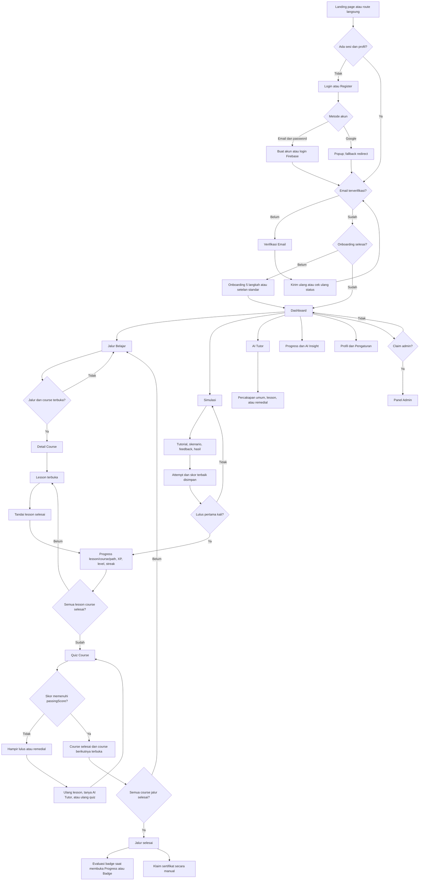

# User Flow Cyber Academy AI

## 1. Pengantar

User flow ini menunjukkan langkah yang benar-benar dilalui pengguna saat memakai Cyber Academy AI, mulai dari membuka landing page sampai belajar, mengerjakan kuis, memakai simulasi, dan melihat pencapaian.

Alur disusun dari router, komponen halaman, tombol, navigasi, service client, endpoint Express, Firebase Auth, perubahan Firestore, aturan akses, dan test pada project ZIP yang diaudit. README dan dokumentasi user flow lama tidak dipakai sebagai dasar keputusan.

Katalog yang ada di source berisi 3 jalur belajar, 25 course, 79 lesson, 25 quiz, dan 160 pertanyaan. Angka tersebut juga diperiksa oleh test integritas katalog.

## 2. Tujuan User Flow

Dokumentasi ini dipakai untuk:

- memahami perjalanan pengguna dari awal sampai menyelesaikan pembelajaran;
- melihat hubungan antarhalaman dan tombol yang memindahkan pengguna;
- menjelaskan keputusan seperti verifikasi email, onboarding, course terkunci, dan hasil quiz;
- membantu pengujian route, navigasi, state kosong, loading, dan error;
- mencatat data yang diperbarui ketika pengguna melakukan suatu tindakan;
- menjadi acuan saat perilaku UI dan validasi server tidak persis sama.

## 3. Jenis Pengguna

| Jenis Pengguna | Kondisi | Alur yang Dapat Dilakukan |
|----------------|---------|---------------------------|
| Pengunjung | Belum punya sesi Firebase Auth | Membuka landing page, login, register, lupa password, privasi, syarat dan ketentuan, serta verifikasi sertifikat publik. Route aplikasi yang dilindungi akan mengarah ke `/login`. |
| Pengguna login tetapi belum terverifikasi | Sesi Auth dan profil `users/{uid}` ada, tetapi `emailVerified` bernilai `false` | Hanya diarahkan ke `/verify-email`. Dapat memeriksa ulang status verifikasi, mengirim ulang email verifikasi, atau keluar. |
| Pengguna terverifikasi tetapi onboarding belum selesai | Email sudah terverifikasi dan `onboardingCompleted` bernilai `false` | Diarahkan ke `/onboarding`, mengisi lima langkah atau memakai setelan standar, lalu masuk ke Dashboard. |
| Pengguna aktif | Sesi Auth ada, profil aktif, email terverifikasi, dan onboarding selesai | Mengakses Dashboard, jalur belajar, course, lesson, quiz, simulasi, Progress, AI Tutor, AI Insight, badge, sertifikat, profil, dan pengaturan. |
| Admin | Semua syarat akun aktif dan terverifikasi terpenuhi, lalu Firebase ID token memiliki custom claim `admin: true` | Mengakses route `/admin/*`, mengelola pengguna dan konten, melihat statistik/log, mengubah status simulasi, serta mencabut atau mengaktifkan sertifikat. |

Nilai `role: "admin"` di dokumen Firestore saja tidak cukup untuk membuka panel admin. Guard dan middleware server memakai custom claim `admin: true` dari Firebase ID token.

Akun dengan `accountStatus: "disabled"` dikeluarkan dari sesi. Halaman login kemudian menampilkan pesan bahwa akun dinonaktifkan.

## 4. Titik Masuk Aplikasi

| Titik Masuk | Route | Kondisi Pengguna | Tujuan Berikutnya |
|-------------|-------|------------------|--------------------|
| Landing page | `/` | Pengunjung | Membaca halaman, pindah ke bagian Fitur/Jalur/FAQ, login, register, atau mencoba tombol fitur. Tombol ke fitur yang dilindungi akan berakhir di `/login`. |
| Route lama beranda | `/home` | Siapa pun | Redirect permanen di sisi router ke `/`. |
| Login langsung | `/login` | Pengunjung | Login email dan password atau Google. Setelah sesi terbentuk, guard menentukan `/verify-email`, `/onboarding`, atau `/dashboard`. |
| Register langsung | `/register` | Pengunjung | Membuat akun email atau masuk dengan Google. Akun email menuju verifikasi; akun Google mengikuti status sesi dan guard. |
| Lupa password | `/forgot-password` | Pengunjung | Mengirim permintaan reset melalui Firebase Auth, lalu pengguna kembali ke `/login` lewat tombol yang tersedia. |
| Email verifikasi | Tautan aksi dari Firebase, lalu `/verify-email` di aplikasi | Pengguna login yang belum terverifikasi | Setelah melakukan aksi dari email, pengguna menekan **Saya Sudah Memverifikasi**. Aplikasi me-reload pengguna Auth lalu menuju onboarding atau Dashboard. Target tautan aksi email tidak didefinisikan sebagai route React di source. |
| Reset password | Tautan aksi dari Firebase | Pemilik email | Proses penggantian password ditangani oleh alur Firebase. Project tidak mempunyai route `/reset-password` atau halaman reset password sendiri. |
| Verifikasi sertifikat | `/verify/certificate` atau `/verify/certificate/:code` | Pengunjung maupun pengguna login | Memasukkan kode atau langsung memeriksa kode dari URL. Sertifikat aktif menampilkan data publik terbatas. |
| Route terlindungi langsung | Contoh: `/dashboard`, `/learn/...`, `/simulations/...`, `/ai-tutor/...` | Bergantung status sesi | Guard mengirim pengguna tanpa sesi ke login, pengguna belum terverifikasi ke verifikasi email, dan pengguna yang belum onboarding ke onboarding. |
| Route admin langsung | `/admin/*` | Bergantung claim admin | Tanpa sesi menuju login, belum terverifikasi menuju verifikasi email, bukan admin menuju Dashboard. |
| Halaman informasi | `/privacy`, `/terms` | Siapa pun | Membaca isi halaman lalu kembali ke beranda. |

Konfigurasi Firebase client memakai `siberaga.web.id` sebagai `authDomain` production. Route aplikasi tetap memakai path relatif, sehingga alur halaman pada dokumen ini tidak bergantung pada hostname tertentu.

## 5. Diagram User Flow Utama

Gambar versi PNG tersedia di `diagrams/user-flow.png`. Diagram Mermaid berikut memakai alur yang sama dan dapat dirender di GitHub.

## 6. Daftar Route dan Proteksinya

### 6.1 Route publik

| Route | Halaman | Perilaku |
|-------|---------|----------|
| `/` | Landing Page | Hanya tampil untuk pengunjung. Pengguna yang sudah login akan dialihkan oleh `PublicRoute`. |
| `/home` | Redirect lama | Redirect ke `/`. |
| `/login` | Login | Hanya untuk pengunjung. |
| `/register` | Register | Hanya untuk pengunjung. |
| `/forgot-password` | Lupa Password | Hanya untuk pengunjung. |
| `/verify/certificate` | Verifikasi Sertifikat | Publik dan tetap dapat dibuka pengguna login. |
| `/verify/certificate/:code` | Verifikasi Sertifikat dengan kode | Langsung menjalankan pemeriksaan kode. |
| `/privacy` | Kebijakan Privasi | Publik. Komponen berisi konten halaman, bukan placeholder kosong. |
| `/terms` | Syarat dan Ketentuan | Publik. |
| `*` | 404 | Menampilkan tombol kembali serta tombol ke beranda atau Dashboard sesuai sesi. |

### 6.2 Route status akun

| Route | Guard | Syarat |
|-------|-------|--------|
| `/verify-email` | `VerificationRoute` | Harus login, profil ada dan aktif, serta email belum terverifikasi. Jika sudah terverifikasi, langsung ke onboarding atau Dashboard. |
| `/onboarding` | `OnboardingRoute` | Harus login, profil aktif, email terverifikasi, dan onboarding belum selesai. |

### 6.3 Route pengguna aktif

| Kelompok | Route |
|----------|-------|
| Dashboard | `/dashboard` |
| Jalur belajar | `/learn/paths`, `/learn/paths/:pathSlug` |
| Course | `/learn/courses/:courseSlug` |
| Lesson | `/learn/courses/:courseSlug/lessons/:lessonSlug` |
| Quiz | `/learn/courses/:courseSlug/quiz` |
| Hasil quiz | `/learn/courses/:courseSlug/quiz/results/:attemptId` |
| Simulasi | `/simulations`, `/simulations/:simulationId` |
| Progress dan AI Insight | `/progress`, `/progress/insight` |
| AI Tutor | `/ai-tutor`, `/ai-tutor/:conversationId` |
| Pencapaian | `/badges`, `/certificates` |
| Profil | `/profile` |
| Pengaturan | `/settings`, `/settings/profile`, `/settings/account`, `/settings/security` |

Semua route pada tabel ini dibungkus `ProtectedRoute`. Syaratnya adalah sesi Firebase Auth, profil Firestore, akun aktif, email terverifikasi, dan onboarding selesai.

### 6.4 Route admin

| Kelompok | Route yang terdaftar | Implementasi halaman |
|----------|----------------------|----------------------|
| Dashboard admin | `/admin` | Statistik, aktivitas terbaru, dan quick action. |
| Pengguna | `/admin/users`, `/admin/users/:id`, `/admin/users/:id/edit` | Ketiganya merender tabel pengguna yang sama. Parameter `:id` tidak dipakai untuk membuka detail atau edit tertentu. |
| Learning path | `/admin/learning-paths`, `/new`, `/:id`, `/:id/edit` di bawah path tersebut | Semua merender halaman daftar yang sama. Create dan edit yang benar dilakukan melalui modal dari tombol di daftar. |
| Course | `/admin/courses`, `/new`, `/:id`, `/:id/edit` | Semua merender halaman daftar yang sama; create/edit memakai modal. |
| Lesson | `/admin/lessons`, `/new`, `/:id`, `/:id/edit` | Semua merender halaman daftar yang sama; create/edit memakai modal. |
| Quiz | `/admin/quizzes`, `/admin/quizzes/new`, `/admin/quizzes/:id`, `/admin/quizzes/:id/edit` | Daftar berada di route dasar. Route baru/detail/edit memakai `AdminQuizEditor` dan benar-benar membaca parameter ID. |
| Simulasi | `/admin/simulations`, `/new`, `/:id`, `/:id/edit` | Semua merender tabel yang sama. UI hanya mencari dan mengubah status published/draft. |
| Badge | `/admin/badges`, `/new`, `/:id`, `/:id/edit` | Semua merender daftar read-only yang sama. Tidak ada form create/edit di UI. |
| Sertifikat | `/admin/certificates`, `/:id`, `/:id/revoke` | Semua merender tabel yang sama. Aksi nyata di UI adalah cabut atau aktifkan. |
| Audit log | `/admin/audit-logs` | Menampilkan log sampai 100 item. Route ada, tetapi tidak ada item Audit Logs di sidebar dan tidak ada quick action ke halaman ini. |

`AdminRoute` tidak memeriksa `onboardingCompleted`. Jadi admin yang aktif dan terverifikasi dapat membuka `/admin` walau onboarding belum selesai. Route pengguna biasa tetap memakai pemeriksaan onboarding.

## 7. Alur Landing Page dan Navigasi Publik

Navbar landing page berisi Beranda, Fitur, Jalur Belajar, dan FAQ. Tombol tersebut kembali ke `/` lalu melakukan scroll ke bagian yang sesuai. Pada layar kecil, item yang sama muncul di menu mobile.

Tombol publik yang ditemukan:

- CTA utama menuju `/register`;
- kartu dan CTA fitur menuju `/learn/paths`, `/simulations`, `/ai-tutor`, atau `/badges`;
- tombol jalur Beginner menuju `/learn/paths`;
- tombol jalur Intermediate dan Advanced pada landing page menuju `/dashboard`;
- footer menuju bagian Jalur Belajar/FAQ, `/simulations`, `/ai-tutor`, `/privacy`, dan `/terms`.

Pengunjung dapat menekan tombol fitur tersebut, tetapi route tujuan tetap dilindungi. Hasil akhirnya adalah redirect ke `/login`, bukan akses demo publik.

## 8. Alur Autentikasi

### 8.1 Register email dan password

1. Pengguna membuka `/register`.
2. Form memeriksa nama minimal 2 karakter, format email, kecocokan password, persetujuan syarat, serta password minimal 8 karakter yang memiliki huruf besar, huruf kecil, dan angka.
3. Firebase Auth membuat akun.
4. `displayName` diperbarui pada akun Auth.
5. Aplikasi membuat `users/{uid}` jika belum ada dengan role `user`, status `active`, dan `onboardingCompleted: false`.
6. Firebase mengirim email verifikasi.
7. UI menampilkan panduan memeriksa inbox/spam, lalu berpindah ke `/verify-email`.

Jika pembuatan profil Firestore gagal, service mencoba menghapus akun Auth yang baru dibuat agar tidak meninggalkan akun tanpa profil. Jika profil sudah berhasil dibuat tetapi email verifikasi gagal dikirim, akun tetap ada dan UI menampilkan error. Pengguna dapat memakai fitur kirim ulang di halaman verifikasi.

Placeholder password menulis “Min. 8 karakter” dan sesuai dengan validasi minimal 8 karakter yang memerlukan huruf besar, huruf kecil, dan angka.

### 8.2 Login email dan password

1. Pengguna mengisi email dan password di `/login`.
2. UI memeriksa kolom wajib dan format email.
3. Firebase Auth memeriksa kredensial.
4. Service memastikan profil `users/{uid}` tersedia.
5. UI menampilkan pesan berhasil dan meminta navigasi ke `/dashboard` setelah 800 ms.
6. Guard tetap menjadi penentu akhir: belum terverifikasi menuju `/verify-email`, onboarding belum selesai menuju `/onboarding`, selain itu menuju Dashboard.

Error Firebase seperti kredensial salah, akun dinonaktifkan, terlalu banyak percobaan, jaringan gagal, dan domain tidak diizinkan dipetakan menjadi pesan Bahasa Indonesia.

### 8.3 Login atau register dengan Google

1. Tombol Google membuka `signInWithPopup` dan meminta pemilihan akun.
2. Jika popup berhasil, aplikasi membuat profil Firestore bila belum ada.
3. Jika popup diblokir atau ditutup, code mencoba `signInWithRedirect` sebagai fallback.
4. Hasil redirect diperiksa ketika `UserProvider` dimuat.
5. UI meminta navigasi ke Dashboard, lalu guard menentukan apakah onboarding masih diperlukan.

Tombol Google pada halaman Login dan Register memakai fungsi service yang sama. Tidak ada flow Google yang terpisah khusus untuk pendaftaran.

### 8.4 Verifikasi email dan kirim ulang

1. Pengguna belum terverifikasi selalu diarahkan ke `/verify-email`.
2. Tombol **Kirim Ulang Email Verifikasi** memanggil Firebase Auth dan memulai cooldown 60 detik bila berhasil.
3. Setelah memakai tautan dari email, pengguna kembali ke aplikasi lalu menekan **Saya Sudah Memverifikasi**.
4. Aplikasi me-reload pengguna Firebase, me-refresh profil, lalu menuju `/onboarding` atau `/dashboard`.
5. Bila status masih belum terverifikasi, halaman menampilkan error dan tetap berada di halaman yang sama.
6. Tombol **Keluar (Ganti Akun)** melakukan logout. Guard kemudian membawa pengguna ke `/login`.

### 8.5 Lupa dan reset password

1. Dari Login, pengguna membuka `/forgot-password`.
2. Form memeriksa format email lalu memanggil `sendPasswordResetEmail` Firebase.
3. Baik Firebase mengembalikan sukses maupun error, UI menampilkan pesan umum: bila email terdaftar, tautan sudah dikirim. Ini mencegah pengecekan apakah suatu email terdaftar.
4. Tombol kembali dan tautan di bagian bawah menuju `/login`.

Tidak ada halaman reset password di React Router. Penggantian password dari tautan email berada pada alur aksi Firebase di luar route aplikasi ini.

### 8.6 Logout dan profil gagal disinkronkan

- Logout dari layout pengguna atau admin menuju `/login`.
- Logout dari layout publik menuju `/`.
- Jika langganan profil mendeteksi akun dinonaktifkan, service logout otomatis dan menyimpan penanda lokal agar halaman Login menampilkan “Akun Anda dinonaktifkan.”
- Jika profil hilang atau Firestore gagal disinkronkan, semua guard menampilkan halaman **Gagal Menyinkronkan Sesi** dengan tombol **Coba Lagi** dan **Keluar**. Kondisi ini tidak langsung dianggap sebagai pengguna tanpa login.

## 9. Onboarding

Onboarding terdiri dari lima langkah:

1. sambutan;
2. tujuan belajar;
3. tingkat kemampuan;
4. topik yang diminati;
5. waktu belajar per hari.

Tombol **Lanjut** pada langkah pilihan baru aktif setelah pilihan wajib diisi. Tombol **Kembali** menuju langkah sebelumnya. Sebelum langkah terakhir, pengguna dapat memilih **Lewati Onboarding**, yang menyimpan nilai standar `protect_self`, `beginner`, minat password/phishing, dan `15min`.

Saat selesai, aplikasi memperbarui dokumen `users/{uid}` dengan preferensi dan `onboardingCompleted: true`, me-refresh profil, lalu mengganti route ke `/dashboard`. Jika penyimpanan gagal, code hanya menulis error ke console dan mengaktifkan kembali tombol; tidak ada pesan error yang terlihat di halaman.

Pilihan skill atau minat tidak membuka jalur Intermediate/Advanced secara otomatis. Urutan buka jalur tetap berdasarkan progress penyelesaian.

## 10. Dashboard dan Navigasi Setelah Login

### 10.1 Isi Dashboard

Dashboard mengambil katalog, progress pengguna, badge yang sudah diberikan, dan sertifikat. Halaman menampilkan:

- total XP, level, streak, progress jalur aktif, jumlah badge, dan status sertifikat;
- rekomendasi lesson berikutnya;
- course pada jalur aktif;
- ringkasan progress semua jalur;
- tombol ke Progress, AI Insight, AI Tutor, Simulasi, Badge, dan Sertifikat.

Jalur aktif dipilih dari jalur pertama yang berstatus `in_progress`. Jika belum ada, Dashboard memakai jalur pertama dalam urutan katalog.

Tombol **Lanjutkan Belajar** mencari lesson pertama yang belum selesai. Pencarian ini tidak memeriksa status lulus quiz sebelum berpindah ke course berikutnya. Jika semua lesson suatu course sudah selesai tetapi quiz belum lulus, tombol dapat membuka URL lesson di course berikutnya yang sebenarnya masih terkunci. Saat pengguna mencoba menandai lesson itu selesai, server tetap menolak karena course sebelumnya belum selesai.

### 10.2 Sidebar desktop dan drawer mobile

Sidebar pengguna berisi Dashboard, Jalur Belajar, Simulasi, AI Tutor, Progress, Badge, Sertifikat, Profil, dan Pengaturan. Admin mendapat item tambahan **Panel Admin**.

Di desktop, sidebar dapat diciutkan dan statusnya disimpan di `localStorage`. Di layar kecil, menu yang sama muncul sebagai drawer. Drawer menutup ketika route berubah, dapat ditutup dengan Escape atau overlay, menahan fokus di dalam drawer, dan mengembalikan fokus setelah ditutup.

### 10.3 Tombol kembali dan breadcrumb

| Halaman | Tujuan tombol kembali dari `AppShell` |
|---------|----------------------------------------|
| Pengaturan detail | `/settings` |
| Pengaturan utama | `/profile` |
| Profil | `/dashboard` |
| Lesson | Detail course yang sama |
| Quiz dan hasil quiz | Detail course yang sama |
| Detail course | `/learn/paths` |
| Detail jalur | `/learn/paths` |
| Daftar jalur | `/dashboard` |
| Detail simulasi | `/simulations` |
| Daftar simulasi | `/dashboard` |
| Percakapan AI Tutor | `/ai-tutor` |
| AI Tutor utama | `/dashboard` |
| AI Insight | `/progress` |
| Progress, Badge, Sertifikat | `/dashboard` |

Beberapa halaman juga memiliki tombol kembali sendiri, seperti Course Detail, Quiz, hasil Quiz, Simulasi, dan Progress. Tujuannya sesuai route yang disebut pada komponen masing-masing.

## 11. Jalur Belajar dan Course

### 11.1 Pemilihan jalur

Jalur diurutkan Beginner, Intermediate, lalu Advanced. Jalur pertama selalu terbuka. Jalur berikutnya baru terbuka jika progress jalur sebelumnya berstatus `completed`.

Pada daftar course dalam suatu jalur:

- course pertama terbuka bila jalurnya terbuka;
- course berikutnya membutuhkan course sebelumnya berstatus `completed`;
- `lessonsCompleted: true` saja belum cukup karena course baru selesai setelah quiz lulus;
- klik pada jalur atau course terkunci menampilkan `alert` dan tidak berpindah halaman.

Halaman memiliki loading, error dengan tombol coba lagi, serta empty state bila tidak ada jalur atau course publik.

### 11.2 Detail course

Detail course mengambil data course dari slug, daftar lesson, progress, quiz, dan daftar jalur. Halaman menghitung ulang apakah jalur sebelumnya serta course sebelumnya sudah selesai.

Lesson pertama terbuka. Lesson berikutnya membutuhkan lesson sebelumnya berstatus selesai. Setelah semua lesson selesai, tombol quiz aktif. Bila quiz pernah lulus, label tombol berubah menjadi **Ulangi Kuis**.

Jika URL course terkunci dibuka langsung, halaman masih dapat menampilkan data course publik. Tombol lesson disembunyikan dan tombol quiz tetap terkunci. Server tetap memeriksa prasyarat ketika progress atau jawaban dikirim.

Course yang tidak ditemukan, belum published, atau gagal dimuat menampilkan state **Kelas Tidak Ditemukan**, tombol kembali ke jalur, dan tombol coba lagi. Course tanpa lesson menampilkan pesan bahwa belum ada materi publik.

## 12. Lesson

### 12.1 Membuka dan berpindah lesson

Lesson dibuka dari Detail Course, tombol Dashboard, rekomendasi remedial, drawer daftar materi, atau URL langsung. Route memakai kombinasi `courseSlug` dan `lessonSlug` sehingga lesson harus cocok dengan course tersebut.

Di halaman lesson:

- **Materi Sebelumnya** selalu dapat dipakai bila lesson sebelumnya ada;
- **Materi Berikutnya** baru aktif setelah lesson saat ini selesai;
- drawer **Daftar Materi** mengunci item bila belum ada progress untuk lesson sebelumnya;
- tombol shell kembali ke Detail Course;
- lesson tidak ditemukan menampilkan state error dan tombol coba lagi.

### 12.2 Menyelesaikan lesson

1. Pengguna menekan **Tandai Selesai & Klaim XP**.
2. UI mencegah klik ganda selama request berjalan.
3. Client mengirim `POST /api/me/lessons/:lessonId/complete` dengan body kosong.
4. Server memeriksa pengguna, status published lesson/course/path, jalur sebelumnya, dan course sebelumnya.
5. Jika ini penyelesaian pertama, server membuat progress lesson dan transaksi XP dari `lesson.xpReward`.
6. Progress course dihitung dari jumlah lesson selesai. Setelah semua lesson selesai, `progressPercent` menjadi 100 dan `lessonsCompleted` menjadi `true`, tetapi status course tetap `in_progress` sampai quiz lulus.
7. Progress jalur dihitung dari jumlah course yang benar-benar berstatus `completed`.
8. Profil `users/{uid}` diperbarui untuk XP, level, streak, dan tanggal belajar.
9. Client mengambil ulang progress dan profil lalu menampilkan dialog hasil. Tombol lanjut menuju lesson berikutnya atau kembali ke course untuk mengambil quiz.

Request penyelesaian ulang tidak memberi XP kedua. Server tidak memeriksa prasyarat lesson sebelumnya; urutan lesson dijaga oleh UI. Karena itu, URL langsung ke lesson berikutnya dapat membuka isi lesson, dan penyelesaiannya tidak ditolak berdasarkan lesson sebelumnya selama jalur serta course-nya sudah terbuka.

Jika request gagal, pesan error muncul di area navigasi lesson dan progress tidak dianggap selesai.

### 12.3 AI Tutor di dalam lesson

Panel **Tanya AI Tutor** tidak membuat percakapan ketika baru dibuka. Pertanyaan dikirim langsung ke `/api/ai/tutor` dengan konteks lesson dan riwayat panel saat itu. Tanya-jawab di panel ini tidak disimpan ke `aiConversations` atau `aiMessages`.

Tombol membuka AI Tutor layar penuh membuat percakapan bertipe `lesson`, lalu menuju `/ai-tutor/:conversationId`. Jika pembuatan percakapan gagal, code hanya menulis error ke console tanpa pesan terlihat.

## 13. Quiz

### 13.1 Membuka dan mengerjakan quiz

Quiz dibuka dari Detail Course setelah semua lesson selesai. Halaman mengambil quiz published, pertanyaan tanpa `correctOptionId`, dan ringkasan skor pengguna.

Jawaban disimpan sementara di `localStorage` dengan kunci yang memuat UID dan course ID. Satu pertanyaan ditampilkan per langkah. Tombol **Berikutnya** tidak aktif sebelum pertanyaan saat ini dijawab. Pengguna dapat kembali ke pertanyaan sebelumnya dan mengganti pilihan.

Pada pertanyaan terakhir, UI menampilkan ringkasan dan konfirmasi. UI memiliki peringatan jawaban kosong, tetapi jalur normal tidak dapat mencapai langkah terakhir tanpa menjawab setiap pertanyaan. Server tetap memeriksa jumlah pertanyaan dan validitas setiap opsi.

Membuka URL quiz secara langsung dapat memuat pertanyaan walau lesson belum selesai. Syarat `lessonsCompleted` baru ditegakkan server ketika submit. Jika belum memenuhi syarat, submit ditolak dengan pesan bahwa quiz masih terkunci.

### 13.2 Penilaian dan hasil

1. Pengguna menekan **Kirim & Lihat Hasil**.
2. Server memeriksa profil aktif, quiz/course/path published, semua lesson selesai, jalur sebelumnya, course sebelumnya, jumlah jawaban, ID pertanyaan, dan ID opsi.
3. Skor dihitung di server. Nilai lulus memakai `quiz.passingScore`, dengan nilai default 70 bila field tidak tersedia.
4. Status hasil menjadi:
   - `remedial_required` bila skor di bawah 50;
   - `almost_passed` bila skor minimal 50 tetapi masih di bawah `passingScore`;
   - `passed` bila skor mencapai `passingScore`.
5. Setiap submit membuat `quizAttempts` dan memperbarui `quizSummaries` untuk jumlah percobaan, skor terbaik, dan status pernah lulus.
6. Hanya kelulusan pertama yang memberi XP quiz.
7. Jika lulus, course menjadi `completed`, course berikutnya terbuka, dan progress jalur dihitung ulang.
8. Client menghapus jawaban sementara, me-refresh profil, lalu menuju route hasil berdasarkan `attemptId`.

Halaman hasil hanya dapat mengambil attempt milik pengguna login. Jika attempt tidak ada atau bukan miliknya, halaman menampilkan **Riwayat Tidak Ditemukan**.

Hasil lulus menuju daftar jalur. Hasil hampir lulus dapat kembali ke materi, membuka AI Tutor remedial, atau mengulang quiz. Hasil remedial menampilkan lesson rekomendasi dari pertanyaan yang salah, AI Tutor, dan tombol ulang quiz. Riwayat attempt dan pembahasan juga tersedia.

Detail Course dan hasil hampir lulus membaca `passingScore` quiz yang sedang dibuka. Pada katalog source saat ini, jalur Beginner memakai 70, Intermediate 75, dan Advanced 80.

Jika load atau submit quiz gagal, halaman error menampilkan tombol **Kembali** dan **Coba Lagi**, tetapi kedua tombol hanya menghapus pesan error. Keduanya tidak menjalankan ulang fungsi load atau submit secara langsung.

## 14. Progress, XP, Level, dan Streak

### 14.1 Sumber progress

Progress memakai koleksi `userProgress` dengan tipe `lesson`, `course`, `path`, dan `simulation`. Client hanya membaca melalui API; perubahan progress utama dilakukan server dengan Admin SDK.

XP diberikan pada:

- penyelesaian pertama setiap lesson;
- kelulusan pertama setiap quiz;
- kelulusan pertama setiap simulasi.

Badge tidak memberi XP. Penyelesaian lesson/course yang sama, kelulusan ulang quiz, dan kelulusan ulang simulasi tidak menggandakan reward karena setiap reward memakai kunci idempotensi.

### 14.2 Level

| Total XP | Level |
|----------|-------|
| 0–99 | 1 |
| 100–249 | 2 |
| 250–449 | 3 |
| 450–699 | 4 |
| 700 ke atas | 5 |

Halaman Progress menghitung persentase level dengan batas tersebut. Teks di halaman mengatakan “setiap 100 XP”, tetapi implementasi level memakai batas bertingkat pada tabel. Kartu level di Dashboard memakai `totalXp % 100`, sehingga indikator “ke level berikutnya” di Dashboard tidak mengikuti rentang bertingkat setelah Level 2.

### 14.3 Streak

Tanggal belajar memakai zona waktu `Asia/Jakarta`.

- Aktivitas reward pertama memberi streak 1.
- Aktivitas lain pada tanggal yang sama tidak menambah streak.
- Aktivitas pada hari berikutnya menambah 1.
- Jeda lebih dari satu hari mengembalikan streak ke 1.

Streak berubah ketika ada XP baru dari lesson, kelulusan pertama quiz, atau kelulusan pertama simulasi. Attempt gagal atau aktivitas ulang tanpa XP tidak menambah streak.

### 14.4 Halaman Progress dan reset

Halaman Progress menghitung total lesson/course dari katalog, menampilkan 20 transaksi XP terbaru, dan memanggil evaluasi badge. Halaman memiliki empty state bila belum ada transaksi, banner error katalog dengan retry, serta pesan error badge bila evaluasi gagal.

Tombol reset memakai konfirmasi browser, lalu mengirim string `RESET_MY_PROGRESS`. Server:

- menghapus dokumen `userProgress` milik pengguna;
- menghapus dokumen `xpTransactions` milik pengguna;
- mengatur XP 0, Level 1, streak 0, dan tanggal belajar menjadi null;
- menolak reset bila total write lebih dari 450 dokumen.

Reset tidak menghapus `quizAttempts`, `quizSummaries`, `simulationAttempts`, `userBadges`, `certificates`, percakapan AI, atau cache AI Insight di `localStorage`. Dialog konfirmasi UI menyebut cakupan yang direset dan data yang tetap dipertahankan.

## 15. Badge

Ada empat badge aktif:

| Badge | Syarat server |
|-------|---------------|
| Beginner Master | Semua course, lesson published, dan quiz published pada `beginner-path` selesai/lulus. |
| Intermediate Master | Semua course, lesson published, dan quiz published pada `intermediate-path` selesai/lulus. |
| Advanced Master | Semua course, lesson published, dan quiz published pada `advanced-path` selesai/lulus. |
| Simulation Defender | Semua simulasi required yang published telah memiliki minimal satu attempt lulus. Attempt berulang dihitung satu kali per simulasi. |

Badge tidak otomatis diberikan saat endpoint lesson, quiz, atau simulasi selesai. Evaluasi dan pemberian terjadi ketika pengguna membuka `/progress` atau `/badges`, karena kedua halaman memanggil `POST /api/me/badges/evaluate`.

Evaluasi membaca data server, bukan progress yang dikirim client. Jika syarat baru terpenuhi, server membuat `userBadges` dan `adminAuditLogs`. Proses idempotent dan tidak memberi XP.

Halaman Badge memiliki filter Semua/Telah Diraih/Belum Diraih, detail modal, progress server, tombol belajar atau simulasi untuk badge terkunci, dan salin teks pencapaian untuk badge yang sudah diraih. Error load muncul sebagai banner. Empty state muncul bila filter tidak menghasilkan badge.

Saat katalog badge dibaca atau dievaluasi, server memastikan empat definisi badge utama ada dan menonaktifkan definisi lama. Jadi operasi baca ini dapat memperbarui koleksi `badges` bila definisinya belum sinkron.

## 16. Sertifikat

1. Pengguna membuka `/certificates` dan memilih jalur yang memiliki course.
2. Halaman mengambil kelayakan, daftar sertifikat milik pengguna, dan jalur publik.
3. Server menyatakan layak bila progress jalur `completed`, semua course published berstatus `completed`, dan semua course memiliki `quizSummaries.passed: true`.
4. Simulasi bukan syarat sertifikat.
5. Pengguna yang layak mengisi nama penerima minimal 2 karakter lalu menekan tombol terbitkan.
6. Server membuat satu dokumen sertifikat untuk kombinasi pengguna dan jalur, dengan kode `CYBER-TAHUN-6KARAKTER`, hash verifikasi, status aktif, dan path PDF.
7. Jika sertifikat aktif sudah ada, request tidak membuat sertifikat kedua; nama penerima diperbarui.
8. Jika sertifikat yang sama pernah dicabut, pengguna tidak dapat menerbitkannya kembali dan harus menghubungi admin.

Sertifikat aktif dapat disalin link verifikasinya, dibuka pada route publik, dan diunduh sebagai PDF. Endpoint PDF menolak format kode salah, sertifikat tidak ditemukan, atau sertifikat dicabut.

Halaman kelayakan menampilkan target skor 70 untuk Beginner, 75 untuk Intermediate, dan 80 untuk Advanced. Pemeriksaan server tidak membandingkan skor dengan angka tampilan itu secara terpisah; server memakai status `passed` dari masing-masing quiz summary, yang berasal dari `quiz.passingScore` saat attempt dinilai.

Verifikasi publik hanya mengembalikan nama penerima, jalur, tanggal terbit, kode, issuer, dan status. Sertifikat tidak ditemukan menghasilkan 404, sedangkan sertifikat dicabut menghasilkan 410 dan tidak ditampilkan sebagai valid.

## 17. Simulasi

Source menyediakan empat simulasi: `phishing-email`, `whatsapp-scam`, `vishing-call`, dan `malware-analysis`. Daftar hanya mengaktifkan tombol bila simulasi tersebut berstatus published pada API.

Alurnya:

1. Pengguna membuka daftar simulasi dan melihat riwayat, skor terbaik, serta status pernah lulus.
2. Pengguna membuka detail, membaca tujuan, lalu memilih mulai atau ulangi.
3. Halaman menampilkan tutorial singkat.
4. Pada setiap skenario, pengguna memilih satu tindakan lalu menekan konfirmasi.
5. Server memeriksa tindakan dan mengembalikan benar/salah, penjelasan, risiko, dan tips.
6. Setelah feedback muncul, pengguna lanjut ke skenario berikutnya.
7. Pada skenario terakhir, client mengirim semua jawaban dan waktu pengerjaan.
8. Server menghitung skor dan `passed` memakai `passingScore` simulasi.
9. Setiap submit membuat `simulationAttempts` dan memperbarui progress simulasi, jumlah attempt, serta skor terbaik.
10. XP hanya diberikan pada kelulusan pertama. Pengulangan tetap menyimpan attempt dan skor terbaik.

Ketika keluar saat fase aktif, UI meminta konfirmasi bahwa jawaban belum disimpan. Browser juga mendapat peringatan `beforeunload`. Error pemeriksaan jawaban atau penyimpanan hasil muncul di tahap aktif; load gagal mempunyai tombol kembali dan coba lagi. ID simulasi yang tidak dikenal menampilkan state tidak ditemukan.

Pemanggilan daftar atau submit simulasi menjalankan `ensureDefaultSimulations`. Jika salah satu dari empat dokumen default belum ada, server dapat membuat dokumen aman tanpa answer key di koleksi `simulations`.

## 18. AI Tutor

### 18.1 Percakapan

Route `/ai-tutor` mengambil semua percakapan milik pengguna. Jika belum ada percakapan, halaman otomatis membuat percakapan `general` lalu menuju `/ai-tutor/:conversationId`.

Pengguna dapat:

- membuat percakapan umum baru;
- memilih riwayat percakapan;
- membuka percakapan dari lesson dengan konteks `lesson`;
- membuka percakapan dari hasil quiz dengan konteks `remedial`;
- menghapus percakapan setelah konfirmasi;
- mengirim pertanyaan manual atau pertanyaan lanjutan yang disarankan AI.

Tipe `simulation` didukung oleh schema dan tampilan AI Tutor, tetapi tidak ditemukan tombol pada `SimulationPlayer` yang membuat percakapan bertipe ini.

### 18.2 Mengirim pesan

1. Client memastikan percakapan ada pada daftar milik pengguna.
2. Client mengambil riwayat pesan dan mengirim pertanyaan, konteks, lima pesan terakhir, `conversationId`, dan `requestId` ke `/api/ai/tutor`.
3. Server memverifikasi token dan kepemilikan percakapan, membersihkan input sensitif, memeriksa prompt injection/permintaan berbahaya, menerapkan kuota dan deduplikasi, lalu meminta output terstruktur dari provider AI.
4. Permintaan yang meminta peretasan, malware, pembobolan akun, atau perubahan batas sistem ditolak dan dialihkan ke jawaban defensif.
5. Setelah jawaban diterima, client menyimpan pasangan pesan ke endpoint `/api/me/ai/conversations/:id/exchanges`.
6. Server membuat satu pesan user dan satu pesan assistant di `aiMessages`, lalu memperbarui waktu percakapan.

Jika AI menjawab tetapi penyimpanan riwayat gagal, UI menampilkan error “Jawaban diterima, tetapi riwayat percakapan gagal disimpan.” Request ID membuat retry penyimpanan tidak menggandakan pasangan pesan.

Percakapan milik pengguna lain atau ID yang tidak ada ditampilkan sebagai **Akses Ditolak atau Obrolan Tidak Ditemukan**. Menghapus percakapan menghapus seluruh pesannya dan dokumen percakapan, tetapi server menolak penghapusan sekaligus bila ada lebih dari 450 pesan.

Riwayat tampil sebagai sidebar desktop dan drawer tersendiri di mobile. Empty state tersedia untuk percakapan tanpa pesan, dan error ditampilkan sebagai banner di area chat.

## 19. AI Insight

AI Insight dibuka dari Dashboard atau `/progress/insight`.

1. Halaman mengambil progress, semua attempt quiz, dan attempt simulasi.
2. Statistik yang dikirim ke AI berisi jumlah lesson selesai, rata-rata skor quiz, riwayat quiz, attempt simulasi, dan progress umum.
3. Endpoint `/api/ai/insight` memakai maksimal tiga hasil quiz dan tiga hasil simulasi terbaru dalam prompt.
4. Output harus mengikuti schema ringkasan, topik kuat, topik yang perlu ditingkatkan, maksimal dua rekomendasi, tips belajar, dan confidence.
5. Hasil valid disimpan di `localStorage` dengan kunci per UID. Tidak ada pemeriksaan masa berlaku cache.
6. Tombol **Perbarui Analisis** melewati cache dan meminta hasil baru.

Catatan implementasi yang terlihat di source:

- total lesson untuk persentase AI Insight ditulis tetap sebagai 12, bukan jumlah lesson katalog yang saat ini 79;
- angka **Simulasi Berhasil** memakai jumlah attempt simulasi, bukan jumlah simulasi unik yang lulus;
- klik rekomendasi lesson atau quiz selalu menuju `/learn/paths`, sedangkan rekomendasi simulasi menuju `/simulations`; ID rekomendasi tidak dipakai untuk membuka item tertentu;
- setelah reset progress, cache lama tetap dapat ditampilkan sampai pengguna menekan perbarui atau cache dinyatakan tidak valid oleh pemeriksaan schema.

Halaman mempunyai loading analisis, error dengan tombol coba lagi, empty state bila tidak ada hasil, serta pesan khusus untuk AI tidak tersedia, respons salah format, timeout, dan gangguan jaringan.

## 20. Profil dan Pengaturan

Halaman Profil menampilkan identitas, provider login, level, streak, jumlah course/lesson selesai, badge, dan sertifikat aktif. Tombol yang tersedia menuju Edit Profil dan Pengaturan.

Pengaturan terdiri dari:

- **Profil**: mengubah nama minimal 2 karakter, bio maksimal 150 karakter, dan avatar JPG/PNG/WEBP maksimal 2 MB. Avatar disimpan ke Firebase Storage, URL disinkronkan ke Firebase Auth dan `users/{uid}`.
- **Akun**: menampilkan email dan provider. Akun password dapat meminta perubahan email setelah memasukkan password saat ini; Firebase mengirim verifikasi sebelum email berubah. Akun Google hanya melihat petunjuk bahwa perubahan dilakukan melalui Google.
- **Keamanan**: akun password dapat mengganti password setelah reautentikasi. Password baru minimal 8 karakter, memiliki huruf besar, huruf kecil, angka, cocok dengan konfirmasi, dan berbeda dari password lama. Akun Google hanya melihat petunjuk pengelolaan melalui Google.

Semua form menampilkan loading pada tombol serta pesan sukses atau error. Tidak ditemukan tombol hapus akun.

## 21. Alur Admin yang Benar-Benar Ada

### 21.1 Masuk panel

Admin membuka item **Panel Admin** di sidebar pengguna atau URL `/admin`. Middleware server memverifikasi Firebase token dan custom claim admin untuk setiap endpoint admin.

### 21.2 Aksi admin

| Area | Aksi UI yang ditemukan |
|------|------------------------|
| Dashboard | Melihat jumlah learning path, course published, lesson published, quiz, attempt simulasi, sertifikat aktif, dan 10 log terbaru. Quick action menuju pengguna, learning path, course, lesson, dan quiz. |
| Users | Mencari nama/email, mengubah role user/admin, serta status active/disabled. Tombol untuk akun admin sendiri dinonaktifkan. Server juga menolak admin menurunkan role atau menonaktifkan dirinya sendiri. |
| Learning Paths | Mencari, memfilter, membuat, mengedit, dan menghapus melalui modal pada halaman daftar. |
| Courses | Mencari, memfilter, membuat, mengedit, memindahkan relasi path, dan menghapus melalui modal. |
| Lessons | Mencari, memfilter, membuat, mengedit, memindahkan relasi course, dan menghapus melalui modal. |
| Quizzes | Membuka editor create/detail/edit, mengubah metadata quiz, serta membuat, mengedit, atau menghapus pertanyaan. Hapus quiz meminta konfirmasi; server dapat mengarsipkan quiz yang sudah memiliki attempt. |
| Simulations | Mencari dan mengubah status published/draft. Tidak ada editor skenario atau create simulation pada UI. |
| Badges | Melihat badge aktif dan legacy. Empat metadata badge utama dikunci server dan legacy tidak dapat diaktifkan kembali. UI tidak menyediakan tombol edit. |
| Certificates | Melihat daftar dan mengubah status active/revoked. Pencabutan meminta konfirmasi. |
| Audit Logs | Melihat 100 log terbaru melalui URL langsung `/admin/audit-logs`. |

Sidebar admin juga memiliki **Kembali ke Aplikasi** menuju `/dashboard` dan tombol logout menuju `/login`. Drawer mobile memakai item yang sama dan menutup ketika route berubah.

## 22. Loading, Empty, Error, dan Not Found

| Kondisi | Perilaku yang ditemukan |
|---------|--------------------------|
| Sesi sedang diperiksa | Guard menampilkan `LoadingBoundary` dengan pesan “Memuat sesi Anda...”. |
| Lazy page | Landing dan Lesson memakai fallback loading khusus. |
| Error React yang tidak tertangani | `ErrorBoundary` menampilkan pesan, isi error, dan tombol muat ulang halaman. |
| Profil Auth gagal sinkron | Halaman penuh dengan tombol coba lagi atau keluar. |
| Dashboard | Loading skeleton; katalog gagal memiliki retry; katalog kosong memiliki CTA ke jalur. Error progress/pencapaian hanya dicatat ke console dan nilai awal tetap tampil. |
| Jalur/Course/Lesson | Masing-masing memiliki loading. Data tidak ada atau request gagal menampilkan pesan dan retry sesuai komponen. |
| Quiz | Loading, quiz tidak tersedia, error load/submit, dan hasil attempt tidak ditemukan. Tombol retry pada error quiz hanya membersihkan error. |
| Simulasi | Loading, ID tidak ditemukan, load gagal dengan retry, serta error per tahap. |
| AI Tutor | Loading pesan, percakapan kosong, pesan kosong, error banner, dan percakapan tidak ditemukan/bukan milik pengguna. |
| AI Insight | Loading analisis, error dengan retry, serta state tidak ada data. |
| Badge | Skeleton, error banner, dan hasil filter kosong. |
| Sertifikat | Loading penerbitan, checklist belum layak, error banner, dan preview sertifikat aktif. Tidak ada indikator loading awal khusus saat data kelayakan pertama dimuat. |
| Route tidak dikenal | Halaman 404 dengan tombol history back serta tombol ke Dashboard bila login atau beranda bila tidak login. |

## 23. API yang Mendukung User Flow

Semua endpoint privat memakai Firebase ID token pada header Bearer. UID selalu diambil dari token terverifikasi, bukan dari body client.

| Flow | Endpoint utama | Akses |
|------|----------------|-------|
| Health | `GET /api/health` | Publik |
| Katalog | `GET /api/catalog/learning-paths`, detail path, course per path, course by slug, lesson per course, lesson by slug | Publik; hanya data published |
| Progress | `GET /api/me/progress`, `GET /api/me/xp-transactions` | Login |
| Selesai lesson | `POST /api/me/lessons/:lessonId/complete` | Login |
| Reset progress | `POST /api/me/learning-state/reset` | Login |
| Quiz publik | `GET /api/quizzes/course/:courseId`, `GET /api/quizzes/:quizId/questions` | Publik; jawaban benar tidak dikirim |
| Attempt quiz | `POST /api/quizzes/:quizId/attempts`, `GET /api/me/quiz-attempts`, detail attempt, quiz summary | Login |
| Simulasi | `GET /api/simulations`, `POST /api/simulations/:id/check`, `POST /api/simulations/:id/attempts`, `GET /api/me/simulation-attempts` | Daftar publik; check/attempt/history login |
| Badge | `GET /api/badges`, `GET /api/me/badges`, progress badge, `POST /api/me/badges/evaluate` | Katalog publik; data pengguna login |
| Sertifikat | Eligibility, daftar milik pengguna, `POST /api/me/certificates` | Login |
| Verifikasi dan PDF sertifikat | `GET /api/certificates/verify/:code`, `GET /api/certificates/download/:code` | Publik dan rate-limited |
| AI Tutor | `POST /api/ai/tutor` | Login |
| AI Insight | `POST /api/ai/insight` | Login |
| Riwayat AI | CRUD percakapan dan message exchange di `/api/me/ai/*` | Login dan harus pemilik |
| Admin user/log/statistik | `/api/admin/users`, `/api/admin/audit-logs`, `/api/admin/stats` | Admin claim |
| Admin konten | CRUD learning path, course, lesson di `/api/admin/*` | Admin claim |
| Admin quiz/question | CRUD `/api/admin/quizzes` dan `/api/admin/questions` | Admin claim |
| Admin pencapaian/simulasi | Admin badge, sertifikat, dan simulasi di `/api/admin/*` | Admin claim |

Endpoint memakai rate limit pada aksi sensitif seperti submit lesson, submit quiz, simulasi, AI, reset, verifikasi sertifikat, dan download PDF.

## 24. Perubahan Firestore dan Firebase

| Proses | Data yang dibaca atau diperbarui |
|--------|----------------------------------|
| Register/login | Firebase Auth; membuat `users/{uid}` bila belum ada. |
| Verifikasi/lupa password | Firebase Auth mengirim email aksi. Tidak menulis koleksi progress. |
| Onboarding/profil | Client SDK memperbarui field yang diizinkan pada `users/{uid}`. |
| Avatar | File ke Storage `users/{uid}/avatar/{filename}`, lalu `photoURL` ke Auth dan `users/{uid}`. |
| Selesai lesson | `userProgress`, `xpTransactions`, dan `users`; dihitung dalam transaction server. |
| Submit quiz | `quizAttempts`, `quizSummaries`, `userProgress`, `xpTransactions`, dan `users`. |
| Submit simulasi | `simulationAttempts`, `userProgress`, `xpTransactions`, dan `users`. |
| Buka daftar/evaluasi badge | Dapat menyinkronkan `badges`; evaluasi yang lolos membuat `userBadges` dan `adminAuditLogs`. |
| Klaim sertifikat | Membaca progress/summary lalu membuat atau memperbarui `certificates`. |
| AI Tutor | `aiConversations` dan `aiMessages`. Panel AI di lesson tidak menulis koleksi ini. |
| AI Insight | Data hasil disimpan di `localStorage`, bukan Firestore. |
| Reset progress | Menghapus `userProgress` dan `xpTransactions`, lalu mereset field statistik pada `users`. |
| Admin user | Firebase Auth disabled/custom claims, `users`, dan `adminAuditLogs`. |
| Admin konten | `learningPaths`, `courses`, `lessons`, `quizzes`, `questions`, `simulations`, `badges`, atau `certificates` sesuai aksi; perubahan admin dicatat di `adminAuditLogs`. |

Aturan Firestore memakai default deny. Client hanya diizinkan membaca/membuat/memperbarui dokumen profilnya sendiri dengan daftar field terbatas. Semua koleksi katalog, progress, quiz, simulasi, badge, sertifikat, AI, dan audit ditolak untuk akses Client SDK dan dilayani lewat backend Admin SDK.

Storage hanya mengizinkan pemilik UID mengunggah avatar kurang dari 2 MB dengan tipe JPEG, PNG, atau WEBP. File avatar dapat dibaca publik.

## 25. Bukti Perilaku dari Test

Seluruh test project dijalankan setelah audit: 36 file test dan 339 test lulus.

Test yang paling berhubungan dengan user flow memeriksa:

- redirect pengguna belum verifikasi dan pengguna terverifikasi pada `RouteGuards.test.tsx`;
- race pembuatan profil register pada `UserContext.test.tsx`, `Register.test.tsx`, dan `authService.test.ts`;
- lock jalur/course serta beda `lessonsCompleted` dengan course `completed` pada `learningPathsHelper.test.ts`;
- navigasi sebelumnya/berikutnya, drawer, AI panel, completion, dan pencegahan double click pada `LessonDetail.test.tsx`;
- XP idempotent, level, streak, prasyarat course/path, dan scope reset pada test learning state;
- quiz tidak membocorkan jawaban benar, menolak submit sebelum lesson selesai, dan menyelesaikan course setelah lulus pada `quizApi.test.ts`;
- skor simulasi dihitung server, jawaban tidak lengkap gagal, dan reward idempotent pada `simulationScoring.test.ts`;
- empat badge, syarat course/lesson/quiz, seluruh simulasi, serta deduplikasi attempt pada test badge;
- verifikasi sertifikat tidak membocorkan UID, email, atau hash pada `certificates.test.ts`;
- kepemilikan percakapan, deduplikasi message exchange, safety, timeout, dan AI tidak tersedia pada test AI;
- katalog tepat 3 jalur, 25 course, 79 lesson, 25 quiz, dan 160 pertanyaan pada `catalog_data.test.ts`.

## 26. Catatan Audit yang Perlu Diperhatikan

Catatan ini bukan fitur tambahan, tetapi perbedaan atau batas yang memang ada pada implementasi saat ini.

1. Tidak ada route reset password di aplikasi; link reset ditangani Firebase.
2. Route admin selain Quiz banyak yang terdaftar sebagai `/new`, `/:id`, atau `/edit`, tetapi tetap merender daftar yang sama dan tidak memakai parameter URL.
3. Admin ditentukan oleh custom claim, bukan hanya field role Firestore.
4. Guard admin tidak memeriksa onboarding, sedangkan guard pengguna biasa memeriksanya.
5. UI menjaga urutan lesson, tetapi endpoint selesai lesson tidak memeriksa lesson sebelumnya.
6. Route quiz langsung dapat memuat pertanyaan sebelum semua lesson selesai; submit tetap ditolak server.
7. Tombol lanjut Dashboard dapat memilih lesson di course berikutnya sebelum quiz course sebelumnya lulus.
8. Error Quiz memiliki dua tombol yang hanya menghapus error, bukan menjalankan retry.
9. Badge baru diberikan saat evaluasi dari halaman Progress atau Badge.
10. Reset progress tidak menghapus riwayat quiz, simulasi, badge, sertifikat, AI, atau cache Insight.
11. AI Insight memakai total lesson tetap 12 dan menghitung jumlah attempt simulasi sebagai “Simulasi Berhasil”.
12. Rekomendasi AI Insight tidak membuka ID item tertentu.
13. Teks level pada Progress dan indikator level Dashboard tidak selalu sesuai batas level server.
14. Nilai lulus yang menentukan hasil adalah `quiz.passingScore` server, walau beberapa teks UI menampilkan angka tetap.
15. Membaca daftar simulasi atau badge dapat membuat/menyinkronkan definisi default di Firestore bila data belum ada atau berbeda.

## 27. Ringkasan Audit Wajib

| Bagian audit | Hasil pemeriksaan |
|--------------|-------------------|
| Route, router, publik, navbar, not found | Diperiksa dari `src/App.tsx`, layout, navbar, footer, shell, guard, dan halaman 404. |
| Login, register, Google, verifikasi, resend, lupa/reset | Diperiksa dari komponen Auth, `authService`, `UserContext`, Firebase Auth, dan test. Tidak ada route reset password internal. |
| Proteksi dan redirect | Diperiksa untuk pengunjung, belum verifikasi, belum onboarding, akun disabled, user biasa, dan admin. |
| Dashboard, sidebar, mobile drawer, kembali/lanjut | Diperiksa dari Dashboard, AppShell/AdminShell, sidebar, drawer, breadcrumb, dan tombol halaman. |
| Jalur, course, lock, lesson, quiz | Diperiksa pada UI, service client, endpoint, transaksi server, dan test prasyarat. |
| Progress, XP, level, streak | Diperiksa pada helper client/server, transaksi Firestore, reset, dan test batas level/streak. |
| Badge dan sertifikat | Diperiksa pada UI, eligibility server, endpoint publik/privat/admin, PDF, dan test. |
| Simulasi | Diperiksa untuk daftar, tutorial, check per skenario, submit, hasil, attempt, reward, dan error. |
| AI Tutor dan AI Insight | Diperiksa untuk context, history, ownership, safety, cache, retry, error, dan route rekomendasi. |
| Profil dan pengaturan | Diperiksa untuk tampilan, edit profil/avatar, perubahan email/password, provider Google, loading, dan error. |
| Admin | Diperiksa dari route, guard, sidebar, komponen, endpoint, custom claim, dan audit log. |
| API, Firestore, Firebase Auth, Storage | Diperiksa dari semua router Express, service server/client, rules, dan server mount. |
| Loading, empty, error, test | Diperiksa per halaman dan dikonfirmasi dengan 339 test yang lulus. |
