# Wireframe Cyber Academy AI

**Jenis:** low-fidelity responsive wireframe  
**Status:** dokumentasi tampilan yang sudah diimplementasikan  
**Frontend:** React, TypeScript, React Router, Vite, dan Tailwind CSS

Dokumen ini menjelaskan susunan dasar halaman Cyber Academy AI berdasarkan source final. Gambar wireframe menunjukkan hierarki dan posisi umum komponen, bukan detail warna atau ukuran yang harus sama persis dengan tampilan akhir.

## 1. Prinsip layout

- Konten utama memakai satu kolom pada layar kecil dan grid saat ruang layar mencukupi.
- Halaman pengguna memakai sidebar pada desktop dan drawer pada mobile.
- Halaman lesson menjaga area baca sebagai fokus utama, dengan daftar materi dan panel AI yang dapat dibuka saat diperlukan.
- Tombol, form, status loading, error, kosong, terkunci, dan selesai ditampilkan sesuai kebutuhan setiap halaman.
- Arah visual final mengikuti [Design System](../design-system.md).

## 2. Layout global

### Halaman publik

Landing page, autentikasi, verifikasi sertifikat, privacy, dan terms memakai navbar publik, area konten, serta footer. Navbar berubah menjadi menu mobile pada layar kecil.

### Halaman pengguna

Pada desktop, sidebar berisi Dashboard, Jalur Belajar, Simulasi, AI Tutor, Progress, Badge, Sertifikat, Profil, Pengaturan, dan tombol keluar. Sidebar dapat diciutkan. Pada mobile, navigasi yang sama dibuka melalui drawer dari topbar.

### Halaman admin

Panel admin mempunyai shell dan sidebar tersendiri. Route admin hanya dapat dibuka oleh pengguna dengan custom claim admin.

## 3. Peta halaman

| Bagian | Route | Susunan utama |
| --- | --- | --- |
| Landing page | `/` | Navbar, hero, fitur, jalur belajar, cara kerja, simulasi, AI Tutor, gamification, FAQ, CTA, footer |
| Login | `/login` | Email, password, lupa password, login email, login Google, tautan register |
| Register | `/register` | Nama, email, password minimal 8 karakter, konfirmasi, persetujuan, register email atau Google |
| Lupa password | `/forgot-password` | Email, tombol kirim reset, status berhasil atau gagal |
| Verifikasi email | `/verify-email` | Status verifikasi, kirim ulang, muat ulang status, dan keluar |
| Onboarding | `/onboarding` | Beberapa langkah pilihan profil belajar dan hasil rekomendasi |
| Dashboard | `/dashboard` | Sapaan, lanjut belajar, XP, level, streak, badge, sertifikat, progress jalur, dan learning insight |
| Jalur belajar | `/learn/paths` dan `/learn/paths/:pathSlug` | Daftar tiga jalur, status lock, progress, serta daftar course |
| Detail course | `/learn/courses/:courseSlug` | Ringkasan course, target belajar, lesson, progress, dan akses kuis |
| Lesson | `/learn/courses/:courseSlug/lessons/:lessonSlug` | Drawer materi, area baca, navigasi lesson, tandai selesai, dan panel AI Tutor |
| Kuis | `/learn/courses/:courseSlug/quiz` | Soal pilihan ganda, progress jawaban, navigasi soal, dan submit |
| Hasil kuis | `/learn/courses/:courseSlug/quiz/results/:attemptId` | Skor, status, passing score milik kuis, pembahasan, rekomendasi lesson, dan riwayat attempt |
| Simulasi | `/simulations` | Empat card simulasi published, status, XP, nilai terbaik, dan tombol mulai |
| Player simulasi | `/simulations/:simulationId` | Intro, tutorial, lima skenario, feedback, hasil, retry, dan kembali |
| AI Tutor | `/ai-tutor` dan `/ai-tutor/:conversationId` | Percakapan baru, riwayat, area chat, saran pertanyaan, input, serta status AI |
| Progress | `/progress` | Ringkasan XP/level/streak, progress jalur, transaksi XP, reset progress belajar |
| AI Insight | `/progress/insight` | Ringkasan progress dan rekomendasi AI |
| Badge | `/badges` | Empat badge milestone beserta status diperoleh atau terkunci |
| Sertifikat | `/certificates` | Eligibility, generate, preview, unduh PDF, dan tautan verifikasi |
| Verifikasi sertifikat | `/verify/certificate` dan `/verify/certificate/:code` | Input kode serta hasil valid, revoked, atau tidak ditemukan |
| Profil | `/profile` | Avatar, identitas akun, XP, level, badge, sertifikat, dan aktivitas |
| Pengaturan | `/settings` | Menu profil, akun, dan keamanan |
| Pengaturan profil | `/settings/profile` | Nama tampilan dan avatar |
| Pengaturan akun | `/settings/account` | Email akun dan tindakan pengelolaan akun |
| Pengaturan keamanan | `/settings/security` | Ubah password dengan reauthentication |
| Admin | `/admin/*` | Dashboard, pengguna, jalur, course, lesson, kuis, simulasi, badge, sertifikat, dan audit log |

## 4. Landing page

Desktop memakai hero dua kolom dengan informasi utama dan ilustrasi. Bagian berikutnya menampilkan fitur, alasan project, tiga jalur belajar, alur belajar, simulasi, AI Tutor, pencapaian, FAQ, dan CTA. Pada mobile seluruh section ditumpuk menjadi satu kolom.

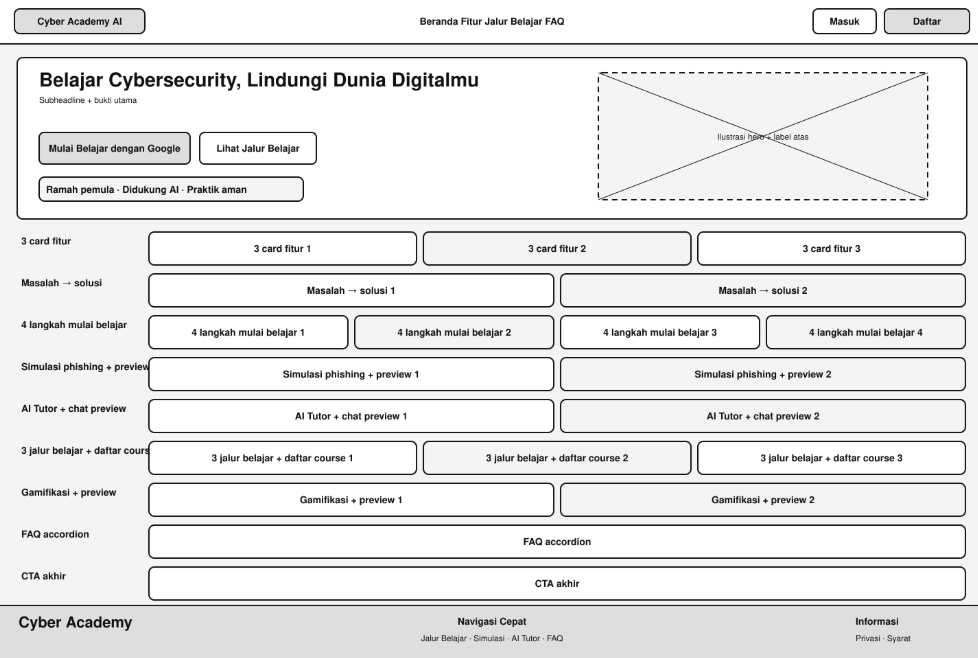

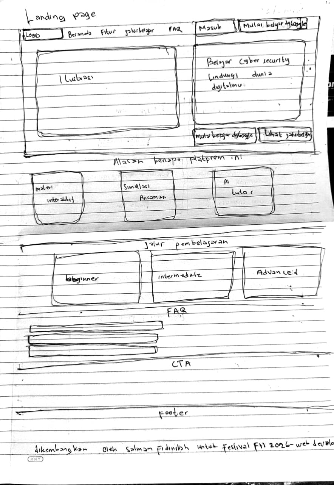

## 5. Login dan register

Form autentikasi menjadi fokus utama. Login menyediakan email/password, Google, dan tautan lupa password. Register menambahkan nama, konfirmasi password, persetujuan syarat, serta petunjuk password minimal 8 karakter.

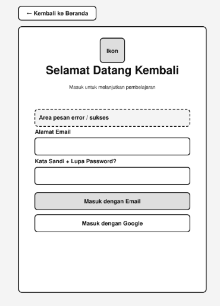

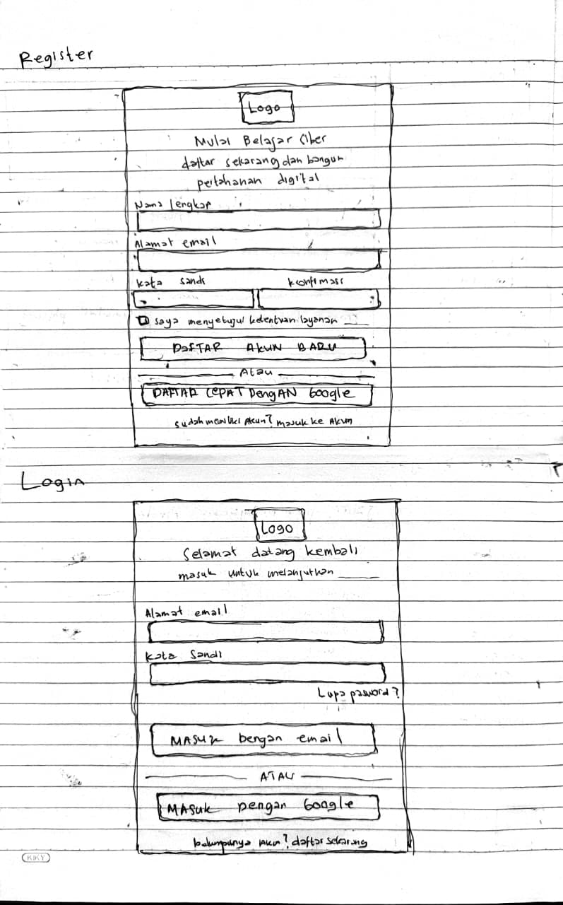

## 6. Dashboard

Dashboard menampilkan sapaan pengguna, tombol lanjut belajar, ringkasan XP, level, streak, badge, sertifikat, progress jalur, course aktif, serta learning insight. Tidak ada Daily Challenge pada source final.

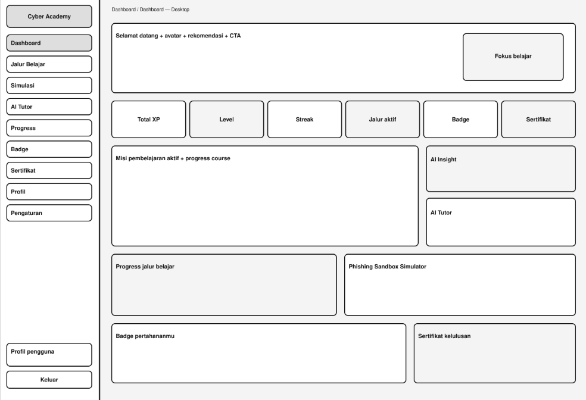

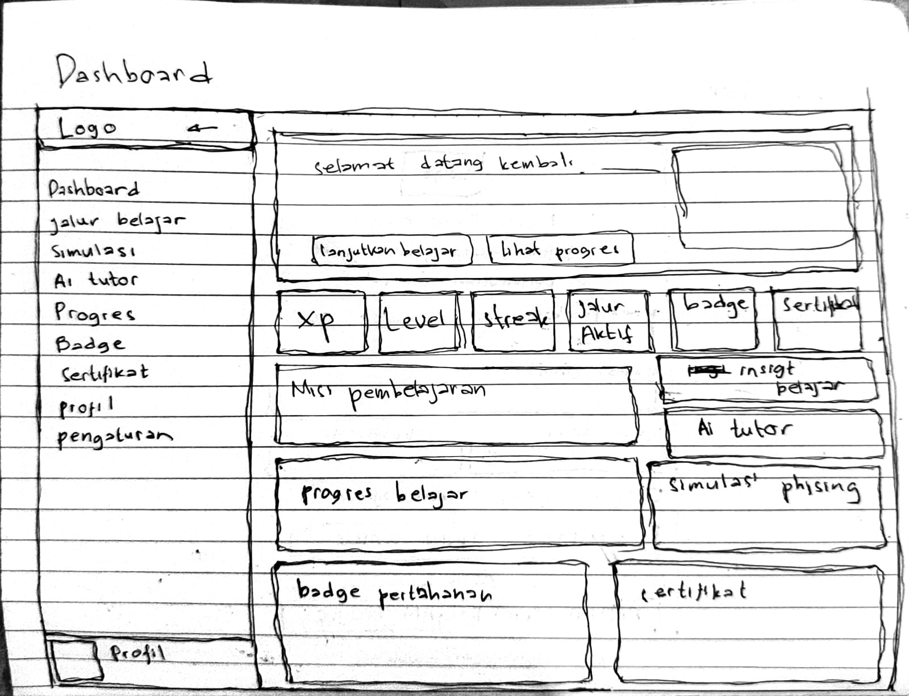

## 7. Learning path, course, lesson, dan kuis

Alur belajar dimulai dari daftar jalur, masuk ke course, membuka lesson berurutan, lalu mengerjakan kuis setelah seluruh lesson course selesai. Course berikutnya dibuka setelah course sebelumnya selesai melalui kelulusan kuis.

Lesson desktop memakai sidebar aplikasi, area materi utama, drawer daftar materi, dan panel AI yang dapat dibuka. Pada mobile, area baca tetap satu kolom dan kedua panel menjadi drawer.

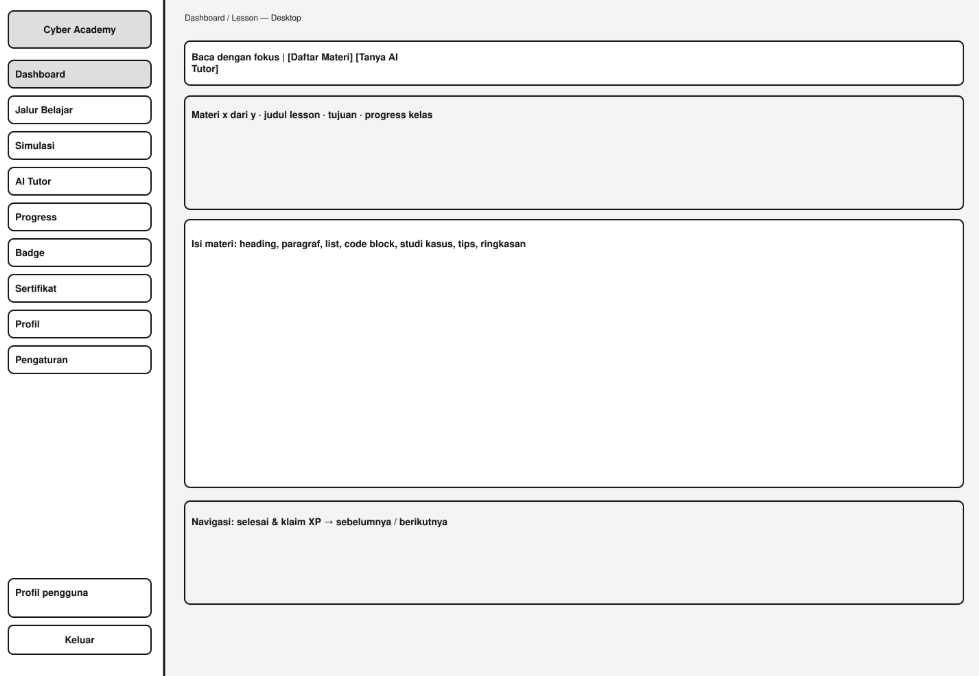

Hasil kuis selalu menampilkan passing score dari data kuis. Nilainya dapat berbeda menurut tingkat, yaitu 70, 75, atau 80.

## 8. Simulasi

Halaman simulasi menampilkan empat simulasi defensif: email phishing, WhatsApp scam, vishing, dan analisis malware dalam sandbox fiktif. Setiap simulasi mempunyai intro, tutorial, lima skenario, feedback, skor, nilai terbaik, retry, dan XP pada kelulusan pertama.

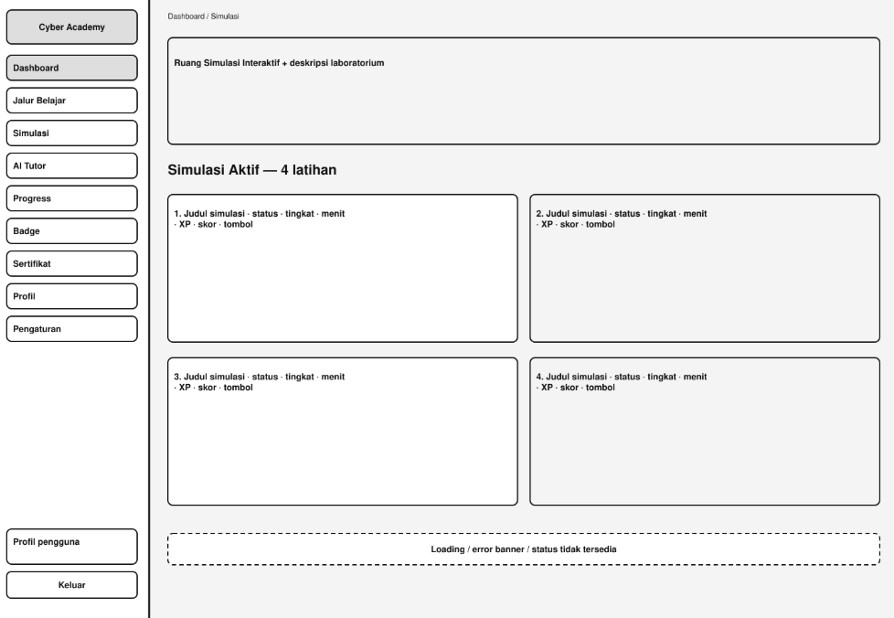

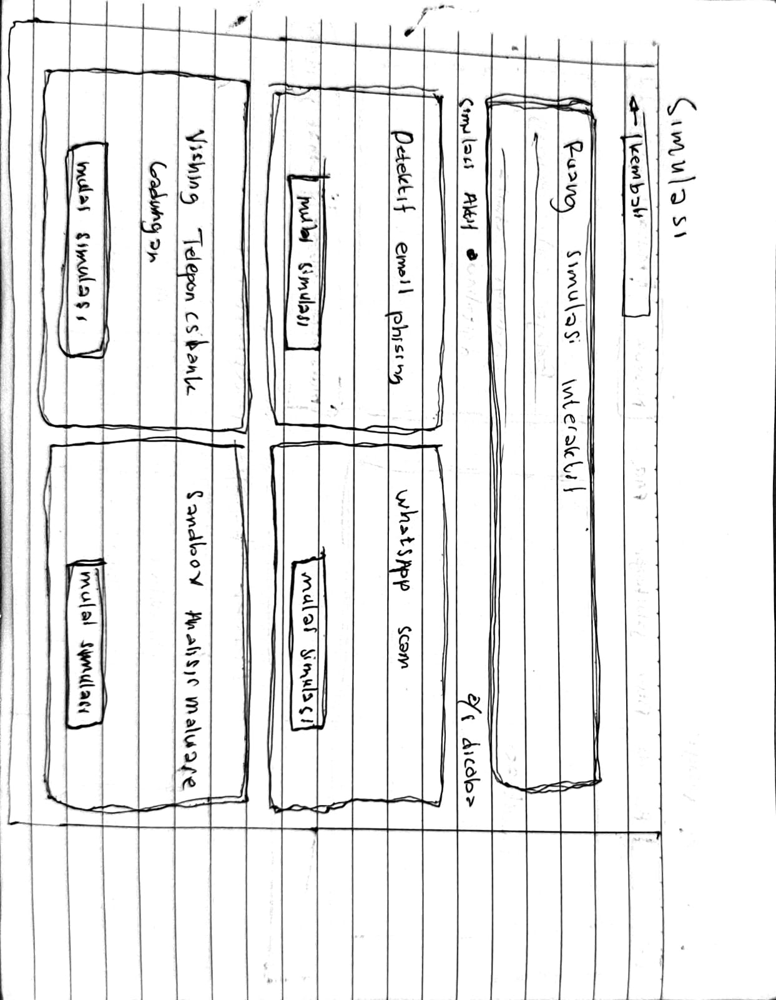

## 9. AI Tutor

Desktop membagi halaman menjadi riwayat percakapan dan panel chat. Pada mobile riwayat dibuka melalui drawer. Chat memuat konteks percakapan, respons terstruktur, saran pertanyaan, status loading, error, rate limit, serta penolakan aman.

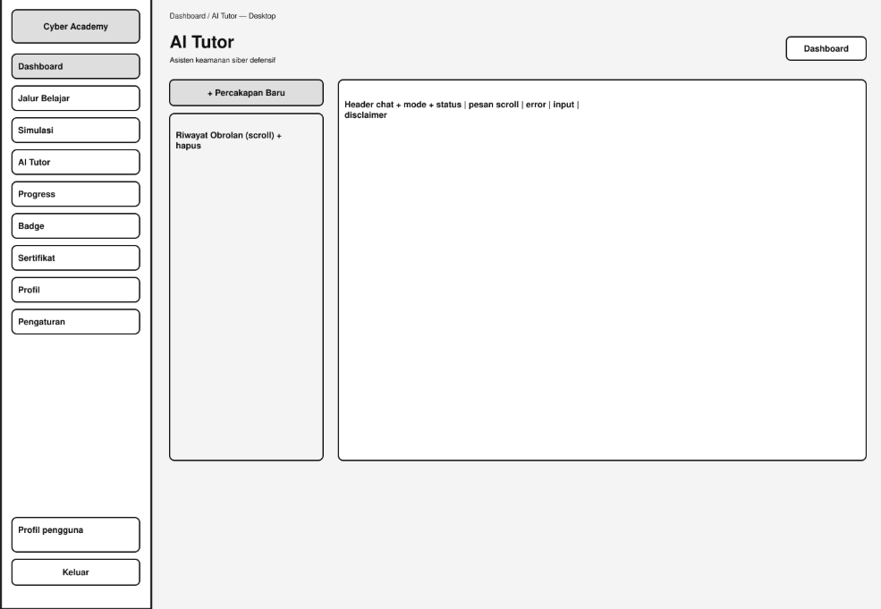

## 10. Progress, badge, dan sertifikat

Halaman Progress menampilkan total XP, level, streak, progress jalur, dan transaksi XP. Reset hanya menghapus penyelesaian materi, progress course/path, transaksi dan total XP, level, serta streak. Riwayat kuis, simulasi, badge, sertifikat, dan AI tetap dipertahankan.

Empat badge final adalah Beginner Master, Intermediate Master, Advanced Master, dan Simulation Defender. Sertifikat tersedia untuk jalur yang memenuhi syarat dan dapat diverifikasi melalui route publik.

## 11. Profil dan pengaturan

Profil menampilkan identitas serta ringkasan pencapaian pengguna. Pengaturan dipisahkan menjadi halaman profil, akun, dan keamanan. Source final tidak mempunyai pengaturan tema, preferensi notifikasi, bio, atau penghapusan akun dari UI.

## 12. Admin

Panel admin memakai route dan shell terpisah untuk mengelola pengguna, learning path, course, lesson, kuis beserta pertanyaan, simulasi, badge, sertifikat, dan audit log. Tampilan form serta tabel mengikuti data yang didukung endpoint admin.

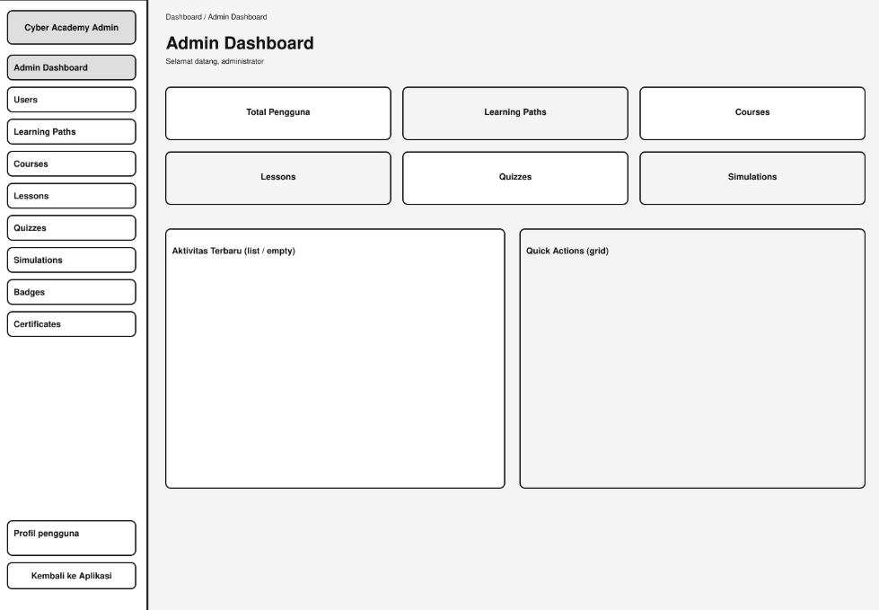

## 13. Responsive dan state

| Area | Desktop | Mobile |
| --- | --- | --- |
| Navigasi pengguna | Sidebar tetap dan dapat diciutkan | Topbar dan drawer |
| Landing page | Hero dua kolom dan grid | Satu kolom |
| Dashboard | Beberapa kolom sesuai ruang | Card ditumpuk |
| Lesson | Area baca dengan drawer/panel pendamping | Area baca satu kolom dengan drawer |
| AI Tutor | Riwayat dan chat berdampingan | Chat utama dengan riwayat dalam drawer |
| Admin | Sidebar, tabel, dan form lebar | Drawer serta konten yang dapat menyesuaikan atau scroll |

State yang digunakan sesuai konteks halaman meliputi loading, empty, error, locked, disabled, success, dan retry. Status penting tidak hanya disampaikan melalui warna.

## 14. Daftar file wireframe

| File | Isi |
| --- | --- |
| `landing-wireframe.png` | Landing page digital |
| `landing-hand-drawn.jpeg` | Sketsa landing page |
| `login-wireframe.png` | Login digital |
| `login-register-hand-drawn.jpeg` | Sketsa login dan register |
| `dashboard-wireframe.png` | Dashboard digital |
| `dashboard-hand-drawn.jpeg` | Sketsa dashboard |
| `lesson-wireframe.png` | Lesson digital |
| `simulation-wireframe.png` | Daftar simulasi digital |
| `simulation-hand-drawn.jpeg` | Sketsa simulasi |
| `ai-tutor-wireframe.png` | AI Tutor digital |
| `admin-wireframe.png` | Dashboard admin digital |

Seluruh file di atas dapat dibuka dan tidak mempunyai duplikat byte pada audit final.
